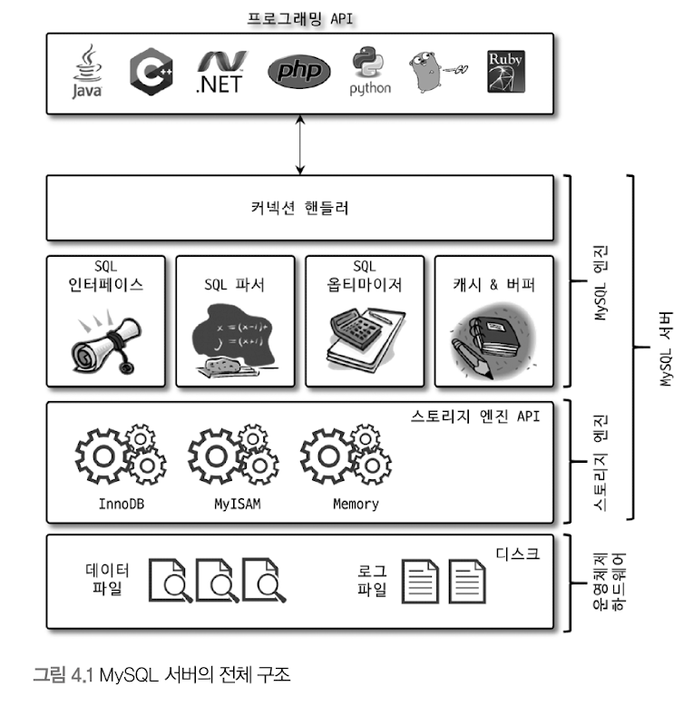
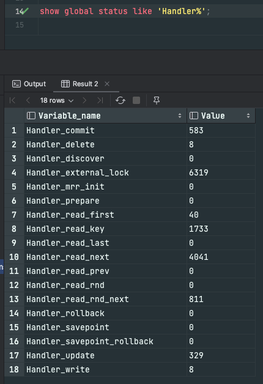
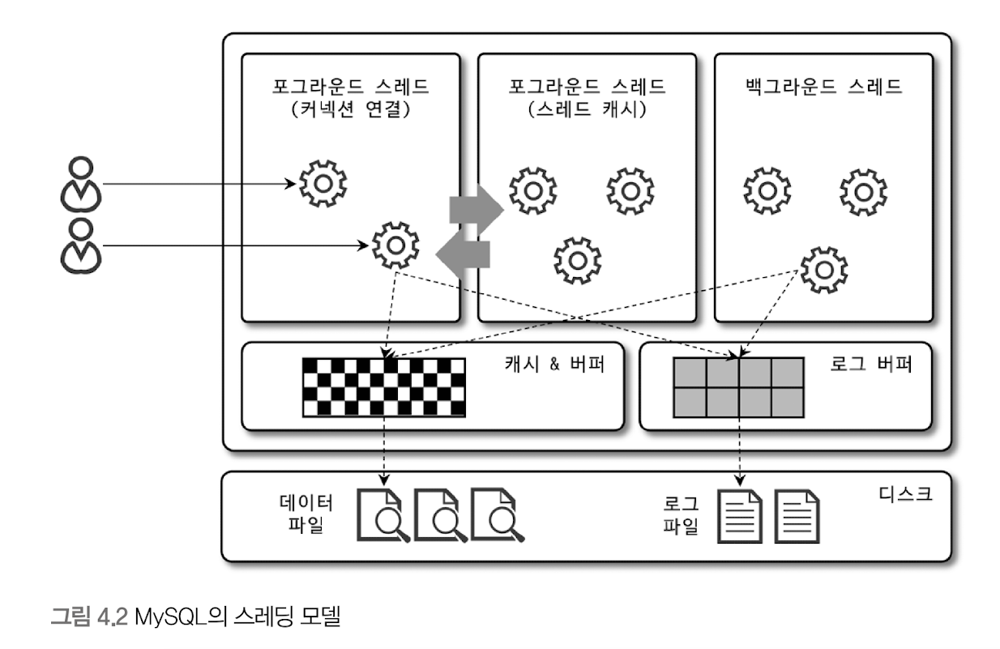
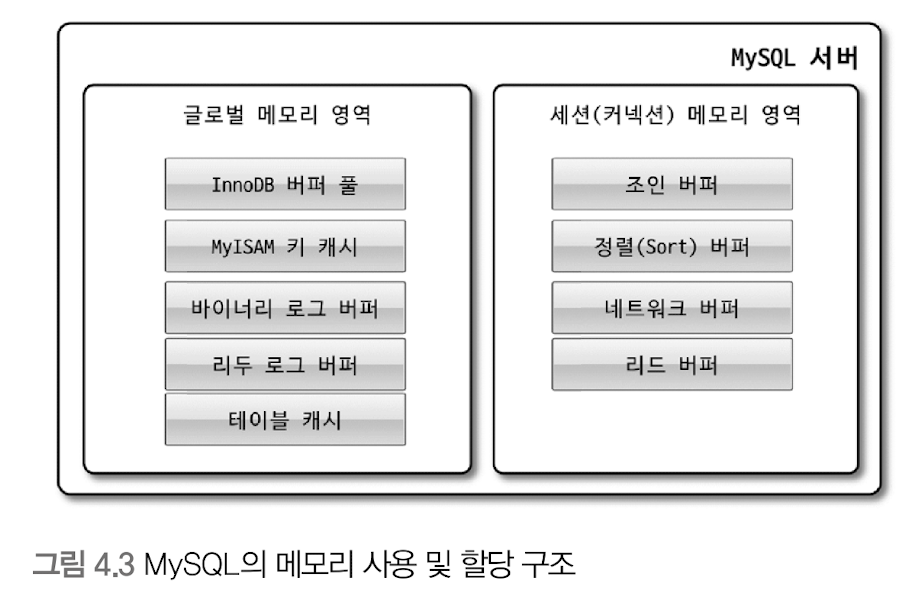
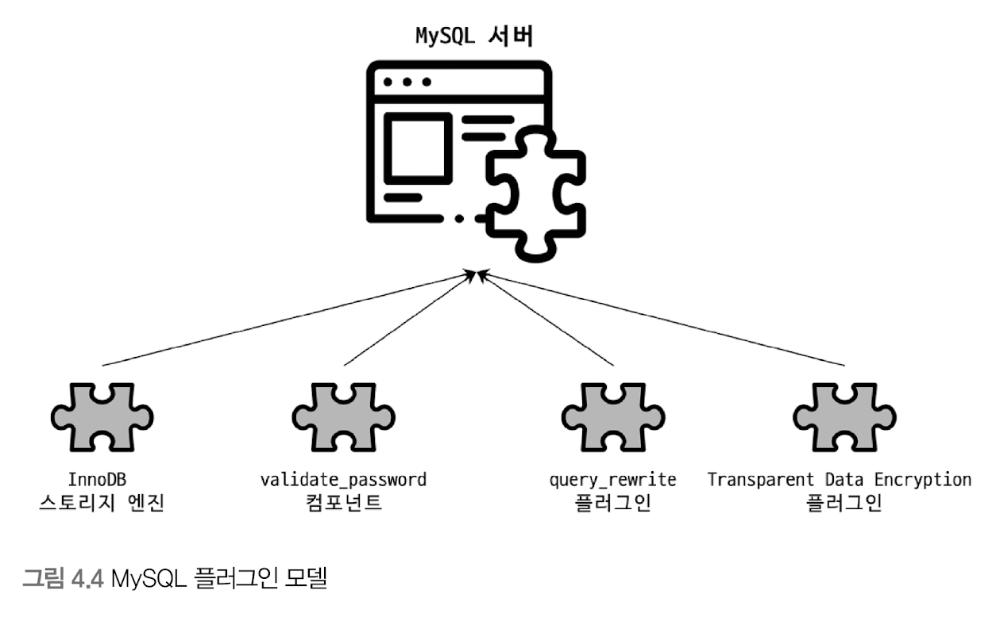
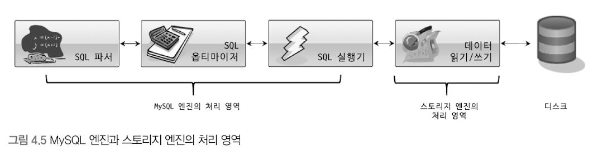
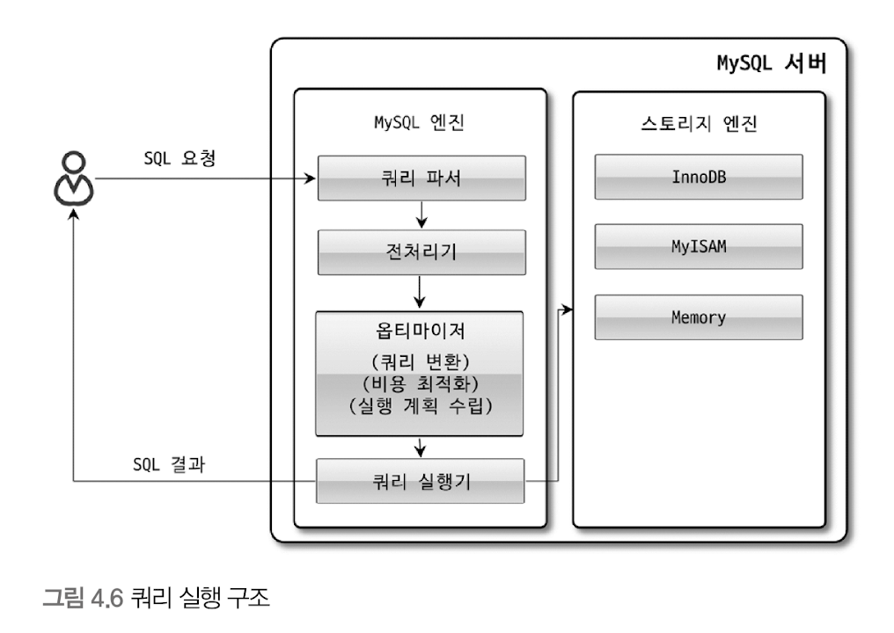
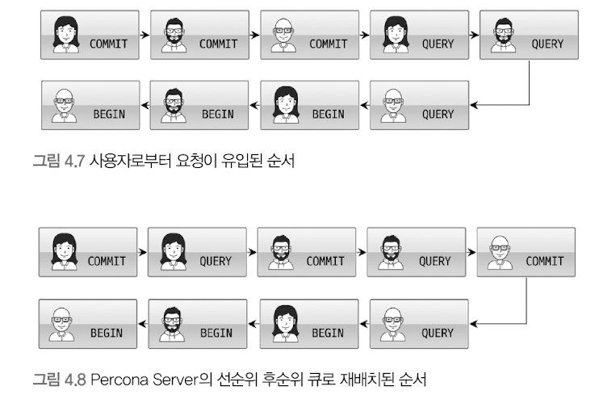

# 엔진 아키텍처
- 엔진 : MySQL 쿼리를 작성하고 튜닝할 때 필요
  

### MySQL 엔진
- 요청된 SQL 문장을 분석하거나 최적화하는 등 DBMS의 두뇌에 해당하는 처리 수행
    - 커넥션 핸들러
    - SQL 인터페이스
    - SQL 파서
    - SQL 옵티마이저
    - 캐시 & 버퍼


### 스토리지 엔진
- 실제 데이터를 디스크 스토리지에 저장하거나 읽어오는 부분을 전담
- MySQL 엔진은 하나, but 스토리지 엔진은 여러개 동시 사용 가능
```mysql
create table test_table (fd1 int, fd2 int) engine=innodb;
```
- 위와 같이 작성하면 엔진을 지정함 -> 이후 해당 테이블의 모든 읽기/변경 작업은 정의된 스토리지 엔진이 처리
- 각 스토리지 엔진은 성능 향상을 위한 기능을 내장함
    - MyISAM : 키 캐시
    - InnoDB : InnoDB 버퍼 풀


### 핸들러 API
- 데이터를 쓰거나 읽을 때 -> 각 스토리지 엔진에 쓰기/읽기 요청
  - 이러한 요청을 핸들러 요청이라고 함
  - 여기서 사용되는 API가 핸들러 API임


- 핸들러 API를 통해 얼마나 많은 데이터(레코드) 작업이 있었는지는 아래와 같이 확인 가능


<br>

## MySQL 스레딩 구조

- MySQL 서버는 프로세스 기반이 아닌 **스레드 기반**으로 작동한다.
- 전체 44개의 스레드가 실행 중
    - Foreground 스레드 : 3개
        - `one_connection` : 실제 사용자 요청을 처리하는 포그라운드 스레드
    - Background 스레드 : 41개
    - 동일한 스레드 이름이 2개 이상인 경우 -> 서버 설정에 의해 여러 스레드가 동일 작업을 병렬로 처리하는 경우


- 스레드 풀 모델
    - 커넥션과 포그라운드 스레드는 1:1관계가 아니라 하나의 스레드가 여러 커넥션 요청을 전담함


- 전통적인 스레드 모델
    - 커넥션 별로 포그라운드 스레드가 하나씩 생성 및 할당 됨


### 포그라운드 스레드 (클라이언트 스레드)
- 최소한 서버에 접속된 클라이언트 수만큼 존재
    - 각 클라이언트가 요청하는 쿼리 문장을 처리


- 클라이언트 사용자가 작업을 마치고 커넥션 종료 -> 해당 커넥션을 담당하던 스레드는 다시 **스레드 캐시**로 되돌아감
    - 이 때 일정 개수 이상의 대기중인 스레드가 있을 경우, 스레드 캐시에 넣지 않고 스레드를 종료시켜 일정 개수의 스레드만 스레드 캐시에 존재함
    - `thread_cache_size` 시스템 변수로 설정


- 데이터를 MySQL의 데이터 버퍼나 캐시로부터 가져옴
    - 버퍼나 캐시에 없는 경우 -> 디스크의 데이터나 인덱스 파일로부터 데이터를 읽어와서 작업 처리
    - MyISAM : 디스크 쓰기 작업까지 포그라운드 스레드가 처리
    - InnoDB : 데이터 버퍼나 캐시까지만 포그라운드 스레드가 처리. 나머지 버퍼로부터 디스크까지 기록하는 작업은 백그라운드 스레드가 함


### 백그라운드 스레드
- InnoDB는 다음과 같이 여러가지 작업이 백그라운드로 처리 됨 (MyISAM은 별로 해당사항이 없음)
    - 인서트 버퍼를 병합하는 스레드
    - 로그를 디스크로 기록하는 스레드
    - InnoDB 버퍼 풀의 데이터를 디스크에 기록하는 스레드
    - 데이터를 버퍼로 읽어 오는 스레드
    - 잠금이나 데드락을 모니터링하는 스레드


- 위 작업들 중에서도 가장 중요한 것
    - 로그 스레드
    - 쓰기 스레드
        - 읽기 작업은 주로 클라이언트 스레드에서 처리함


- 사용자 요청을 처리하는 도중
    - 데이터의 쓰기 작업은 지연 처리될 수 있음
    - 읽기 작업은 절대 지연될 수 없음
    - 그렇기 때문에, InnoDB는 쓰기 작업을 지연시켜 일괄 처리하는 기능이 탑재돼 있다.
        - MyISAM은 클라이언트 스레드가 쓰기 작업까지 함께 처리함 (쓰기 지연 불가)
    - InnoDB는 쓰기 지연이 가능하여, insert, update, delete쿼리로 데이터가 변경되는 경우, 데이터가 디스크 데이터 파일로 완전히 저장될 때까지 기다리지 않아도 됨.


<br>

## 메모리 할당 및 사용 구조

### 글로벌 영역
- 서버가 시작되면서 OS로부터 할당받음 <br/><br/>
- 클라이언트 스레드 수와 무관. 하나의 메모리 공간만 할당 됨.
    - 필요에 따라 2개 이상의 메모리 공간을 할당받을 순 있으나, 클라이언트 스레드 수와 무관함
    - 영역이 N개 여도 모든 스레드에 의해 공유됨 <br/><br/>
- 다음과 같은 영역들이 있음
    - 테이블 캐시
    - InnoDB 버퍼 풀
    - InnoDB 어댑티브 해시 인덱스
    - InnoDB 리두로그 버퍼

### 로컬 메모리 영역
- 세션(커넥션) 메모리 영역 or 클라이언트 메모리 영역
- 서버상에 존재하는 클라이언트 스레드가 쿼리를 처리하는 데 사용하는 메모리 영역
- 다음과 같은 영역들이 있음
    - 정렬 버퍼
    - 조인 버퍼
    - 바이너리 로그 캐시
    - 네트워크 버퍼
- 클라이언트 스레드별로 독립적으로 할당됨
    - 절대 공유되지 않음


- 각 쿼리의 용도별로 필요할 때만 공간이 할당되고, 필요하지 않은 경우에는 메모리 공간을 할당조차도 하지 않을 수도 있다.
    - 쿼리를 실행하는 순간에만 할당했다가 다시 해제하는 공간
    - 소트 버퍼, 조인 버퍼 <br/><br/>
- 로컬 메모리 공간은 커넥션이 열려 있는 동안 계속 할당된 상태로 남아있는 공간도 있다.
    - 커넥션 버퍼, 결과 버퍼

<br>

## 플러그인 스토리지 엔진 모델

- 스토리지 엔진만 플러그인 해서 사용할 수 있는 것이 아님
- 플러그인 모델 
  - 전문 검색 엔진을 위한 검색어 파서 (인덱싱 키워드 분리 작업)도 플러그인 형태로 개발해서 사용 가능 
  - Native Authentication, Caching SHA-2 Authentication 등 인증을 위한 것도 플러그인으로 구현되어 제공 



- 데이터 읽기/쓰기 작업은 대부분 1건의 레코드 단위로 처리될 것 <br/><br/>
- 핸들러 : 어떤 기능을 호출하기 위해 사용하는 객체 
  - MySQL 엔진(사람) -> 핸들러(운전대) -> 스토리지 엔진(자동차)
  - **MySQL 엔진이 각 스토리지 엔진에게 데이터를 읽어오거나 저장하도록 명령하려면 반드시 핸들러를 통해야 한다.**
  - `Handler_`로 시작되는 상태 변수 : MySQL 엔진이 각 스토리지 엔진에게 보낸 명령의 횟수를 의미<br/><br/> 
- 스토리지 엔진에 차이가 있어도
  - MySQL 처리 내용은 대부분 동일
  - 데이터 읽기/쓰기 영역만 차이가 있을 뿐 
  - `group by`, `order by` 등 복잡한 처리는 MySQL 엔진 처리 영역인 쿼리 실행기에서 수행함 <br/><br/>
- 하나의 쿼리 작업 -> 여러 하위 작업으로 나뉨 
  - 각 하위 작업이 MySQL 엔진 영역에서 처리되는지, 스토리지 엔진 영역에서 처리되는지 구분할 줄 알아야 한다. (작업 단위를 뭐가 처리하는지 알아야함!)


<br>

## 컴포넌트 
- 기존의 플러그인 아키텍처를 대체하기 위해 지원되는 **컴포넌트 아키텍처**
- 플러그인의 단점 
  - 오직 MySQL 서버와 인터페이스 가능. 플러그인끼리는 통신 불가
  - MySQL 서버의 변수나 함수를 직접 호출 -> 위험 (캡슐화 안됨)
  - 상호 의존관계 설정 불가 -> 초기화 어려움 

<br>

## 쿼리 실행 구조


### 쿼리 파서
- 요청으로 들어온 쿼리 문장을 토큰으로 분리해 트리 형태의 구조로 만들어 내는 작업 
  - 토큰 : MySQL이 인식할 수 있는 최소 단위의 어휘나 기호 
- 쿼리 문법 오류는 기본 문법 오류는 이 과정에서 발견되고, 사용자에게 오류 메시지를 전달함


### 전처리기 
- 파서 과정에서 만들어진 파서 트리를 기반으로 쿼리 문장에 구조적인 문제점이 있는지 확인
- 각 토큰을 테이블 이름이나 칼럼 이름, 또는 내장 함수와 같은 개체를 매핑
  - 해당 객체의 존재 여부 확인
  - 접근 권한 확인 
- 실제 존재하지 않거나 권한 상 사용할 수 없는 개체의 토큰은 걸러짐 


### 옵티마이저 
- 사용자의 요청으로 들어온 쿼리 문장을 저렴한 비용으로 가장 빠르게 처리할지를 결정하는 역할 
- DBMS의 두뇌에 해당 
- 역할이 아주 중요하고 범위가 넓기 때문에 나중에 자세히 설명


### 실행 엔진 
- 실행 엔진과 핸들러 : DBMS의 손과 발에 해당
- 실행 엔진 작동 예시 (옵티마이저가 group by를 처리하기 위해 임시 테이블을 사용하기로 했을 때) 
  1. 실행 엔진이 핸들러에게 임시 테이블을 만들라고 요청
  2. 실행 엔진은 where 절에 일치하는 레코드를 읽어오라고 핸들러에게 요청 
  3. 읽어온 레코드들을 1번에서 준비한 임시 테이블로 저장하라고 핸들러에게 요청 
  4. 데이터가 준비된 임시 테이블에서 필요한 방식으로 데이터를 읽어 오라고 핸들러에게 요청 
  5. 최종적으로 실행 엔진은 결과를 사용자나 다른 모듈로 넘김 


- 만들어진 계획대로 각 핸들러에게 요청해서 받은 결과를 또 다른 핸들러 요청의 입력으로 연결하는 역할을 수행


### 핸들러(스토리지 엔진)
- 서버 가장 밑단에서 MySQL 실행 엔진의 요청에 따라 데이터를 디스크로 저장하고 디스크로부터 읽어 오는 역할을 담당
- 스토리지 엔진을 의미.
  - InnoDB 테이블 조작 -> 핸들러가 InnoDB 스토리지 엔진이 됨 


### 복제 
- 매우 중요한 역할을 담당하기 때문에 별도의 장에서 다룸 

<br>

## 쿼리 캐시 
- 빠른 응답을 필요로 하는 웹 기반 응용 프로그램에서 매우 중요한 역할 담당 
- SQL 실행 결과를 메모리에 캐시 -> 동일 SQL 쿼리가 실행되면 테이블을 읽지 않고 즉시 결과 반환. (매우 빠른 성능)
- 하지만...
  - 테이블의 데이터가 변경되면 캐시에 저장된 결과 중에서 변경된 테이블과 관련된 것들은 모두 삭제해야 했음 
  - 이는 심각한 동시 처리 성능 저하를 유발
  - MySQL 서버가 발전하면서 성능이 개선되는 과정에서, 쿼리 캐시는 계속된 동시 처리 성능 저하와 많은 버그의 원인이 되기도 했음


- 그래서, MySQL 8.0부터 쿼리 캐시는 서버의 기능에서 완전히 제거되었음. (시스템 변수 또한 제거)


<br>

## 스레드 풀
- 엔터프라이즈 에디션만 해당 기능 제공 
- 대신, `Percona Server`에서 제공하는 스레드 풀 기능을 살펴보자
  - 엔터프라이즈 풀은 MySQL 서버에 내장되어 있음
  - `Percona Server`의 스레드 풀은 플러그인 형태로 작동하게 구현돼 있음 
    - 이를 인스톨 해서 사용하면 커뮤니티 에디션에도 사용 가능 <br/><br/>
- 스레드 풀은 내부적으로 사용자 요청을 처리하는 스레드 개수를 줄여서 동시 처리되는 요청이 많다 하더라도, MySQL 서버의 CPU가 제한된 개수의 스레드 처리에만 집중할 수 있게 해서 서버의 자원 소모를 줄이는 것이 목적임
  - 스케줄링 과정에서 CPU 시간을 제대로 확보하지 못하는 경우, 쿼리 처리가 더 느려지는 사례도 발생함 
  - 제한된 수의 스레드만으로 CPU가 처리하도록 적절히 유도한다면, CPU의 프로세서 친화도를 높이고, OS 입장에서는 불필요한 컨텍스트 스위치를 줄여 오버헤드를 낮출 수 있음
  - 스레드 풀이 실제 서비스에서 눈에 띄는 성능 향상을 보여준 경우는 드물다 <br/><br/>

### `Percona Server`의 스레드 풀 
- CPU 코어 개수만큼 스레드 그룹 생성 
- CPU 코어의 개수와 스레드 그룹의 개수를 맞추는 것이 CPU 프로세서 친화도를 높이는 데 좋음 
- 요청 -> 스레드 풀로 처리 이관 -> 스레드 풀이 처리 중인 작업이 있을 경우, `thread_pool_oversubscribe`에 설정된 개수만큼 추가로 더 받아들여서 처리 
- 해당 값이 너무 클 경우 스케줄링 해야 할 스레드가 많아지므로, 스레드 풀이 비효율적으로 작동할 수도 있음<br/><br/>

#### 스레드 그룹의 모든 스레드가 일을 처리하고 있는 경우
- 스레드 풀은 해당 스레드 그룹에 새로운 작업 스레드를 추가할지, 아니면 처리를 완료할 때 까지 기다릴지 여부를 판단해야 함 
- 타이머 스레드 
  - 주기적으로 스레드 그룹의 상태 체크 
  - 지정된 시간 내에 스레드가 작업을 끝내지 못하면 새로운 스레드를 생성해서 그룹에 추가(`thread_pool_stall_limit`)
  - 스레드 개수는 설정된 개수를 넘어설 수 없음 (`thread_pool_max_thread`) 


#### 선순위 큐와 후순위 큐 
- 특정 트랜잭션이나 쿼리를 우선적으로 처리할 수 있는 기능 제공 
- 먼저 시작된 트랜잭션 내에 속한 SQL을 빨리 처리 -> 해당 트랜잭션이 가지고 있던 락이 빨리 해제됨 -> 락 경합 낮춤 -> 전체적인 처리 성능을 향상시킬 수 있음 


<br>

## 트랜잭션 지원 메타데이터
- 메타데이터(혹은 데이터 딕셔너리) : 테이블의 구조 정보, 스토어드 프로그램 등의 정보
  - 5.7 버전까지는 테이블 구조를 FRM 파일에, 일부 스토어드 프로그램 파일을 TRN, TRG, PAR.. 기반으로 관리함
  - 파일 기반 메타데이터는 생성 및 변경 작업이 트랜잭션을 지원하지 않았음
  - 테이블의 생성 또는 변경 도중에 MySQL 서버가 비정상 종료될 경우, 일관되지 않은 상태로 남는 문제가 있었음<br/><br/>
- 8.0버전 부터는 메타데이터를 InnoDB의 테이블에 저장하도록 개선
  - 시스템 테이블 : 서버 작동 시 기본적으로 필요한 테이블 (인증, 권한 관련...)
  - 이런 시스템 테이블들을 모두 InnoDB 스토리지 엔진을 사용하도록 했음 
  - `mysql DB`에 저장 -> `mysql.ibd` (주의해야 함)
  - 트랜잭션 기반의 InnoDB 스토리지 엔진에 저장되므로, 스키마 변경 작업 중간에 MySQL 서버가 비정상적으로 종료된다 하더라도 스키마 변경이 완전한 성공 또는 완전한 실패로 정리됨<br/><br/> 
- InnoDB 외의 스토리지 엔진들은 메타데이터를 어떻게 관리할까?
  - MyISAM, CSV ...
  - SDI(Serialized Dictionary Information) 파일을 사용함 (직렬화를 위한 포맷)
    - `*.sdi` 파일이 존재 -> `*.FRM`과 동일한 역할 수행 
  - `ibd2sdi`유틸리티 이용하면 스키마 정보 추출 가능 


