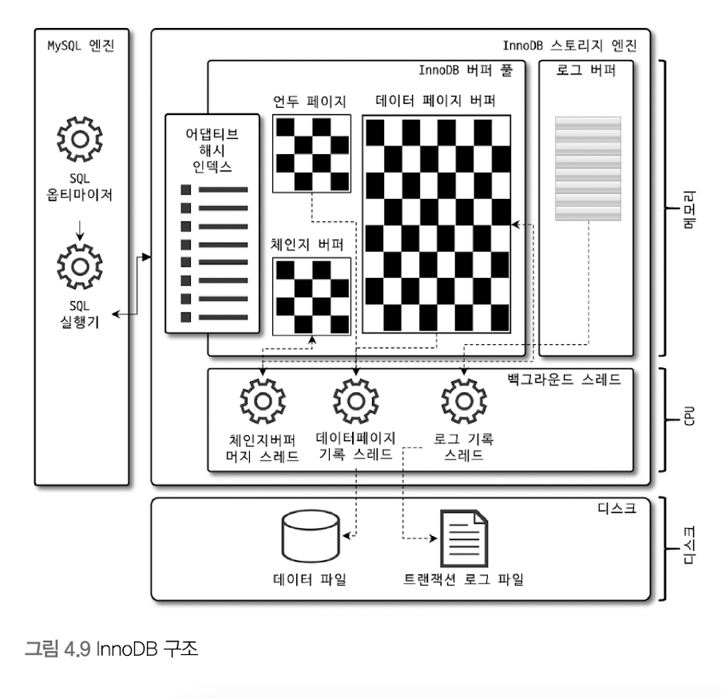
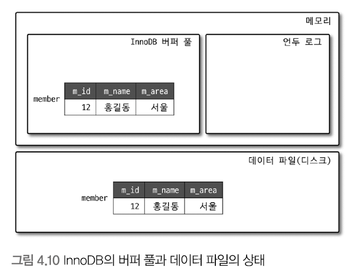
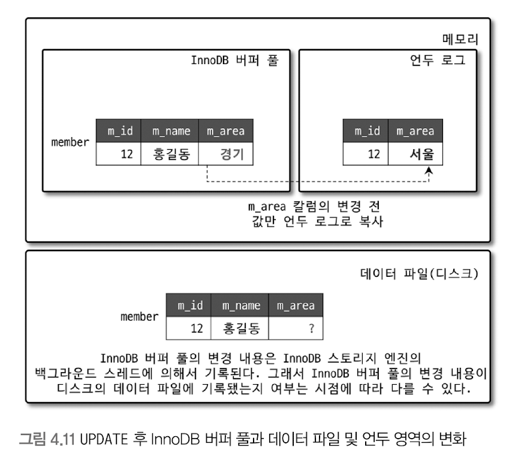
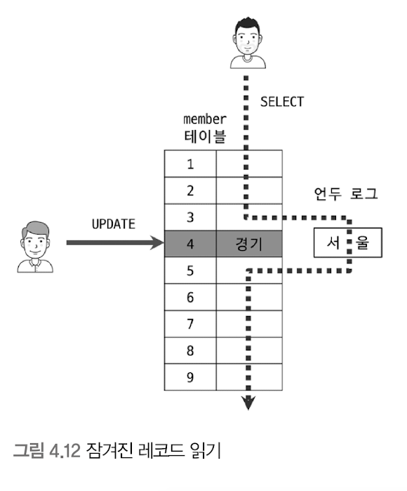
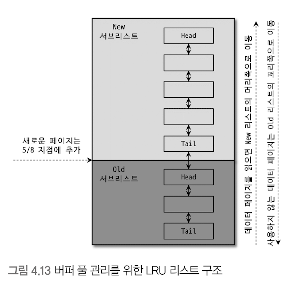
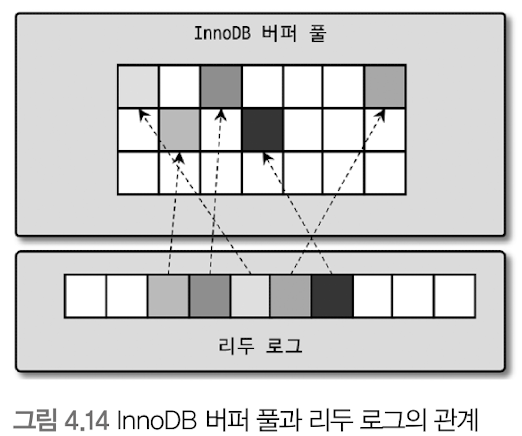
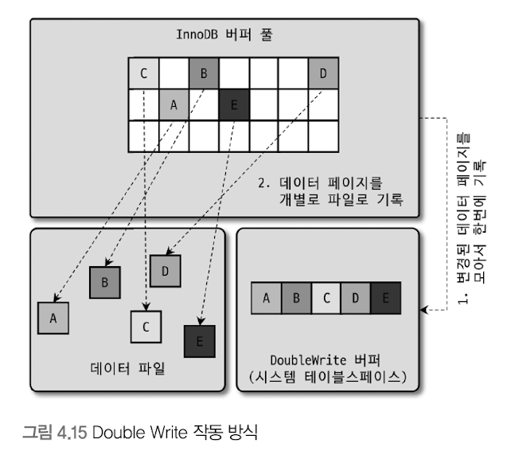
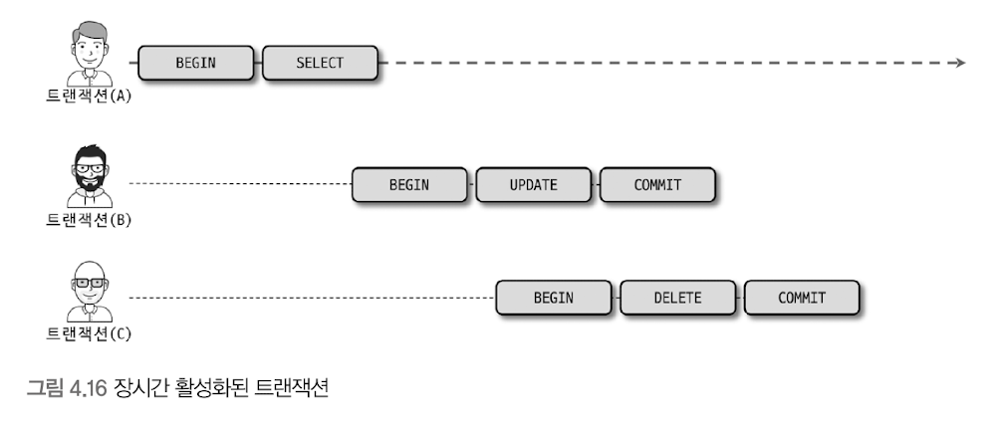
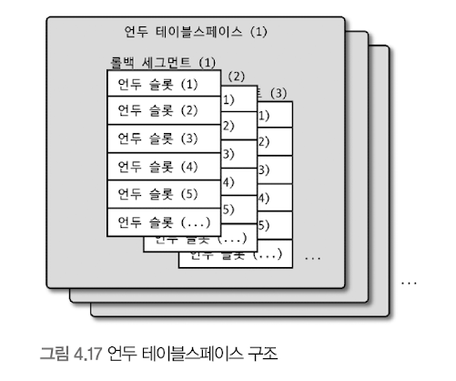
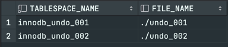

# InnoDB 스토리지 엔진 아키텍처 


- 스토리지 엔진 중 거의 유일하게 레코드 기반 잠금 제공 
- 높은 동시성 처리 가능
- 안정적이며 성능이 뛰어남 

<br>

## 프라이머리 키에 의한 클러스터링 
- InnoDB의 모든 테이블은 프라이머리 키를 기준으로 클러스터링되어 저장 됨 
  - 프라이머리 키 값 순서대로 디스크에 저장된다는 뜻 
  - 모든 세컨더리 인덱스 -> 레코드 주소 대신 프라이머리 키의 값을 논리 주소로 사용 
- 프라이머리 키가 클러스터링 인덱스 -> PK를 이용한 레인지 스캔은 상당히 빨리 처리될 수 있음 
- 쿼리 실행 계획에서 PK는 다른 보조 인덱스에 비해 기본적으로 비중이 높게 설정됨 
  - 쿼리 실행 계획에서 다른 보조 인덱스보다 PK가 선택될 확률이 높음 


- MyISAM : 클러스터링 키 지원 X 
  - PK와 세컨더리 인덱스가 구조적으로 차이가 없음 
  - PK == 유니크 제약을 가진 세컨더리 인덱스 
  - PK를 포함한 모든 인덱스가 물리적인 레코드 주소 값(ROWID)을 가짐

<br>

## 외래 키 지원 
- InnoDB 스토리지 엔진 레벨에서 지원하는 기능 
- FK는 데이터베이스 서버 운영의 불편함 때문에 서비스용 DB에선 생성하지 않는 경우도 자주 있음 
- InnoDB의 외래 키
  - 부모 테이블과 자식 테이블 모두 해당 칼럼에 인덱스 생성 필요 
  - 변경 시 부모 or 자식 테이블에 데이터가 있는지 체크하는 작업 필요 -> 락이 여러 테이블로 전파됨 
  - 그로 인해 데드락이 발생할 수 있음 -> 개발 시 FK 존재에 주의하는 것이 좋음 

- `foreign_key_checks` 시스템 변수
  - global, session 모두 설정 가능 -> 주의해야 함 
  - 반드시 현재 작업을 실행하는 세션에만 적용하자 
  - 작업 완료 후에는 반드시 세션을 종료하거나 해당 기능을 활성화 시켜주자 

<br>

## MVCC(Multi Version Concurrency Control)
- 레코드 레벨 트랜잭션을 지원하는 DBMS가 제공하는 기능 
- 락을 사용하지 않는 일관된 읽기를 제공함 
- InnoDB는 **언두 로그(Undo log)** 를 이용해서 이 기능 구현 
  - Multi version : 하나의 레코드에 대해 여러 개의 버전이 동시에 관리됨

### data를 insert 후 update 할 때


- insert 문이 실행되면 DB 상태는 위와 같이 변경된다.
  - InnoDB 버퍼 풀에 데이터 존재
  - 데이터 파일(디스크)에 데이터 쓰기


`update member set m_area='경기' where m_id=12;`


- update 문이 실행되면 위와 같이 변경된다.
  - `m_area`의 변경 전 값만 언두 로그로 복사한다. (InnoDB 버퍼 풀은 즉시 새로운 데이터로 변경된다.)
  - InnoDB 버퍼 풀의 변경 내용은, InnoDB 스토리지 엔진의 백그라운드 스레드에 의해 기록된다.
    - InnoDB 버퍼 풀의 변경 내용이 디스크의 데이터 파일에 기록됐는지 여부는 시점에 따라 다르다 
    - 즉, 체크포인트나 Write 스레드에 의해 새로운 값으로 업데이트돼 있을 수도 있고 아닐 수도 있음
    - 보통은 InnoDB가 ACID를 보장하기 때문에 InnoDB 버퍼 풀과 데이터 파일은 동일한 상태로 가정해도 됨 


아직 커밋이나 롤백이 되지 않은 상태에서, 다음과 같은 쿼리로 작업 중인 레코드를 조회하면 어디의 데이터를 조회할까? 
`select * from member where m_id=12;`
- 서버의 `transaction_isolation`시스템 변수에 설정된 격리 수준에 따라 다르다!
- `READ_UNCOMMITED` : InnoDB 버퍼 풀이 현재 가지고 있는 변경된 데이터를 읽어서 반환. (커밋/롤백이 되지 않았음에도)
- `READ_COMMITED`, `REPEATABLE_READ`, `SERIALIZABLE` 
  - 아직 커밋되지 않았기 때문에 InnoDB 버퍼 풀이나 데이터 파일에 있는 내용 대신, **변경되기 이전의 내용을 보관하고 있는 언두 영역의 데이터**를 반환한다.


위와 같은 과정을 DBMS에서는 `MVCC`라고 표현한다.
- 즉, 하나의 레코드에 대해 2개의 버전이 유지되고, 필요에 따라 어느 데이터가 보여지는지 여러 가지 상황에 따라 달라지는 구조임.
- 관리해야 하는 예전 버전 데이터는 무한히 많아질 수 있음 


커밋이되었을 때는 InnoDB는 더이상의 변경 작업 없이 지금의 상태를 영구적인 데이터로 만든다.
- 하지만 롤백이 되었다면 InnoDB는 언두 영역에 있는 백업된 데이터를 InnoDB 버퍼 풀로 다시 복구하고, 언두 영역의 내용을 삭제한다.
- 언두 영역 데이터는 커밋 시 항상 바로 삭제되는 것은 아니며, 이 언두 영역을 필요로 하는 트랜잭션이 없을 때 삭제된다.

<br>

## 잠금 없는 일관된 읽기(Non-Locking Consistent Read)
InnoDB 스토리지 엔진은 MVCC 기술을 이용해 락을 걸지 않고 읽기 작업을 수행한다. 
- 락을 걸지 않기 때문에, 다른 트랜잭션이 가지고 있는 잠금을 기다리지 않고 읽기 작업 가능 
- `serializable`격리 수준이 아니라면, 순수한 읽기(only select)작업은 다른 트랜잭션의 변경 작업과 관계 없이 항상 락을 대기하지 않고 바로 실행 됨 


</img>

- 특정 사용자가 update 실행 중임 + 아직 커밋 안했을 경우 
  - 해당 변경 트랜잭션이 다른 사용자의 select 작업을 방해하지 않음 
  - 변경되기 전의 데이터를 읽기 위해 언두 로그를 사용 


- 오랜 시간 활성 상태인 트랜잭션 -> 서버가 너무 느려지거나 문제가 발생 
  - 일관된 읽기를 위해 언두 로그를 삭제하지 못하고 계속 유지해야 하기 때문에 발생 
  - 트랜잭션이 시작됐다면 가능한 한 빨리 롤백/커밋을 통해 트랜잭션을 완료하자

<br>

## 자동 데드락 감지 
- 락 대기 목록 그래프(Wait-for List)
  - 락이 교착 상태에 빠지지 않았는지 체크
- InnoDB 스토리지 엔진은 데드락 감지 스레드를 갖고 있다.
  - 해당 스레드가 주기적으로 락 대기 그래프를 검사해 데드락에 빠진 트랜잭션들을 찾아서 그 중 하나를 강제 종료함 
  - 강제 종료 기준 -> 트랜잭션의 언두 로그 양 -> 언두 로그 레코드를 더 적게 가진 트랜잭션이 롤백의 대상 
  - 언두 레코드를 적게 가졌다 == 롤백을 해도 언두 처리를 해야할 내용이 적다 
    - 따라서 트랜잭션 강제 롤백으로 인한 서버 부하도 덜 유발함 


- InnoDB 스토리지 엔진은 상위 레이어인 MySQL 엔진에서 관리되는 테이블 락은 볼 수 없음 
  - 데드락 감지가 불확실할 수 있음 
  - `innodb_table_locks`를 활성화 하면 스토리지 엔진 내부 레코드 락 + 테이블 레벨의 락까지 감지할 수 있게 됨 
  - 특별한 이유가 없다면 해당 변수는 활성화 하자 


- 일반적인 서비스 상에서
  - 데드락 감지 스레드가 트랜잭션 락 목록을 검사해서 데드락을 찾아내는 작업은 크게 부담되지 않음
- 동시 처리 스레드가 매우 많아지거나 각 트랜잭션이 가진 락의 개수가 많아지면, 데드락 감지 스레드가 느려짐 
  - 데드락 감지 스레드는 락 상태가 변경되지 않도록, 락 목록이 저장된 리스트(락 테이블)에 새로운 락을 걸고 데드락 스레드를 찾는다.
  - 데드락 감지 스레드가 느려지면, 서비스 쿼리를 처리 중인 스레드는 더는 작업을 진행하지 못하고 대기하면서 서비스에 악영향을 미침 
  - 동시 처리 스레드가 많은 경우, 데드락 감지 스레드는 더 많은 CPU 자원을 소모할 수도 있음

### 문제 해결 
- `innodb_deadlock_detect` 시스템 변수 제공 
  - 이를 OFF로 설정하면 데드락 감지 스레드가 더이상 작동하지 않음 
    - InnoDB 스토리지 엔진 내부에서 2개 이상의 트랜잭션이 상대방이 가진 락을 요구하는 상황(데드락 상황)이 발생해도 중재자가 없기 때문에 무한정 대기하게 됨 
- `innodb_lock_wait_timeout` 시스템 변수 활성화
  - 데드락 상황에서 일정 시간이 지나면 자동으로 요청 실패 -> 에러 메시지 반환 
  - 초 단위 설정 가능
  - 설정 시간 내에 락을 획득하지 못하면 쿼리는 실패하고 에러 반환 
  - 데드락 감지 스레드가 부담되어 innodb_deadlock_detect를 비활성화 했다면 시간 설정을 기본값인 50초보다 훨씬 낮은시간으로 변경해서 사용할 것을 권고 


> 만약 PK 또는 세컨더리 인덱스 기반으로 매우 높은 동시성 처리를 요구하는 서비스가 있다면 `innodb_deadlock_detect`를 비활성화 해서 성능 비교를 해보는 것도 좋을것임


<br>

## 자동화된 장애 복구 
InnoDB에는 손실이나 장애로부터 데이터를 보호하기 위한 여러 가지 매커니즘이 탑재돼있음.
- 이를 이용해 서버가 시작될 때 완료되지 못한 트랜잭션이나, 디스크에 일부만 기록된(Partial write) 데이터 페이지 등에 대한 일련의 복구 작업이 자동으로 진행 됨 

InnoDB 스토리지 엔진은 데이터 파일이 손상되거나, 서버가 시작되지 못하는 경우는 거의 발생하지 않음 
- 하지만, 서버와 무관하게 디스크나 서버 하드웨어 이슈로 스토리지 엔진이 자동으로 복구를 못하는 경우도 발생할 수 있음 
- InnoDB 데이터 파일은 기본적으로 MySQL 서버가 시작될 때 항상 자동 복구를 수행함 
- 자동으로 복구될 수 없는 손상이 있을 경우 자동 복구를 멈추고 서버가 종료됨 


### 해결 
- 서버 설정 파일에 `innodb_force_recovery`시스템 변수 설정 후 서버 시작 
  - 해당 변수는 InnoDB 스토리지 엔진이 데이터 파일이나 로그 파일의 손상 여부 검사 과정을 선별적으로 진행할 수 있게 함 
  - 로그 파일이 손상된 경우 -> 6으로 설정하고 서버 기동
  - 테이블 데이터 파일 손상 -> 1로 설정하고 서버 기동 
  - 어떤 부분이 문제인지 알 수 없다면 1~6까지 변경하면서 재시작 해봄 (값이 커질수록 심각한 상황)


- MySQL 서버가 기동된 후 InnoDB 테이블이 인식된다면, `mysqldump`를 이용해 데이터를 가능한 만큼 백업하고 해당 데이터로 서버의 DB와 테이블을 다시 생성하는 것이 좋음 

<br>

#### 값이 1인 경우
- SRV_FORCE_IGNORE_CORRUPT
- 테이블스페이스의 데이터나 인덱스 페이지 손상이 발견돼도 무시하고 서버 시작 
- `Database page corruption on disk or a failed` 메시지가 출력 될 때 대부분 이 경우임
- `mysqldump` 프로그램이나 `select into outfile` 명령을 이용해 덤프 후 db를 다시 구축하는 것이 좋음

<br>

#### 값이 2인 경우
- SRV_FORCE_NO_BACKGROUND
- InnoDB는 쿼리 처리를 위해 여러 종류의 백그라운드 스레드를 동시에 사용함 
- 해당 복구 모드에서는 백그라운드 스레드 가운데 메인 스레드를 시작하지 않은 채 서버를 시작함 
- 트랜잭션의 롤백을 위한 언두 데이터 관리 -> 트랜잭션이 커밋되어 불필요한 언두 데이터는 메인 스레드에 의해 주기적으로 삭제(Undo perge)됨 
- InnoDB의 메인 스레드가 언두 데이터를 삭제하는 과정에서 장애가 발생한다면 해당 모드로 복구하면 됨 


<br>

#### 값이 3인 경우 
- SRV_FORCE_NO_TRX_UNDO
- InnoDB는 트랜잭션 실행 시, 롤백에 대비해 변경 전 데이터를 언두 영역에 기록함 
- 일반적으로 서버 재시작 시 언두 영역 데이터를 먼저 데이터 파일에 적용하고, 그 다음 리두 로그의 내용을 다시 덮어 써서 장애 시점의 데이터 상태를 만들어냄 
- 정상적인 서버 시작에서는 최종적으로 커밋되지 않은 트랜잭션은 롤백 수행 
  - 3단계의 복구 모드에서는 커밋되지 않은 트랜잭션 작업을 롤백하지 않고 그대로 둔다.
- 즉, 커밋되지 않고 종료된 트랜잭션이 계속 그 상태로 남아있도록 MySQL 서버를 시작하는 모드 
- `mysqldump`로 데이터를 백업하고 db를 재구축하는게 좋음 


<br>

#### 값이 4인 경우 
- SRV_FORCE_NO_IBUF_MERGE
- 데이터 변경으로 인한 인덱스 변경 작업을 상황에 따라 즉시 처리 or 인서트 버퍼에 저장해두고 나중에 처리 함 
- 인서트 버퍼에 기록된 내용은 언제 데이터 파일에 병합될지 알 수 없음
- 서버를 종료해도 병합되지 않을 수 있음 
  - 만약 서버가 재시작되면서 인서트 버퍼의 손상을 감지하면 InnoDB는 에러를 발생시키고 MySQL 서버는 시작하지 못함 
- 4단계 복구 모드에서는 InnoDB 스토리지 엔진이 인서트 버퍼의 내용을 무시하고 강제로 MySQL이 시작되게 함 
- 인서트 버퍼는 실제 데이터 관련 부분이 아닌, 인덱스 관련 부분임 -> 테이블 덤프 후 다시 db를 구축하면 데이터 손실 없이 복구 가능 


<br>

#### 값이 5인 경우
- SRV_FORCE_NO_UNDO_LOG_SCAN
- 서버가 장애나 정상적으로 종료되는 시점에 진행중인 트랜잭션이 있는 경우, 단순히 그 커넥션을 강제로 끊고 별도의 정리 작업 없이 종료함 
  - 서버를 재시작하면 InnoDB 엔진은 언두 레코드를 이용해 DB 페이지를 복구하고, 리두 로그를 적용해 종료 시점이나 장애 발생 시점의 상태를 재현함 
  - InnoDB는 마지막으로 커밋되지 않은 트랜잭션에서 변경한 작업은 모두 롤백 처리함 
- 만약 InnoDB의 언두 로그를 사용할 수 없다면, 엔진의 에러로 인해 서버를 시작할 수 없게 됨 
- 5단계 복구 모드에서는 InnoDB 엔진이 언두 로그를 모두 무시하고 서버를 시작함 
- 이 모드로 시작할 경우, 서버가 종료되던 시점에 커밋되지 않았던 작업도 모두 커밋된 것처럼 처리 됨 -> 잘못된 데이터가 DB에 남음 
- `mysqldump`를 이용해 데이터 백업 및 DB 새로 구축 


<br>

#### 값이 6인 경우 
- SRV_FORCE_NO_LOG_REDO
- InnoDB 스토리지 엔진의 리두 로그가 손상되면 서버가 시작되지 못함
- 6단계 복구 모드로 시작하면 InnoDB 엔진은 리두 로그를 모두 무시한 채로 서버가 시작됨 
- 커밋이 됐다 하더라도, 리두 로그에만 기록되고 데이터 파일에 기록되지 않은 데이터는 모두 무시 
  - 마지막 체크 포인트 시점의 데이터만 남음
- 이 때는 기존 InnoDB의 리두 로그는 모두 삭제하거나 별도의 디렉터리에 백업하고 서버를 시작하는 것이 좋음 
- 서버가 시작되면서 리두 로그가 없으면 새로 생성하므로 별도로 파일을 만들 필요가 없음. 
- `mysqldump`를 이용해 모두 백업해서 서버를 새로 구축하는 것이 좋음 


위와 같이 진행헀음에도 서버가 시작되지 않으면, 백업을 이용해 재구축 하는 방법밖에 없음
- 백업이 있다면 마지막 백업으로 데이터베이스를 새로 구축하고, 바이너리 로그를 사용해 최대한 장애 시점까지의 데이터를 복구할 수도 있음 
- 풀 백업과 바이너리 로그로 복구하는 편이 데이터 손실이 더 적을 수 있음 
- 백업은 있지만 복제의 바이너리 로그가 없거나 손실됐다면 마지막 백업까지만 복구 가능 


<br>

## InnoDB 버퍼 풀
- 디스크의 데이터 파일이나 인덱스 정보를 메모리에 캐시해 두는 공간
- 쓰기 작업을 지연시켜 일괄 작업으로 처리할 수 있게 해주는 버퍼 역할도 함
- 일반적인 애플리케이션
  - 데이터를 변경하는 쿼리는 데이터 파일의 이곳 저곳에 위치한 레코드를 변경함 -> 랜덤한 디스크 작업 발생
  - 버퍼 풀은 이러한 변경된 데이터를 모아서 처리하여 랜덤한 디스크 작업의 횟수를 줄인다.


### 버퍼 풀의 크기 설정 
- OS와 각 클라이언트 스레드가 사용할 메모리를 충분히 고려해서 설정해야 함 
- 서버 내 메모리를 필요로 하는 부분은 크게 없으나, 아주 독특한 경우 레코드 버퍼가 상당한 메모리를 사용하기도 함 
  - 레코드 버퍼 : 각 클라이언트 세션에서 테이블의 레코드를 읽고 쓸 때 버퍼로 사용하는 공간 
  - 커넥션이 많고 사용하는 테이블이 많은 경우, 레코드 버퍼 용도로 사용되는 메모리 공간이 많이 필요해질 수 있음


- InnoDB 버퍼 풀 크기 설정 방법
  - OS 전체 메모리가 8GB 미만일 경우 
    - 50% 정도만 버퍼 풀로 설정
  - 8GB 이상일 경우
    - 50%에서 시작해서 조금씩 올려가며 최적점을 찾음
    - 50GB 이상 -> 20~35GB


- 동적으로 버퍼 풀 크기 확장 가능 (`innodb_buffer_pool_size`)
  - 크리티컬한 변경임 -> 한가한 시점에 진행 
- 버퍼 풀은 내부적으로 128MB 청크 단위로 쪼개어 관리 -> 크기를 줄이거나 늘리기 위한 단위로 사용됨 


- InnoDB 버퍼 풀은 전체를 관리하는 락(세마포어)으로 인해 내부 락 경합을 많이 유발해왔다.
  - 이러한 경합을 줄이기 위해 버퍼 풀을 여러 개로 쪼개어 관리할 수 있게 개선 됨 
  - 버퍼 풀 -> 여러 개의 작은 버퍼 풀 -> 개별 버퍼 풀 전체를 관리하는 락(세마포어) 자체도 경합이 분산되는 효과가 나타남 
  - 각 버퍼 풀 == 버퍼 풀인스턴스


### 버퍼 풀 구조 
- 버퍼 풀을의 페이지 크기 조각을 관리하기 위해, 다음 3개의 자료 구조를 관리한다.

<br>

#### LRU(Least Recently Used) 리스트
</img>

- 엄밀하게 LRU + MRU(Most Recently Used)가 결합된 형태 
  - `Old 서브리스트` : LRU
  - `New 서브리스트` : MRU


- LRU의 목적 : 디스크로부터 한 번 읽어온 페이지를 최대한 오랫동안 버퍼 풀의 메모리에 유지해서 디스크 읽기를 최소화<br/><br/>
- InnoDB 스토리지 엔진에서 데이터를 찾는 과정
  1. 필요한 레코드가 저장된 데이터 페이지가 버퍼 풀에 있는지 검사 
     1. InnoDB 어댑티브 해시 인덱스를 이용해 페이지 검색
     2. 해당 테이블의 인덱스(B-Tree)를 이용해 버퍼 풀에서 페이지 검색
     3. 버퍼 풀에 이미 데이터 페이지가 있을 경우 해당 페이지의 포인터를 MRU 방향으로 승급 <br/><br/>
  2. 디스크에서 필요한 데이터 페이지를 버퍼 풀에 적재하고, 적재된 페이지에 대한 포인터를 LRU 헤더 부분에 추가<br/><br/>
  3. 버퍼 풀의 LRU 헤더 부분에 적재된 데이터 페이지가 실제로 읽히면, MRU 헤더 부분으로 이동
     - Read Ahead와 같이 대량 읽기의 경우 디스크의 데이터 페이지가 버퍼 풀로 적재는 되지만 실제 쿼리에서 사용되지는 않을 수도 있음 
     - 사용되지 않는 경우 MRU로 이동되지 않음<br/><br/>
  4. 버퍼 풀에 상주하는 데이터 페이지는 사용자 쿼리가 얼마나 최근에 접근했었는지에 따라 나이(age)가 부여됨 
     - 버퍼 풀에 상주하는 동안 쿼리에서 오랫동안 사용되지 않으면, 데이터 페이지에 부여된 나이가 오래됨(Aging)
       - 해당 페이지는 버퍼 풀에서 제거됨(Eviction)
     - 쿼리에 의해 사용되면 나이가 초기화되어 다시 젊어지고, MRU의 헤더 부분으로 옮겨짐
     - 즉, 버퍼 풀 내부에서 최근 접근 여부에 따라 데이터 페이지는 서로 경쟁하면서 MRU 또는 LRU로 이동함
       - 그러다 LRU의 끝으로 밀려난 데이터 페이지들을 InnoDB 스토리지 엔진이 버퍼 풀에서 제거하고, 새로운 데이터 페이지를 적재할 수 있도록 빈 공간 준비<br/><br/>
  5. 필요한 데이터가 자주 접근됐다면 해당 페이지의 인덱스 키를 어댑티브 해시 인덱스에 추가 


- 처음 한 번 읽힌 데이터가 자주 사용된다면 -> MRU 영역에서 계속 생존 
- 거의 사용되지 않는다면 -> LRU의 끝으로 밀려나 버퍼 풀에서 제거됨 


<br>

#### 플러시(Flush) 리스트
- 디스크로 동기화되지 않은 데이터를 가진 데이터 페이지(더티 페이지)의 변경 시점 기준의 페이지 목록을 관리
- 디스크에서 읽은 상태 그대로 전혀 변경이 없을 경우 플러시 리스트에 의해 관리되지 않음
- 한 번 데이터 변경이 가해진 데이터 페이지는 플러시 리스트에 관리되고 특정 시점이 되면 디스크로 기록함
  - 데이터가 변경되면 변경 내용을 **리두 로그**에 기록하고 버퍼 풀의 데이터 페이지에도 변경 내용을 반영함 
- 리두 로그의 각 엔트리는 특정 데이터 페이지와 연결됨 
- 리두 로그가 디스크로 기록됐다고 해서 데이터 페이지가 디스크로 기록됐다는 것을 항상 보장하지는 않음.
  - InnoDB 스토리지 엔진이 체크 포인트를 발생시킴 -> 디스크의 리두 로그와 데이터 페이지의 상태를 동기화함 
  - 체크 포인트는 서버가 시작될 때 InnoDB 스토리지 엔진이 리두 로그의 어느 부분부터 복구를 실행해야 할지 판단하는 기준점을 만드는 역할을 함 

<br>

#### 프리(free) 리스트 : 버퍼 풀에서 실제 사용자 데이터로 채워지지 않은 비어 있는 페이지들의 목록
  - 사용자의 쿼리가 새롭게 디스크의 데이터 페이지를 읽어와야 할 때 사용 


<br>

### 버퍼 풀과 리두 로그 
- 버퍼 풀 : 서버의 메모리가 허용하는 만큼 크게 설정할 수록 쿼리 성능이 빨라짐 
  - 성능 향상을 위해 데이터 캐시와 쓰기 버퍼링이라는 두 가지 용도 제공 
  - 버퍼 풀의 메모리 공간만 늘리는 것은 캐시 기능만 향상시키는 것임<br/><br/>
- 쓰기 버퍼링 기능까지 향상시키려면 InnoDB 버퍼 풀과 리두 로그와의 관계를 먼저 이해해야 함<br/><br/>

</img>

- 버퍼 풀은 다음과 같은 페이지들을 가지고 있음
  - 디스크에서 읽은 상태로 전혀 변경되지 않은 **클린 페이지**
  - 변경된 데이터를 가진 **더티 페이지**<br/><br/>
- 더티 페이지는 디스크와 버퍼 풀(메모리)의 데이터 상태가 다르다.
  - 언젠가는 디스크로 기록돼야 함 
  - 버퍼 풀에 무한정 머무를 수 없음 <br/><br/>
- InnoDB 스토리지 엔진에서 리두 로그는 1개 이상의 고정 크기 파일을 연결해서 순환 고리처럼 사용함 
  - 데이터 변경이 계속 발생할 경우, 리두 로그 파일에 기록됐던 로그 엔트리는 어느 순간 다시 새로운 로그 엔트리로 덮어 쓰임
  - InnoDB 스토리지 엔진은 전체 리두 로그 파일에서 재사용 가능한 공간과 당장 재사용이 불가능한 공간을 구분해서 관리해야 함 
  - 재사용 불가능한 공간 : 활성 리두 로그 
  - 위 그림에서 화살표를 가진 엔트리들이 활성 리두 로그 공간이다.<br/><br/>
- 리두 로그 파일 공간은 계속 순환되어 재사용되나, 매번 기록될 때 마다 로그 포지션이 계속 증가된 값을 갖는다.
  - 이를 LSN(Log Sequence Number)이라고 함<br/><br/>
- InnoDB 스토리지 엔진은 주기적으로 체크포인트 이벤트를 발생시켜 리두 로그와 버퍼 풀의 더티 페이지를 디스크로 동기화함
  - 이렇게 발생한 체크포인트 중 가장 최근 체크포인트 지점의 LSN이 활성 리두 로그 공간의 시작점이 됨 
  - 활성 리두 로그 공간의 마지막은 계속해서 증가 -> 체크포인트와 무관함 
  - 가장 최근 체크포인트의 LSN과 마지막 리두 로그 엔트리의 LSN 차이를 체크포인트 에이지(Checkpoint Age)라고 함 
    - 이는 활성 리두 로그 공간의 크기임<br/><br/> 
- InnoDB 버퍼 풀의 더티 페이지
  - 특정 리두 로그 엔트리와 관계를 가짐 
  - 체크포인트가 발생하면 체크포인트의 LSN보다 작은 리두 로그 엔트리와 관련된 더티 페이지는 모두 디스크로 동기화 
  - 체크포인트 LSN보다 작은 LSN 값을 가진 리두 로그 엔트리도 디스크로 동기화 돼야 함<br/><br/>

예제 
```text
1. InnoDB 버퍼 풀이 100GB & 리두 로그 파일의 전체 크기는 100MB
2. InnoDB 버퍼 풀이 100MB & 리두 로그 파일의 전체 크기는 100GB
```
- 1번의 경우 리두 로그 파일 크기가 100MB밖에 안되기 때문에 체크포인트 에이지도 최대 100MB만 허용됨 
  - 평균 리두 로그 엔트리가 4KB -> 25600개(100MB/4KB) 정도의 더티 페이지만 버퍼 풀에 보관할 수 있음 
  - 데이터 페이지가 16KB라고 가정하면 허용 가능한 전체 더티 페이지 크기는 400MB 수준밖에 안됨 
  - 버퍼 풀의 크기는 매우 크지만 버퍼링을 위한 효과는 거의 못보는 상황 <br/><br/>
- 2번의 경우 대략 400GB 정도의 더티 페이지를 가질 수 있음
  - 버퍼 풀의 크기가 100MB이기 때문에 최대 허용 가능한 더티 페이지는 100MB임 <br/><br/>

> 버퍼 풀의 크기가 100GB라고 해서 리두 로그 공간이 100GB가 돼야 하는 것은 아님 
> - 리두 로그는 변경분만 가지고 버퍼 풀은 데이터 페이지를 통째로 가지기 때문에 데이터 변경이 발생해도 리두 로그는 훨씬 작은 공간만 있으면 됨


<br>

## 버퍼 풀 플러시(Buffer Pool Flush)
- 더티 페이지 플러시 : 더티 페이지를 디스크에 동기화하는 작업 

### 플러시 리스트(Flush_list) 플러시
- 리두 로그 공간 재활용을 위해, 주기적으로 오래된 리두 로그 엔트리가 사용하는 공간을 비워야 함<br/><br/> 
- 오래된 리두 로그 공간이 지워지기 위한 조건 
  - InnoDB 버퍼 풀 안의 더티 페이지가 먼저 디스크로 동기화 되어야 함 
  - 이를 위해 InnoDB 스토리지 엔진이 **주기적으로 Flush_list 플러시 함수를 호출**해서 오래 전에 변경된 데이터 페이지를 순서대로 디스크에 동기화 하는 작업을 수행함<br/><br/>
- 클리너 스레드
  - InnoDB 스토리지 엔진에서 더티 페이지를 디스크로 동기화하는 스레드 
  - InnoDB 스토리지 엔진은 여러 개의 버퍼 풀 인스턴스를 동시에 사용할 수 있음 
  - 하나의 클리너 스레드가 하나 혹은 여러개의 버퍼 풀 인스턴스 처리 <br/><br/>
- InnoDB 버퍼 풀
  - 클린 페이지, DML(insert, update,delete)에 의해 변경된 더티페이지를 가지고 있음 
  - 한계가 있기 떄문에 무한정 더티 페이지 유지 불가 
  - 버퍼 풀이 더티 페이지를 많이 가지고 있을수록 디스크 쓰기 작업이 버퍼링함으로써 여러번의 쓰기를 한 번으로 줄이는 효과를 극대화 할 수 있음 <br/><br/>
  - 그런데 버퍼 풀에 더티 페이지가 많으면 많을수록 **디스크 쓰기 폭발(Disk IO Burst)** 현상이 발생할 가능성이 높아짐 <br/><br/>
- 디스크 쓰기 폭발
  - 디스크로 기록되는 더티 페이지 개수 < 발생되는 더티페이지의 수 
  - 버퍼 풀에 더티 페이지가 계속 증가 
  - 비율이 설정한 값을 넘어가면 InnoDB 스토리지 엔진은 급작스럽게 더티 페이지를 디스크로 기록해야 한다고 판단함 
  - 급작스럽게 디스크 쓰기 폭증 
  - 그러니 일정 수준 이상의 더티페이지가 발생할 때 조금씩 디스크로 쓰게 해야 함 <br/><br/> 
- 디스크 읽고 쓰기 
  - InnoDB 스토리지 엔진의 백그라운드 스레드가 수행하는 디스크 작업을 의미 
  - 버퍼 풀의 더티 페이지 쓰기가 이에 해당 
  - 사용자의 쿼리를 처리하기 위해 디스크 읽기도 수행함  <br/><br/>
- 어댑티브 플러시(Adaptive flush)
  - 리두 로그 증가 속도 분석 
  - 적절한 수준의 더티 페이지가 버퍼 풀에 유지될 수 있도록 디스크 쓰기 실행 <br/><br/> 
- 이웃 페이지들 동시 쓰기 (innodb_flush_neighbors)
  - SSD에선 잘 쓰지 않는 기능 


<br>

### LRU 리스트(LRU_list) 플러시
- LRU 리스트에서 사용 빈도가 낮은 데이터 페이지들을 제거해서, 새로운 페이지들을 읽어올 공간을 만들어야 함 
- 이를 위해 LRU_list 플러시 함수가 사용 됨 
- InnoDB 스토리지 엔진
  - LRU 리스트 끝부분부터 설정된 개수 만큼의 페이지 스캔 
  - 더티 페이지는 디스크에 동기화 
  - 클린 페이지는 즉시 프리 리스트로 페이지를 옮김


<br>

## 버퍼 풀 상태 백업 및 복구 
- 버퍼 풀은 쿼리 성능에 밀접하게 연결됨 
  - 버퍼 풀에 쿼리들이 사용할 데이터가 준비돼 있는 경우, 디스크에서 데이터를 읽지 않아도 쿼리가 처리될 수 있기 때문 
- 워밍업
  - 디스크 데이터가 버퍼 풀에 적재돼 있는 상태 
  - 잘 워밍업된 상태에서는 쿼리 처리 속도가 빠르다
- 버퍼 풀 덤프 및 적재 기능 
  - 서버를 재시작 하는 경우, InnoDB 버퍼 풀의 상태를 백업 
  - 다시 시작하면 백업된 버퍼 풀의 상태를 복구 

<br>

## 버퍼 풀의 적재 내용 확인 
- innodb_cached_indexes
- 각 테이블의 인덱스 별로 데이터 페이지가 얼마나 InnoDB 버퍼 풀에 적재돼 있는지 확인 가능 


<br>

## Double Write Buffer
- InnoDB 스토리지 엔진의 리두 로그
  - 공간 낭비를 막기 위해 페이지의 변경된 내용만 기록 
- 더티 페이지를 디스크 파일로 플러시할 때 일부만 기록되는 문제가 발생할 경우, 그 페이지의 내용은 복구할 수 없을 수도 있음 
  - Partial-page or Torn-page
    - 페이지가 일부만 기록되는 현상
- 이를 방지하기 위해 Double Write 기법 사용


A~E 까지의 더티 페이지를 디스크로 플러시 한다고 가정할 때 

</img>

- 실제 데이터 파일에 변경 내용을 기록하기 전에 더티 페이지들을 묶음
- 이들을 **한 번의 디스크 쓰기**로 시스템 테이블 스페이스의 DoubleWirte 버퍼에 기록 
- 각 더티 페이지를 파일의 적당한 위치에 하나씩 랜덤으로 쓰기 실행 


- DoubleWrite 버퍼에 기록된 변경 내용
  - 실제 데이터 파일에 더티 페이지가 정상적으로 기록될 경우 더이상 필요가 없어짐 
  - 해당 버퍼 내용은 실제 데이터 파일 쓰기가 중간에 실패할 때만 원래의 목적으로 사용 됨 


- 비정상적으로 종료됐다고 가정할 경우 
  - InnoDB 스토리지 엔진은 재시작될 때 항상 DoubleWrite 버퍼의 내용과 데이터 파일의 페이지들을 모두 비교
  - 다른 내용을 담고 있는 페이지가 있을 경우 DoubleWrite 버퍼의 내용을 데이터 파일의 페이지로 복사 


- DoubleWrite 버퍼는 데이터 안정성을 위해 자주 사용된다
  - HDD처럼 원판(Platter)이 회전하는 저장 시스템 -> 어차피 한 번의 순차 디스크 쓰기를 하는 것 -> 부담 X
  - SSD처럼 랜덤 IO나 순차 IO의 비용이 비슷한 저장 시스템에서는 부담스러움 
  - 하지만 데이터 무결성이 매우 중요한 서비스에서는 해당 버퍼 활성화를 고려하라 


> 일반적으로 MySQL 서버는 복제를 이용해 동일 데이터에 대해 여러 개의 사본을 유지함 
> - 서버가 비정상 종료될 경우, 버리고 백업과 바이너리 로그를 이용해 다시 동기화하는 경우도 많음 


<br>

## 언두 로그 
- InnoDB 스토리지 엔진은 트랜잭션과 격리 수준을 보장하기 위해 DML(insert, update, delete)로 변경되기 이전 버전의 데이터를 별도로 백업함 
- 이렇게 백업된 데이터를 언두 로그(Undo Log)라고 함
- 트랜잭션 보장 
  - 트랜잭션이 롤백되면 트랜잭션 도중 변경된 데이터를 변경 전 데이터로 복구해야 함 
  - 이 때 언두 로그에 백업해둔 이전 버전의 데이터를 이용해 복구함 
- 격리 수준 보장
  - 특정 커넥션에서 데이터를 변경하는 도중, 다른 커넥션에서 데이터를 조회하면 트랜잭션 격리 수준에 맞게 변경 중인 레코드를 읽지 않고 언두 로그에 백업해둔 데이터를 읽어서 반환하기도 함


### 언두 로그 레코드 모니터링 
- 언두 영역 
  - DML로 데이터를 변경했을 때, 변경되기 전의 데이터를 보관하는 영역 
  - 롤백 시 언두 영역의 백업 데이터를 다시 데이터 파일로 복구 


- 사용처
  - 트랜잭션 롤백 대비용 
  - 트랜잭션 격리 수준을 유지하면서 높은 동시성을 제공하기 위함 




- 트랜잭션이 완료됐다고 해서 해당 트랜잭션이 생성한 언두 로그를 즉시 삭제할 수 있는 것은 아님
  - 위 그림에서 B 트랜잭션과 C 트랜잭션은 완료 됨
  - 각각 변경을 수행했으므로 변경 전 데이터를 언두 로그에 백업했을 것임 
  - 먼저 시작된 A 트랜잭션이 아직 활성 상태 -> B,C 트랜잭션 완료 여부와 관계 없이 해당 트랜잭션들이 생성한 언두 로그가 삭제되지 않음


- 활성 상태의 트랜잭션이 장시간 유지되는 것은 성능상 좋지 않음 
  - `show engine innodb status;` 명령어로 언두 로그 레코드가 얼마나 되는지 항상 모니터링 하는 것이 좋음


```mysql
# mysql 8.0부터는 아래의 명령어로 확인 가능
select count
from information_schema.INNODB_METRICS
where SUBSYSTEM = 'transaction'
  and NAME = 'trx_rseg_history_len';
```

<br>

### 언두 테이블스페이스 관리
- 언두 테이블스페이스 : 언두 로그가 저장되는 공간 
- MySQL 8.0부터 언두 로그는 항상 시스템 테이블스페이스 외부의 별도 로그 파일에 기록되도록 개선됨 

<br>

#### 언두 테이블스페이스

</img>

- 하나의 언두 테이블 스페이스 : 1개 이상 128개 이하의 롤백 세그먼트를 가짐 <br/><br/>
- 롤백 세그먼트 : 1개 이상의 언두 슬롯을 가짐 
  - InnoDB 페이지 크기를 16바이트로 나눈 값의 개수만큼 언두 슬롯을 가짐 <br/><br/>
- 하나의 트랜잭션이 필요로 하는 언두 슬롯의 개수 : 트랜잭션이 실행하는 insert, update, delete 문장 특성에 따라 최대 4개까지 언두 슬롯 사용 
  - 일반적으로는 트랜잭션이 임시 테이블을 사용하지 않음. 하나의 트랜잭션은 대략 2개 정도의 언두 슬롯을 필요로 한다고 가정할 수 있음 
  - 최대 동시 처리 가능한 트랜잭션 개수 = (InnoDB 페이지 크기) / 16 * (롤백 세그먼트 개수) * (언두 테이블 스페이스 개수) <br/><br/>
- 언두 로그 공간이 남는 것은 크게 문제되지 않음 
  - 언두 로그 슬롯이 부족한 경우 트랜잭션을 시작할 수 없는 심각한 문제가 발생함 

<br>

#### 테이블스페이스 확인
```mysql
select tablespace_name, file_name
from information_schema.FILES
where FILE_TYPE like 'UNDO LOG';
```




<br>

#### Undo tablespace truncate
- 언두 테이블스페이스 공간을 필요한 만큼만 남기고, 불필요하거나 과도하게 할당된 공간을 OS로 반납하는 것 
- 불필요한 공간을 잘라내는(Truncate) 방법은 자동, 수동 두 가지 방법이 있음   <br/><br/>
- 자동 모드
  - 데이터 변경으로 인해 기록된 언두 로그는 트랜잭션이 커밋되면 불필요해짐
  - 퍼지 스레드(Purge thread) : 주기적으로 꺠어나서 언두 로그 공간에서 불필요해진 언두 로그를 삭제(Undo Purge) <br/><br/>
- 수동 모드
  - 예상보다 자동 모드의 언두 테이블스페이스 공간 반납이 부진한 경우, 언두 테이블스페이스를 비활성화 -> 언두 테이블스페이스가 더이상 사용되지 않도록 설정 
  - 퍼지 스레드는 비활성 상태의 언두 테이블스페이스를 찾아서 불필요한 공간을 잘라내고 OS로 해당 공간 반납 
  - 반납이 완료되면 언두 테이블스페이스 재활성화 
  - 수동 모드는 최소 3개 이상의 언두 테이블스페이스가 있어야 작동함 


<br/><br/>

## 체인지 버퍼 
- 레코드가 insert되거나 update될 때, 데이터 파일 변경 작업 뿐만 아니라, 해당 테이블에 포함된 **인덱스를 업데이트하는 작업**도 필요함 <br/><br/>
- 인덱스 업데이트 작업
  - 랜덤하게 디스크를 읽는 작업 필요 
  - 인덱스가 많을 경우, 상당히 많은 자원을 소모  <br/><br/>
- 위 문제를 해결하기 위해 InnoDB는...
  - 변경해야 할 인덱스 페이지가 버퍼 풀에 있을 경우 바로 업데이트 수행 
  - 디스크로부터 읽어와서 업데이트 해야 할 경우, 즉시 실행하지 않고 임시 공간에 저장해 두고 바로 사용자에게 결과를 반환 
  - 이 때 사용되는 임시 메모리 공간이 **체인지 버퍼**임 <br/><br/>
- 유니크 인덱스는 체인지 버퍼 사용 불가 
  - 사용자에게 결과를 전달하기 전, 반드시 중복 여부를 체크해야 하기 때문  <br/><br/>
- 체인지 버퍼에 임시로 저장된 인덱스 레코드 조각 
  - 백그라운드 스레드에 의해 병합 됨 
  - 이 스레드를 **체인지 버퍼 머지 스레드**라고 함 

<br/><br/>

## 리두 로그 및 로그 버퍼 
- 리두 로그 : ACID중에서 D(Durable)에 해당하는 영속성과 가장 밀접하게 연관돼 있음 
  - 하드웨어, 소프트웨어 등 여러가지 문제점으로 인해 서버가 비정상적으로 종료됐을 때 데이터 파일에 기록되지 못한 데이터를 잃지 않게 해주는 안전 장치<br/><br/>
- 데이터베이스 서버
  - 데이터 변경 내용을 로그로 먼저 기록 
  - 데이터 파일은 쓰기보다 읽기 성능을 고려한 자료 구조를 가지고 있음 
  - 파일 쓰기 -> 디스크 랜덤 액세스 
    - 변경된 데이터를 데이터 파일에 기록하려면 상대적으로 큰 비용 필요 
    - 쓰기 비용이 낮은 자료 구조를 가진 리두 로그를 가지고 있음
  - 비정상 종료 발생 시
    - 리두 로그의 내용을 이용해 데이터 파일을 서버가 종료되기 직전의 상태로 복구함 
  - ACID도 중요하지만 성능도 중요하다
    - 데이터 파일 뿐만 아니라 리두 로그를 버퍼링 할 수 있는 InnoDB 버퍼 풀이나 리두 로그를 버퍼링할 수 있는 로그 버퍼를 가지고 있음<br/><br/> 
- 서버가 비정상 종료되는 경우, 다음 두 가지의 일관되지 않은 데이터를 가질 수 있음 
  - 커밋됐지만 데이터 파일에 기록되지 않은 데이터 
    - 리두 로그에 저장된 데이터를 데이터 파일에 다시 복사 
  - 롤백됐지만 데이터 파일에 이미 기록된 데이터
    - 리두 로그로는 해결 불가 
      - 변경의 커밋 여부, 롤백 여부, 실행 중인 상태였는지를 확인하기 위한 용도로 사용 
    - 변경되기 전 데이터를 가진 언두 로그의 내용을 데이터 파일에 복사 <br/><br/>
- 리두 로그는 트랜잭션 커밋시 즉시 디스크로 기록되도록 설정하는 것을 권장함 

> ACID
> - A : Atomic. 트랜잭션은 원자성 작업이어야 함을 의미
> - C : Consistent. 일관성을 의미 
> - I : Isolated. 격리성을 의미 
> - D : Durable. 한번 저장된 데이터는 지속적으로 유지돼야 함을 의미

<br/><br/>
### 리두 로그 아카이빙
- InnoDB 스토리지 엔진의 리두 로그를 아카이빙 할 수 있음
- 유입 데이터 변경이 너무 많음 -> 리두 로그가 매우 빠르게 증가 -> 백업 기능이 새로 추가되는 리두 로그 내용을 복사하기도 전에 덮어쓰일 수 있음 -> 백업 실패
- 위 문제점을 개선한 것이 MySQL 8.0의 리두 로그 아카이빙 기능임 
  - 리두 로그 파일에 로그 엔트리가 추가될 때 함께 기록되는 방식 사용 
  - 데이터 변경이 발생한 즉시 아카이빙된 로그 파일 크기가 조금씩 늘어남 
  - 정상적으로 사용하려면 커넥션을 유지하면서 아카이빙을 정상적으로 종료해야 삭제가 안됨 

<br/><br/>
### 리두 로그 활성화 및 비활성화 
- 트랜잭션이 커밋돼도 데이터 파일은 즉시 디스크로 동기화되지 않는 반면, 리두 로그(트랜잭션 로그)는 항상 디스크로 기록됨 
- 데이터를 복구하거나 대용량 데이터를 한번에 적재하는 경우 리두 로그 비활성화해서 데이터 적재 시간 단축 가능 
- 비활성화 했던 리두 로그 기능은 **반드시 다시 활성화**하자 

<br>

## 어댑티브 해시 인덱스
- 인덱스는 일반적으로 B-Tree 인덱스를 의미함 
  - 빠르다의 기준은 상대적이다.
    - B-Tree 인덱스가 항상 빠른 것은 아니다. <br/><br/>
- 어댑티브 해시 인덱스
  - 사용자가 수동으로 생성하는 인덱스가 아닌, InnoDB 스토리지 엔진에서 사용자가 자주 요청하는 데이터에 대해 자동으로 생성하는 인덱스
  - B-Tree 검색 시간을 줄여주기 위해 도입된 기능 
  - 자주 읽히는 데이터의 키 값 -> 해시 인덱스 생성 -> 필요할 때마다 어댑티브 해시 인덱스 검색 -> 페이지 즉시 조회 
    - B-Tree를 루트노드부터 브랜치노드, 리프노드까지 찾아가는 비용이 없어짐 
    - 쿼리 성능이 빨라지고, 동시 처리할 수 있는 양이 증가함 <br/><br/>
- "인덱스 키" 값과 해당 "인덱스 키 값이 저장된 데이터 페이지 주소"의 쌍으로 관리 됨
  - 인덱스 키 값 : B-Tree 인덱스의 고유 번호(id)와 B-Tree 인덱스의 실제 키 값 조합 
    - InnoDB 스토리지 엔진에서 어댑티브 해시 인덱스는 하나만 존재하기 때문에 고유 번호가 포함됨 
    - 즉, 모든 B-Tree 인덱스에 대한 어댑티브 해시 인덱스가 하나의 해시 인덱스에 저장 되며, 특정 키 값이 어느 인덱스에 속한 것인지도 구분해야 하기 때문 
  - 데이터 페이지 주소 : 실제 키 값이 저장된 데이터 페이지의 메모리 주소 
    - InnoDB 버퍼 풀에 로딩된 페이지의 주소를 의미 
    - 어댑티브 해시 인덱스는 **버퍼 풀에 올려진 데이터 페이지에 대해서만** 관리됨
    - 버퍼 풀에서 해당 데이터 페이지가 없어지면 어댑티브 해시 인덱스에서도 해당 페이지의 정보는 사라짐 <br/><br/>
- B-Tree의 루트 노드부터 검색이 많이 줄면서, InnoDB 내부 락(세마포어)의 횟수도 획기적으로 줄어듬 
  - CPU 사용률은 감소하지만, 초당 쿼리 처리 횟수는 증가  <br/><br/>
- 예전의 어댑티브 해시 인덱스는 락 경합이 상당히 심했음. 이를 줄이기 위해 파티션 기능을 제공함 <br/><br/>
- 다음의 경우, 의도적으로 어댑티브 해시 인덱스를 비활성화 하기도 함 
  - 디스크 읽기가 많은 경우 (어댑티브 해시 인덱스는 데이터 페이지를 **메모리(버퍼풀)** 내에서 접근하는 것을 더 빠르게 만드는 기능임)
  - 특정 패턴의 쿼리가 많은 경우(Join, Like 패턴 검색)
  - 매우 큰 데이터를 가진 테이블의 레코드를 폭 넓게 읽는 경우 <br/><br/> 
- 다음과 같은 경우 성능 향상에 많은 도움이 됨
  - 디스크의 데이터가 InnoDB 버퍼 풀 크기와 비슷한 경우 (디스크 읽기가 많지 않은 경우)
  - 동등 조건 검색(동등 비교, in)이 많은 경우
  - 쿼리가 데이터 중에서 일부 데이터에만 집중되는 경우 <br/><br/>
- 어댑티브 해시 인덱스는 공짜가 아니다
  - 메모리를 사용한다
  - 때로는 상당히 큰 메모리를 사용하기도..
  - 데이터 페이지의 인덱스 키가 해시 인덱스로 만들어져야 하고, 불필요한 경우 제거가 필요하다. 
  - 해당 인덱스가 활성화되면 InnoDB 스토리지 엔진은 그 키가 해시 인덱스에 있든 없든 검색해봐야 한다. 
  - 효율이 없어도 사용하게 된다는 뜻이다. <br/><br/>
- 테이블 삭제 작업에 많은 영향 
  - 어댑티브 해시 인덱스에 적재된 테이블을 삭제하거나 변경할 경우 
  - 이 테이블이 가진 모든 데이터 페이지의 내용을 어댑티브 해시 인덱스에서 제거해야 함 
  - 테이블이 삭제되거나 스키마가 변경되는 동안 상당히 많은 CPU 자원을 사용 -> 처리 성능 저하 
  - 즉, 어댑티브 해시 인덱스는 테이블 삭제 또는 변경 작업은 더 치명적인 작업이 되도록 만들어버린다 

<br/><br/>
## InnoDB vs MyISAM vs MEMORY
- MySQL 8.0 기준 서버의 모든 시스템 테이블이 InnoDB 스토리지 엔진으로 교체됨 
- 서버의 모든 기능을 InnoDB 스토리지 엔진만으로 구현할 수 있음 
  - MyISAM 스토리지 엔진은 없어질 것으로 예상 됨 
- MyISAM 스토리지 엔진만이 가지는 장점이 없는 상태
- Memory 스토리지 엔진 
  - 동시 처리 성능이 테이블 락 때문에 InnoDB 스토리지 엔진에 비해 뒤떨어짐 
  - 가변 길이 타입의 칼럼을 지원하지 않아, 8.0부터는 TempTable 스토리지 엔진이 메모리 스토리지 엔진을 대체해 사용되고 있음 
  - 해당 스토리지 엔진도 굳이 장점이 없음.. 향후 버전에서 제거 예상 


