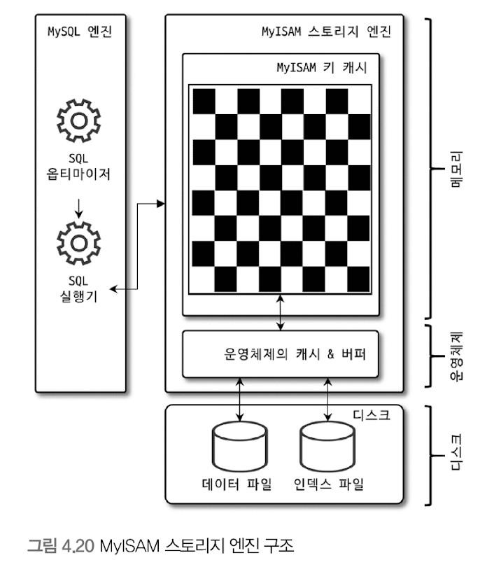

# MyISAM 스토리지 엔진 아키텍처

- 키워드
  - 키 캐시
  - 운영체제의 캐시/버퍼 

## 키 캐시 
- InnoDB의 버퍼 풀과 비슷한 역할을 함 
- 인덱스만을 대상으로 작동 
  - 인덱스의 디스크 쓰기 작업에 대해서만 부분적으로 버퍼링
  - 효율 계산 방법
    - 키 캐시 히트율 = 100 - (Key_reads / Key_read_requests * 100)

## 운영체제의 캐시 및 버퍼 
- 디스크로부터의 I/O를 해결 해줄만한 어떠한 캐시나 버퍼링 기능이 MyISAM에는 없다.
- MyISAM 테이블의 데이터 읽기나 쓰기 작업은 항상 OS의 디스크 읽기/쓰기 작업으로 요청될 수 밖에 없다.
  - 대부분의 OS는 디스크로부터 읽고 쓰는 파일에 대한 캐시나 버퍼링 메커니즘을 탑재하고 있다.
- InnoDB처럼 데이터의 특성을 알고 전문적으로 캐시나 버퍼링을 하지는 못함 
- OS의 캐시 공간은 남는 메모리를 사용하는 것이 기본 원칙 

## 데이터 파일과 PK(인덱스) 구조 
- InnoDB : PK에 의해서 클러스터링되어 저장 
- MyISAM : PK에 의한 클러스터링 없이, 데이터 파일이 Heap 공간처럼 활용됨 
  - 레코드가 PK값과 무관하게 insert 되는 순서대로 데이터 파일에 저장됨 
  - 레코드는 모두 ROWID라는 물리적인 주솟값을 가짐 
  - PK와 세컨더리 인덱스는 모두 데이터 파일에 저장된 레코드의 ROWID 값을 포인터로 가짐 
- ROWID
  - 고정 길이
    - 레코드 개수가 한정됨 
    - ROWID 값으로 4바이트 정수 사용 
    - 레코드가 insert된 순번이 ROWID로 사용됨 
  - 가변 길이
    - 2~7바이트까지의 가변적인 ROWID
    - 첫 번째 바이트 : ROWID 길이 저장 | 나머지 공간 : 실제 ROWID 저장 
    - 데이터 파일의 레코드 위치(offset)가 ROWID로 사용됨 
