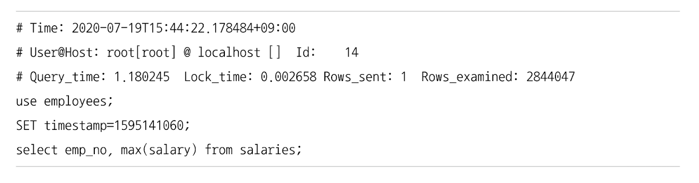
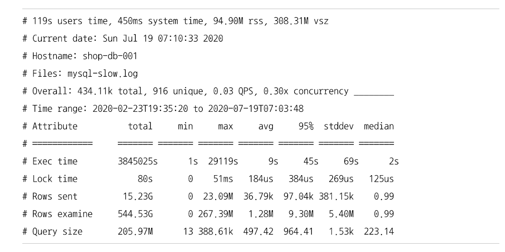
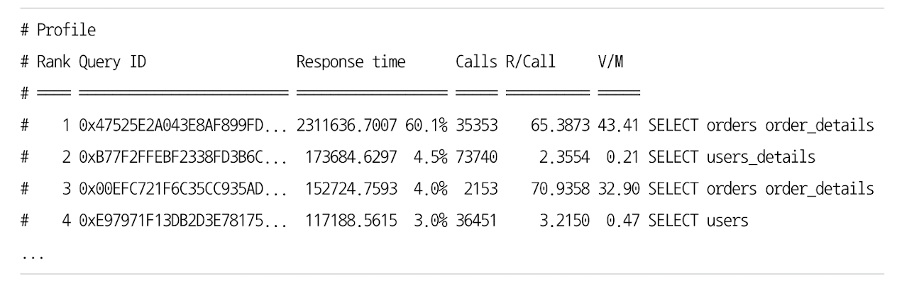
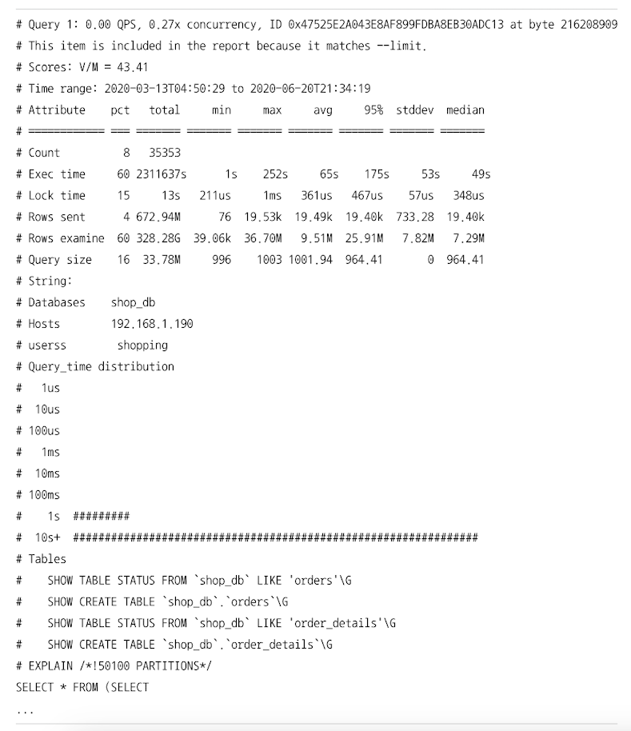

# MySQL 로그 파일 
## 에러 로그 파일 
- 발생하는 에러나 경고 메세지가 출력됨 
- MySQL 설정 파일(my.cnf)에서 `log_error`라는 이름의 파라미터로 정의된 경로에 생성됨 
  - 별도로 정의되지 않은 경우, 데이터 디렉터리(`datadir` 파라미터에 설정된 디렉터리)에 `.err`라는 확장자가 붙은 파일로 생성됨

### MySQL이 시작하는 과정과 관련된 정보성 및 에러 메세지 
- 설정 파일을 변경하거나 DB가 비정상 종료된 이후 다시 시작하는 경우
- 에러 로그 파일을 통해 설정된 변수 이름이나 값이 명확하게 설정되고 의도대로 적용됐는지 확인 
  - 서버가 정상적으로 기동했고(`mysqld: ready for connections` 메세지 확인), 새로 변경하거나 추가한 파라미터에 대한 특별한 에러나 경고성 메세지가 없다면 정상 적용 된 것 
- 특정 변수가 무시된 경우 
  - 서버는 정상 기동하지만, 해당 파라미터는 적용되지 못했음을 의미 
- 변수명을 인식하지 못하거나 설정된 파라미터 값의 내용을 인식하지 못하는 경우
  - MySQL 서버가 에러 메세지를 출력하고, 시작하지 못했다는 메세지를 보여줄 것임 

### 마지막으로 종료할 때 비정상적으로 종료된 경우 나타나는 InnoDB의 트랜잭션 복구 메세지 
- InnoDB는 서버가 비정상적/강제적으로 종료된 경우, 다시 시작되면서 다음과 같은 작업을 수행함 
  - 완료되지 못한 트랜잭션을 정리 
  - 디스크에 기록되지 못한 데이터가 있다면 다시 기록하는 재처리 작업 수행 
- 간단한 메세지가 출력 됨 
- 복구되지 못할 때는 해당 에러 메세지 출력하고 서버가 다시 종료됨 
  - 상대적으로 해결하기 어려운 문제점일 때가 많음 
  - `innodb_force_recovery`를 설정해야 할 수도 있음

### 쿼리 처리 도중에 발생하는 문제에 대한 에러 메세지 
- 사전 예방이 어렵다.
- 주기적으로 에러 로그 파일을 검토하는 과정에서 알게 됨 
- 쿼리 실행 도중 발생한 에러나, 복제에서 문제가 될 만한 쿼리에 대한 경고 메세지가 기록 됨 
- 자주 에러 로그 파일을 검토해야됨 

### 비정상적으로 종료된 커넥션 메세지(Aborted connection)
- 클라이언트 애플리케이션에서 정상적으로 접속 종료를 하지 못하고 프로그램이 종료된 경우 기록됨 
- 네트워크 문제로 의도치 않게 접속이 끊어지는 경우에도 이런 메세지가 기록됨 
- 애플리케이션의 커넥션 종료 로직을 검토해볼 필요가 있음 
- `"Host'host_name' is bloacked"` 에러
  - 클라이언트 호스트에서 발생한 에러의 횟수가 `max_connect_errors` 변수의 값을 넘게 되면 발생 

### InnoDB의 모니터링 또는 상태 조회 명령(show engine innodb status 등)의 결과 메세지
- InnoDB의 테이블 모니터링, 락 모니터링, 엔진 상태를 조회하는 명령은 상대적으로 큰 메세지를 에러 로그 파일에 기록함 
- InnoDB의 모니터링을 활성화 상태로 만들어 두고 그대로 유지하는 경우 에러 로그 파일이 매우 커짐 
  - 파일 시스템 공간을 다 사용해버릴 수도 있음 
  - 모니터링 사용 이후에는 다시 비활성화해서 에러 로그 파일이 커지지 않게 만들자

### MySQL의 종료 메세지
- 아무도 모르게 종료돼있거나, 아무도 모르게 재시작되는 경우 
  - MySQL이 마지막으로 종료되면서 출력한 메세지를 확인해야 이유를 알 수 있음 
- 누가 서버를 종료시켰다면 
  - `Received SHUTDOWN from user ...`라는 메세지 확인 가능 
- 아무런 종료 메세지가 없거나 스택 트레이스와 같은 내용이 출력되는 경우
  - MySQL 서버가 Segmentation fault로 비정상적으로 종료된 것임 
  - 스택 트레이스 내용을 최대한 참조하여 버그와 연관이 있는지 조사
  - 버전을 업그레이드 하거나 회피책을 찾는 것이 최적의 방법임  

## 제너럴 쿼리 로그 파일(general log)
- 서버에서 실행되는 쿼리가 어떤 것들이 있는지 전체 목록을 뽑아서 검토해야 할 때 사용 
- 쿼리 로그 활성화 -> 쿼리를 쿼리 로그 파일로 기록 -> 파일을 검토 
- 쿼리 로그를 파일로 저장할지 테이블로 저장할지는 `log_output` 파라미터로 결정함  

## 슬로우 쿼리 로그 
- MySQL 서버의 쿼리 튜닝
  - 서비스 적용 전에 전체적으로 튜닝
    - 검토해야 할 대상 쿼리가 전부라서 모두 튜닝하면 됨 
  - 서비스 운영 중에 전체적인 성능 저하를 검사하거나 정기적인 점검을 위한 튜닝
    - 어떤 쿼리가 문제의 쿼리인지 판단하기 어려움 
    - 이럴 때 슬로우 쿼리 로그를 보고 판단함  
- 설정한 시간 이상의 시간이 소요된 쿼리가 모두 기록됨 
  - 쿼리가 정상적으로 실행이 완료될 경우에만 기록됨  
- MySQL의 락 처리는 MySQL 엔진 레벨과 스토리지 엔진 레벨의 두 가지 레이어로 처리됨 
  - MyISAM, MEMORY는 별도의 스토리지 엔진 레벨의 락 X
  - InnoDB는 MySQL 엔진 레벨의 락과 스토리지 엔진 자체 락을 가지고 있음 

### 슬로우 쿼리 로그 출력 내용 

- Time : 쿼리가 종료된 시점을 의미 
  - 쿼리 시작 시점을 알고싶다면 Time 시간에서 Query_time 만큼 빼야 함 
- User@Host : 쿼리를 실행한 사용자의 계정
- Query_time : 쿼리가 실행되는 데 걸린 전체 시간을 의미 
- Lock_time : MySQL 엔진 레벨에서 관장하는 테이블 락에 대한 대기 시간 
  - 실제 쿼리가 실행되는 데 필요한 락 체크와 같은 코드 실행 부분의 시간까지 포함됨. 이 값이 매우 작다면 무시할 것
- Rows_examined : 해당 쿼리가 처리되기 위해 몇 건의 레코드에 접근했는지를 의미 
  - Rows_sent : 실제 몇 건의 처리 결과를 클라이언트로 보냈는지를 의미 
  - Row_examined는 높지만 Rows_sent가 상당히 적다면, 이 쿼리는 더 적은 레코드에 접근하도록 튜닝해볼 가치가 있음 
  - group by, count, min, max, avg 등과 같은 집합 함수가 아닌 쿼리인 경우에만 해당함  

- MyISAM, MEMORY : 테이블 단위의 락 사용 & MVCC 메커니즘이 없음 -> select 쿼리라도 Lock_time이 1초 이상 소요될 가능성이 있음 
- InnoDB : select 쿼리의 Lock_time이 상대적으로 큰 값이 발생할 경우, InnoDB 레코드 수준 락이 아닌 MySQL 엔진 레벨에서 설정한 테이블 락 때문일 가능성이 높음 
  - InnoDB 테이블에만 접근하는 쿼리 문장의 슬로우 쿼리 로그에서의 Lock_time 값은 튜닝이나 쿼리 분석에 별 도움이 안됨 

- 슬로우 쿼리 또는 제너럴 로그 파일의 내용이 상당히 많아서 직접 쿼리를 하나씩 검토하기에는 시간이 너무 많이 걸리거나, 어느 쿼리를 집중적으로 튜닝해야 할지 식별하기 어려울 경우
  - Percona Toolkit의 `pt-query-digest` 스크립트를 이용해서 쉽게 빈도나 처리 성능별로 쿼리를 정렬해서 살펴볼 수 있음  

### 슬로우 쿼리 통계

### 실행 빈도 및 누적 실행 시간순 랭킹 

### 쿼리 별 실행 횟수 및 누적 실행 시간 상세 정보 
