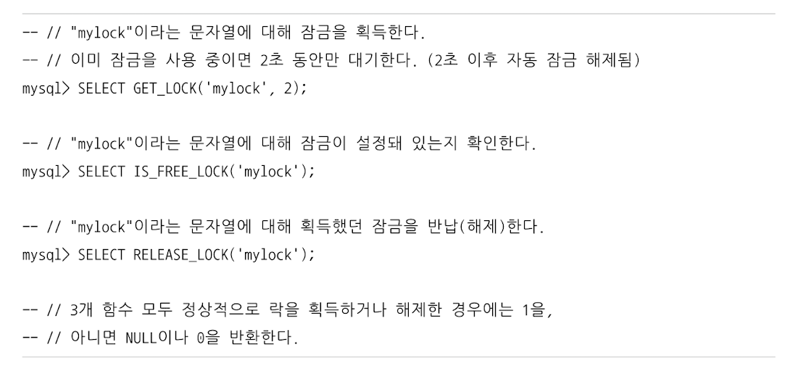
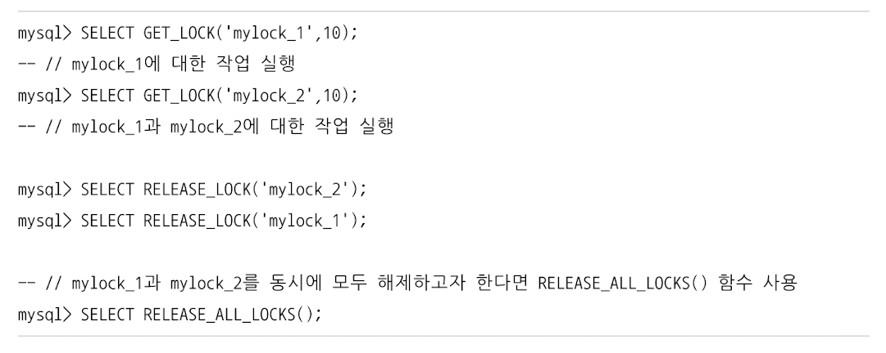
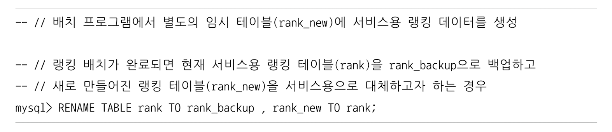
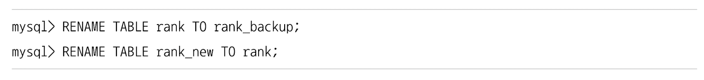
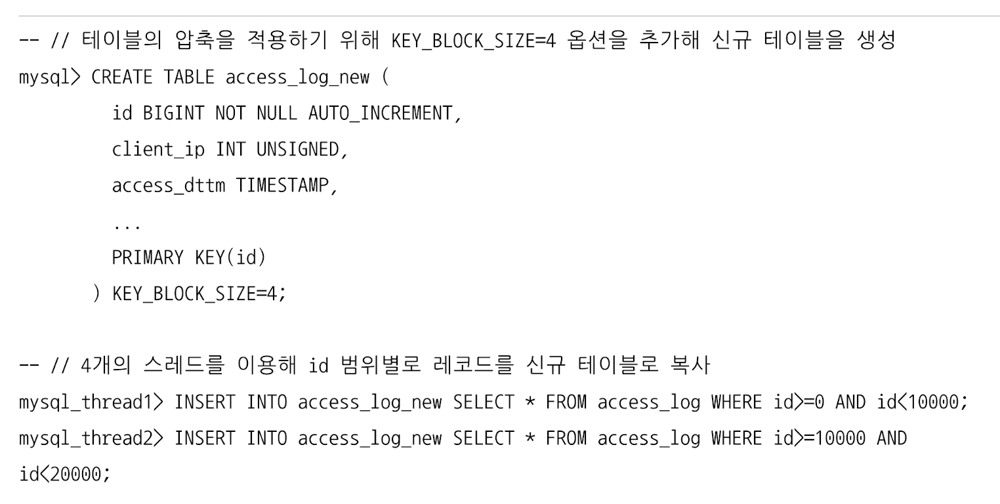
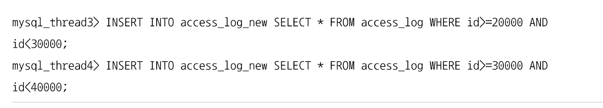
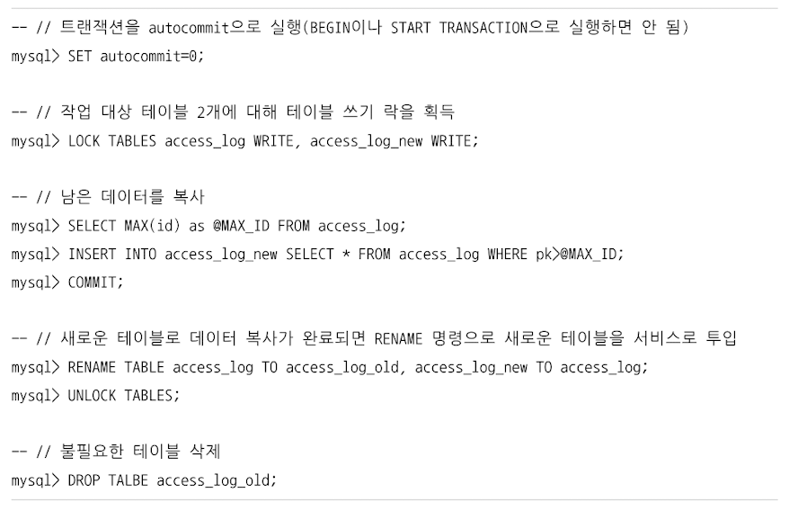

# MySQL 엔진의 락 
- MySQL 엔진 레벨의 락
  - 스토리지 엔진을 제외한 나머지 부분
  - 해당 엔진의 락은 모든 스토리지 엔진에 영향을 미침<br/><br/>
- 스토리지 엔진 레벨의 락
  - 해당 엔진의 락은 스토리지 엔진 간 상호 영향을 미치지 않음<br/><br/> 


## 글로벌 락
```mysql
# 해당 명령 실행과 동시에 서버에 존재하는 모든 테이블을 닫고 락을 검 
flush tables with read lock;
```
- 가장 범위가 큰 락 
- 한 세션에서 글로벌 락을 획득한 상태일 경우  
  - 다른 세션에서 select를 제외한 대부분의 DDL문장이나 DML문장을 실행하면 글로벌 락이 해제될 때까지 해당 문장이 대기 상태로 남음
- 영향 범위 : 서버 전체 (심지어 데이터베이스가 달라도 영향)
- 웹 서비스용 서버에서는 가급적 사용하지 말것 
  - mysqldump와 같은 백업 프로그램은 글로벌 락을 사용할 수도 있으니 확인해볼것 

### 조금 더 가벼운 글로벌 락 (MySQL 8.0 ~)
- Xtrabackup, Enterprise Backup과 같은 백업 툴들의 안정적인 실행을 위해 백업 락 도입 
  - `lock instance for backup`<br/><br/>
- 특정 세션에서 백업락 획득 시 불가능한 것들 
  - db, table 등 모든 객체 생성 및 변경, 삭제 불가 
  - repair table, optimize table 불가 
  - 사용자 관리 및 비밀번호 변경 -> 인증 관련 정보 불가<br/><br/>
- 가능한 것들
  - 일반적인 테이블의 데이터 변경이 가능하긴 함
  - mysql 서버 구성 = 소스 서버 + 레플리카 서버 
  - 주로 백업은 레플리카 서버에서 수행
  - 원래는 백업 중에 스키마 변경이 실행되면 백업이 실패하지만, 백업 락이 도입 됨으로써 DDL 명령이 실행되면 복제를 일시 중지 한다.<br/><br/> 


## 테이블 락 
- 개별 테이블 단위로 설정되는 락
- 명시적 락 획득 : `lock tables table_name [read|write]`
  - `unlock tables`명령어로 락 반납 
  - 특별 상황이 아닐 경우, 애플리케이션 내에서 사용할 필요가 거의 없음<br/><br/> 
- 묵시적 테이블 락
  - myisam, memory 스토리지 엔진의 테이블에 데이터 변경 쿼리를 실행하면 발생 
  - 변경되는 테이블에 락 -> 데이터 변경 -> 락 반납 <br/><br/>
- InnoDB 테이블은 스토리지 엔진 차원에서 레코드 기반 락 제공 
  - 단순 데이터 변경 쿼리로 인해 묵시적 테이블 락이 설정되지 않음 
  - 테이블 락이 설정되지만, 데이터 변경(dml) 쿼리에서는 무시되고, 스키마를 변경하는 쿼리(ddl)의 경우에만 영향 미침 <br/><br/>


## 네임드 락 
- `get_lock`함수를 이용해 임의의 문자열에 대해 락 설정 
- 락의 대상이 테이블, 레코드, auto_increment와 같은 데이터베이스 객체가 아님 
- 단순히 사용자가 지정한 문자열에 대해 락을 획득하고 반납하는 형식임
- 자주 사용되지는 않음<br/><br/>

- 여러 클라이언트가 상호 동기화를 처리해야 할 때 사용하면 좋음

  


- 복잡한 요건으로 레코드를 변경하는 트랜잭션에 유용함 

  - 한꺼번에 많은 레코드 변경 -> 데드락의 원인
  - 동일 데이터를 변경하거나, 참조하는 프로그램끼리 분류 -> 네임드 락을 걸고 쿼리 실행 <br/><br/>


## 메타데이터 락 
- 데이터베이스 객체(테이블, 뷰 등)의 이름이나 구조를 변경하는 경우 획득하는 락
- 명시적 획득/해제 불가 
- `rename table tab_a to tab_b`와 같이 테이블 이름을 변경하는 경우 자동으로 획득 
  - 원본 이름과 변경될 이름 두 개 모두 한꺼번에 락을 설정함 
- 실시간으로 테이블을 바꿔야 하는 요건이 배치 프로그램에서 자주 발생하는데, 이 떄 사용함



- 위와 같이 rename table 명령어에 두 개의 rename 작업을 한꺼번에 실행하면 문제를 발생시키지 않고 적용 가능함
- 하지만 다음과 같이 2개로 나눠서 실행할 경우, 아주 짧은 시간이지만 rank 테이블이 존재하지 않는 순간이 생김 

  - "Table not found 'rank'" 오류 발생 


### 메타데이터 락과 InnoDB 트랜잭션을 동시에 사용해야 하는 경우 
- 다음과 같은 구조의 insert만 실행되는 로그 테이블이 있을 경우 
  - 해당 테이블은 웹 서버의 액세스 로그를 저장만 하기 때문에 update, delete 없음 
```mysql
CREATE TABLE access_log (
    id BIGINT NOT NULL AUTO_INCREMENT, 
    client_ip INT UNSIGNED,
    access_dttm TIMESTAMP,
    # ...
    PRIMARY KEY(id)
);
```

- 위 테이블의 구조를 변경해야 할 일이 발생했다면?
  - mysql의 online ddl의 시간이 오래 걸리는 경우라고 가정하자 
  - 그렇게 되면 언두 로그가 증가할 뿐만 아니라, online ddl이 실행되는 동안 누적된 online ddl 버퍼의 크기 등 고민해야 할 문제가 많음 
  - mysql 서버의 ddl은 단일 스레드로 작동함 -> 시간 오래 걸림 <br/><br/> 
- 이럴 경우 새로운 구조의 테이블을 생성하고, 최근의 데이터까지는 pk인 id 값을 범위 별로 나눠서 여러 개의 스레드로 빠르게 복사하자 





- 나머지 데이터는 트랜잭션과 테이블 락, rename table 명령으로 응용 프로그램의 중단 없이 실행 가능 
  - 남은 데이터를 복사하는 시간 동안에는 테이블 락으로 인해 insert 불가




