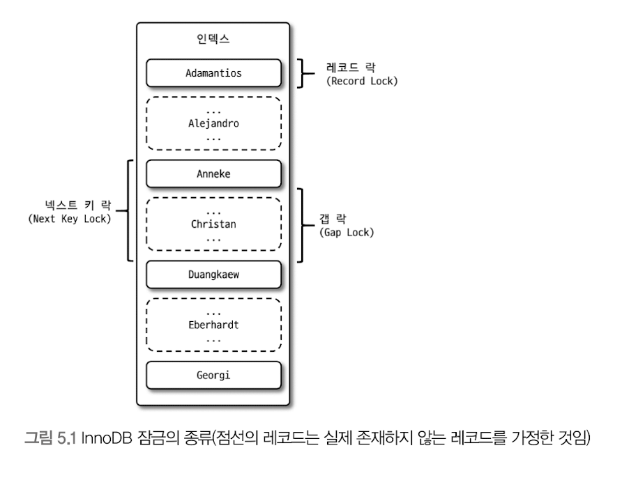
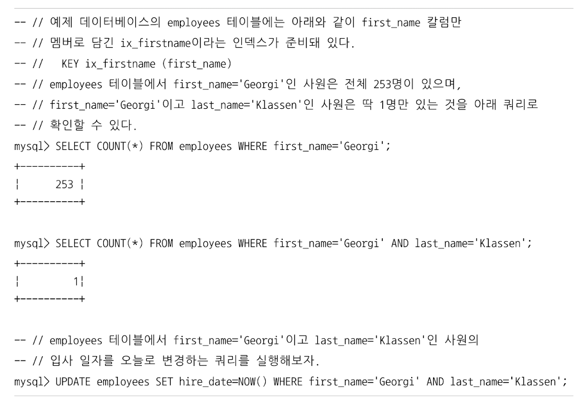
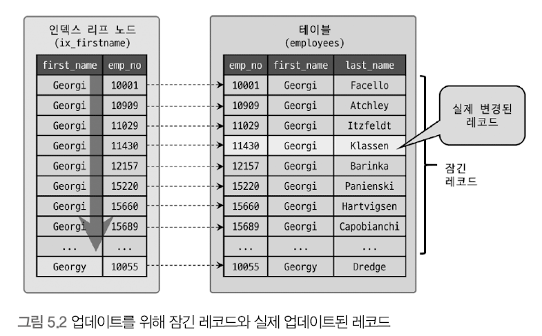
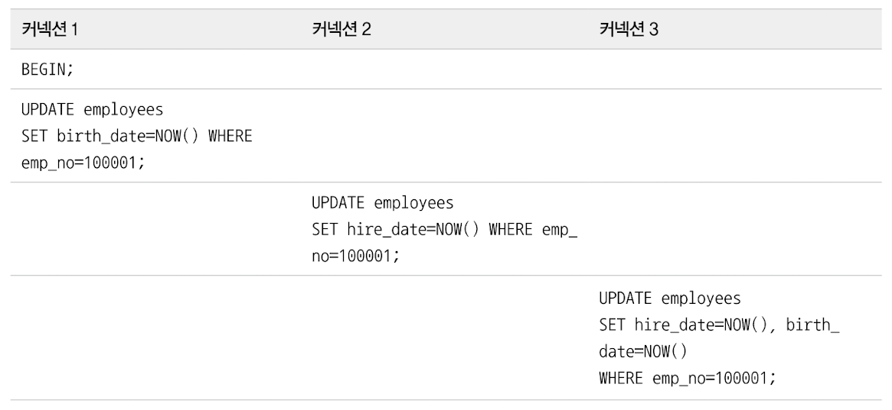
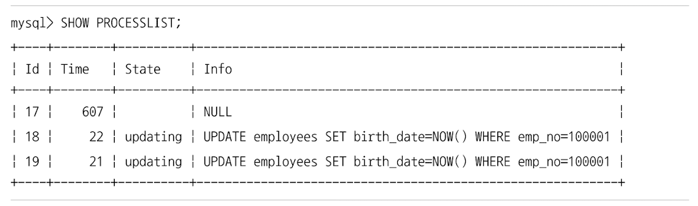
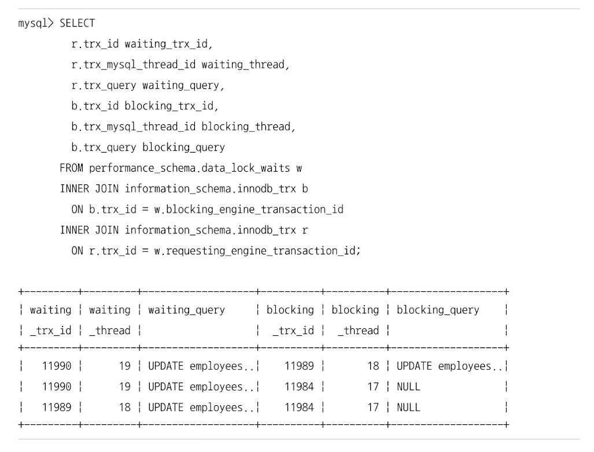

# InnoDB 스토리지 엔진 락
- 레코드 기반 락 방식 
- 뛰어난 동시성 처리

## InnoDB 스토리지 엔진의 락 

- 레코드 기반 락
- 락 정보가 상당히 작은 공간으로 관리 됨 
  - 락 에스컬레이션이 없음 
    - 레코드 락 -> 페이지 락 or 테이블 락으로 레벨업 되는 경우 
- 레코드 락 뿐만 아니라, 레코드와 레코드 사이의 간격을 잠그는 갭(Gap)락이 존재함   

### 레코드 락 
- 레코드 자체만을 잠그는 락 
- 레코드 자체가 아닌, 인덱스의 레코드를 잠금
  - 인덱스가 하나도 없어도, 내부적으로 생성된 클러스터 인덱스를 이용해 락을 설정함   

### 갭 락 
- 레코드 자체가 아닌, 레코드와 바로 인접한 레코드 사이의 간격만을 잠금 
- 즉, 레코드와 레코드 사이의 간격에 새로운 레코드가 생성되는 것을 제어함 
- 해당 락은 자체보다는 넥스트 키 락의 일부로 자주 사용됨   

### 넥스트 키 락
- 레코드 락 + 갭 락 
- MySQL의 격리 수준 : Repeatable read (statement 포맷을 사용하기 때문?)
  - 이에 더해, `innodb_locks_unsafe_for_binlog` 시스템 변수가 비활성화 되면, 변경을 위해 검색하는 레코드에는 넥스트 키 락 방식의 잠금이 걸림 
- 갭 락, 넥스트 키 락 
  - 바이너리 로그에 기록되는 쿼리가 레플리카 서버에서 실행될 때 소스 서버에서 만들어 낸 결과와 동일한 결과를 만들어내도록 보장하는 것이 주 목적임 
  - 해당 락으로 인해 데드락이 발생하거나, 다른 트랜잭션을 기다리게 만드는 일이 자주 발생함
  - 가능하다면 바이너리 로그 포맷을 ROW 형태로 바꿔서 넥스트 키 락이나 갭 락을 줄이는 것이 좋음 
> 즉, statement 포맷의 바이너리 로그의 단점을 row 포맷의 바이너리 로그가 많이 해결해줌. (MySQL8.0의 default)
  

### 자동 증가 락 
- auto_increment 컬럼이사용된 테이블에 동시에 여러 레코드가 insert되는 경우, 각 레코드의 일련번호는 중복되지 않고 저장 순서대로 증가하는 값이어야 함.
  - 이를 위해 내부적으로 auto_increment 락이라는 **테이블 수준의 락** 사용 
- insert, replace와 같이 새로운 레코드를 저장하는 쿼리에서만 락이 걸림 
- 해당 락은 트랜잭션과 관계 없이 auto_increment 값을 가져오는 순간만 락이 걸렸다가 즉시 해제됨 
  - 짧은 시간이므로, 문제가 되는 경우가 거의 없음
- 테이블에 단 하나만 존재 
  - 두 개 이상의 insert 쿼리가 동시 실행되는 경우 
  - 하나의 쿼리가 auto_increment 락을 걸면 나머지 쿼리는 기다려야함   
- `innodb_autoinc_lock_mode=1`로 설정할 경우
  - 한건/여러건의 레코드 insert 
  - 서버가 insert 되는 레코드 건수를 정확히 예측할 수 있을 때
    - 자동 증가 락을 사용하지 않고, 훨씬 가볍고 빠른 래치(뮤텍스)를 이용해 처리함 (아주 짧은 시간 동안만 락 걸고 필요한 자동 증가 값을 가져오면 즉시 해제)
  - 서버가 예측할 수 없을 때 
    - 자동 증가 락 사용 
  - 대량 insert가 수행될 때 
    - InnoDB 스토리지 엔진은 여러 개의 자동 증가 값을 한번에 할당 받아, insert되는 레코드에 사용함 
    - 대량 insert 레코드는 자동 증가 값이 누락되지 않고 연속되게 insert 됨 
    - 자동 증가 값이 남아서 사용되지 못한다면 폐기함 -> 대량 insert 문장 실행 후 insert되는 레코드의 자동 증가 값이 연속되지 않고, 누락된 상황이 발생할 수 있음 
    - 해당 설정에서는 하나의 insert 문장으로 insert되는 레코드는 연속된 자동 증가 값을 가지게 됨 
    - 연속 모드라고도 부름   
- `innodb_autoinc_lock_mode=2 -> MySQL8.0 디폴트!!`
  - 절대 자동 증가 락을 걸지 않고, 경량화된 래치(뮤텍스)를 사용함 
  - 연속된 자동 증가 값 보장 x
  - 인터리빙 모드(interleaved mode)
  - 대량 insert 문장이 실행되는 중에도 다른 커넥션에서 insert를 수행할 수 있음 -> 동시 처리 성능 증가 
  - 유니크한 값이 생성된다는 것만 보장함   

> 자동 증가 값이 한 번 증가하면 절대 줄어들지 않는 이유 
> - auto_increment 락 최소화 하기 위함 
> - 쿼리가 실패해도 한 번 증가된 auto_increment 값은 줄어들지 않고 그대로 남음

  
 

### 인덱스와 잠금 

- 위의 경우, first_name='Georgi'의 레코드 253건의 레코드가 모두 잠김
- update 문장을 위해 적절히 인덱스를 준비돼 있지 않을 경우, 클라이언트 간 동시성이 상당히 떨어짐
  - 한 세션에서 update 작업 시 다른 클라이언트는 해당 테이블을 업데이트 하지 못하고 기다려야 하는 상황이 발생
- 인덱스가 하나도 없을 경우 -> 테이블 풀 스캔 -> 모든 레코드 잠금 
  - InnoDB에서의 인덱스 설계가 중요한 이유임   

### 레코드 수준의 락 확인 및 해제 
- 테이블 락 -> 테이블 자체를 잠금 -> 문제 발생 시 해결이 쉬움 
- 레코드 수준의 락 -> 테이블의 레코드 각각에 락 -> 레코드가 자주 사용되지 않는 경우 오랜 시간 락이 걸려있어도 잘 발견되지 않음    

#### 예시  

- 명령 3개 순차 실행    

- 명령 3개가 실행된 프로세스 목록 조회 
- 17번 스레드 : 트랜잭션 시작 후 update 명령 실행 완료 & 락 가지고있음 
- 18번 -> 19번 순서로 명령 실행 -> 락 대기 중     

- 대기 중인 스레드 18번, 19번
- 18번 스레드 : 17번 스레드를 기다림
- 19번 스레드 : 17번, 18번 스레드를 기다림 

