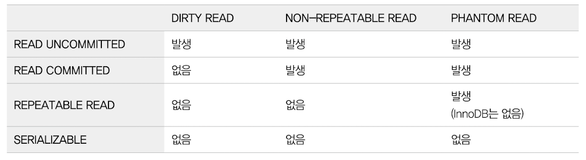
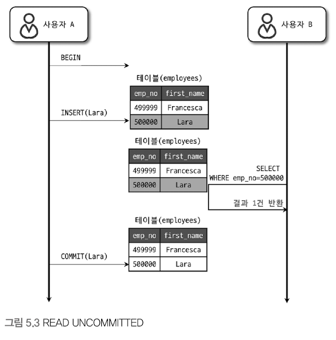
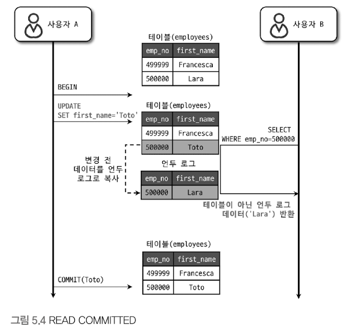
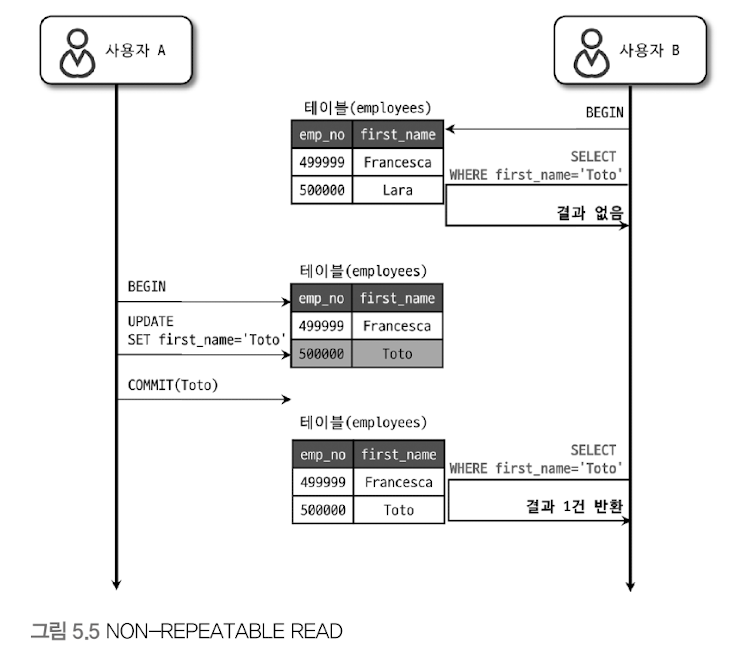
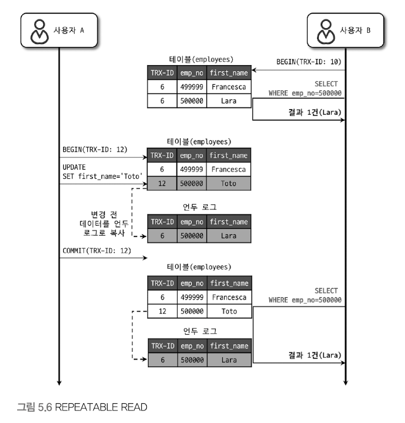
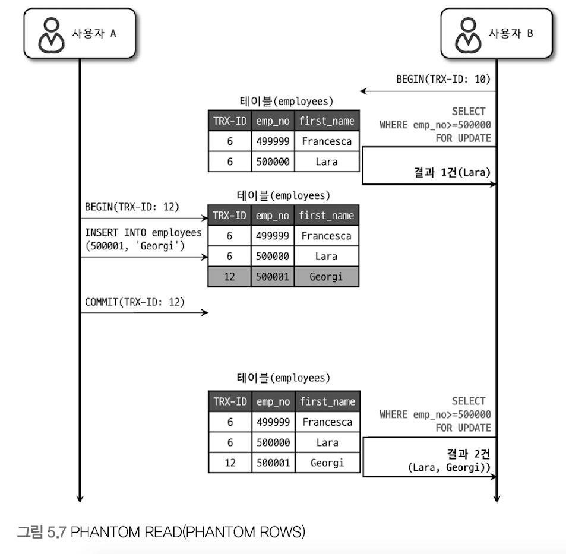

# MySQL의 격리 수준 
- 격리 수준?
  - 여러 트랜잭션이 동시 처리될 때 특정 트랜잭션이 다른 트랜잭션에서 변경하거나 조회하는 데이터를 볼 수 있게 허용할지 말지를 결정하는 것 
- 격리 수준의 분류 (아래로 갈 수록 격리 정도 증가 & 동시 처리 성능 감소)
  - read uncommitted -> dirty read라고도 함 (일반 데이터베이스에서 거의 사용 X)
  - read committed
  - repeatable read
  - serializable -> 동시성이 중요한 데이터베이스에서 거의 사용 X    

- serializable 격리 수준이 아니라면 크게 성능의 개선이나 저하는 발생하지 않음 

#### 3 가지 부정합 문제

- 오라클 -> read committed
- MySQL -> repeatable read   

## READ UNCOMMITTED

- 커밋, 롤백 되지 않아도 조회 가능 (**더티 리드 부정합 발생**)
  - 롤백해도 모를 수 있다는 것이 문제. 있다고 생각하고 작업하게 될 것임.
- 더티 리드는 데이터가 나타났다 사라졌다 하는 현상을 초래 
- 정합성에 문제가 아주 많은 격리 수준
- 절대 사용 X
  

## READ COMMITTED

- 오라클 기본 격리 수준 
- 커밋이 완료된 데이터만 다른 트랜잭션에서 조회 가능
  - 더티 리드 발생하지 않음 
- **`non-repeatable read`부정합 발생**  

### NON-REPEATABLE READ

- 한 트랜잭션 내에서 같은 데이터를 여러번 조회할 경우, 항상 같은 결과가 나와야 함. 
  - 하지만 READ COMMITTED 격리 수준에서는 위 그림과 같이 NON-REPEATABLE READ가 발생할 수 있음
- **금융 관련 업무**와 연결될 경우 문제가 될 수 있음
  

## REPEATABLE READ
- MySQL InnoDB 스토리지 엔진에서 기본적으로 사용되는 격리 수준 
  - 바이너리 로그를 가진 MySQL 서버에서는 최소 REPEATABLE READ 격리 수준 이상을 사용해야 함 
- NON-REPEATABLE READ 발생하지 않음 
- InnoDB 스토리지 엔진 -> 트랜잭션 롤백에 대비해 변경되기 전 레코드를 언두 공간에 백업 -> 실제 레코드 변경 (MVCC)
  - MVCC를 위해 언두 영역에 백업된 이전 데이터를 이용해, 동일 트랜잭션 내에서는 동일한 결과를 보여줄 수 있게 보장함 
  - 사실 READ COMMITTED도 MVCC를 이용해 커밋 되기 전의 결과를 보여줌 
  - 둘 간의 차이는 **언두 영역에 백업된 레코드의 여러 버전 가운데, 몇 번째 이전 버전까지 찾아 들어가야 하느냐**에 있음   

- 모든 InnoDB의 트랜잭션은 고유한 트랜잭션 번호(순차 증가하는 값)를 가짐 
  - 언두 영역에 백업된 모든 레코드에는 변경을 발생시킨 트랜잭션의 번호가 포함돼 있음 
  - 백업된 데이터는 InnoDB 스토리지 엔진이 불필요하다고 판단하는 시점에 주기적으로 삭제함   

- 해당 격리 수준에서는 MVCC를 보장하기 위해 실행 중인 트랜잭션 가운데, 가장 오래된 트랜잭션 번호보다 트랜잭션 번호가 앞선 언두 영역의 데이터는 삭제할 수 없음.
  - 그렇다고 가장 오래된 트랜잭션 번호 이전의 트랜잭션에 의해 변경된 모든 언두 데이터가 필요한 것은 아님 
  - 더 정확하게는, 특정 트랜잭션 번호의 구간 내에서 백업된 언두 데이터는 보존돼야 함   

### 작동 방식 

- N번 트랜잭션이 레코드를 조회 -> 무조건 자기 자신보다 작은 트랜잭션 번호에서 변경한 것만 보게 됨 (언두 로그)   

### 팬텀 리드 부정합 

- 다른 트랜잭션에서 수행한 변경 작업에 의해 레코드가 보였다 안보였다 하는 현상을 의미 
- `select ... for update` -> 레코드에 쓰기 락을 걸어야 하는데, 언두 레코드에는 락을 걸 수 없음
  - `select ... for update`, `select ... lock in share mode`로 조회되는 레코드는 언두 영역의 변경 전 데이터를 가져오지 않고, 현재 레코드의 값을 가져옴
  

## SERIALIZABLE
- 가장 단순하고, 가장 엄격한 격리 수준
- 동시 처리 성능이 매우 안좋음 
- InnoDB 테이블에서 순수한 select 작업은 아무런 레코드 락도 설정하지 않고 실행 됨 
  - `non-locking consistent read(잠금이 필요 없는 일관된 읽기)`라는 말이 이를 의미하는 것임 
  - 하지만 해당 격리 수준은 읽기 작업도 락이 걸림 
- 팬텀 리드가 발생하지 않음 
- 하지만, InnoDB 스토리지 엔진에서는 갭 락과 넥스트 키 락 덕분에 REPEATABLE READ 수준에서도 팬텀 리드가 발생하지 않아, 굳이 SERIALIZABLE 격리 수준을 사용할 필요가 없다.
  - 엄밀하게는 `select ... for update`, `select ... lock in share mode`의 경우에는 팬텀 리드가 발생한다.

  