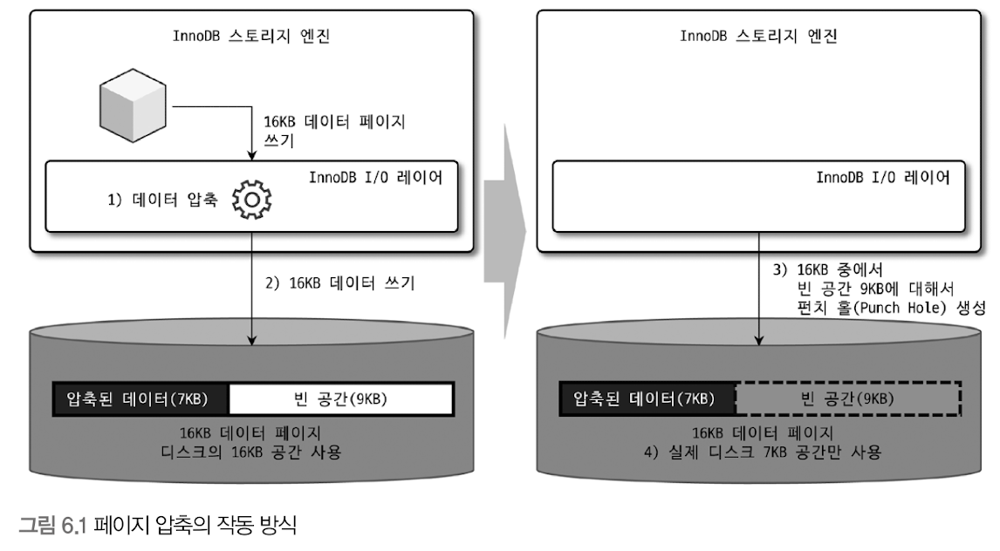
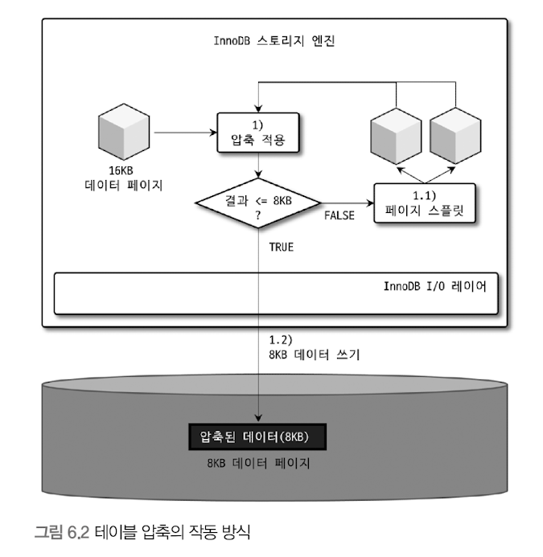

# 데이터 압축
- 데이터 파일의 크기 
  - 쿼리 처리 성능과 직결됨 
  - 백업 & 복구 시간과 밀접하게 연결됨
- 디스크 데이터 파일의 크기가 클 수록
  - 쿼리를 처리하기 위해 더 많은 데이터 페이지를 InnoDB 버퍼 풀로 읽어야 할 수 있음 
  - 새로운 페이지가 버퍼 풀로 적재 -> 더티 페이지가 더 자주 디스크로 기록 됨 
  - 백업 시간이 오래 걸림 
  - 복구 시간이 오래 걸림 

## 페이지 압축 (Transparent Page Compression) 
[페이지가 대체 뭔데?????](https://en.wikipedia.org/wiki/Page_(computer_memory))

[이 글도 참고](https://www.geeksforgeeks.org/paging-in-operating-system/)
- 디스크에 저장하는 시점에 데이터 페이지가 압축되어 저장 됨 
- MySQL 서버가 디스크에서 데이터 페이지를 읽어올 때 압축이 해제 됨 
- 버퍼풀에 데이터 페이지 적재 -> InnoDB는 압축이 해제된 상태로만 데이터 페이지 관리 
  - 압축 여부와 관계 없이 투명(Transparent)하게 작동함 


- 16kb 데이터 페이지를 압축한 결과 예측 불가 -> 적어도 하나의 테이블은 동일한 크기의 페이지(블록)로 통일돼야 하는게 문제임
- 그래서 페이지 압축 기능은 os별로 특정 버전의 파일 시스템에서만 지원되는 펀치 홀(Punch hole)이라는 기능을 사용함
  - [펀치홀 관련 자료1](https://flashsql.github.io/mysql/2018/04/18/test9.html)
  - [펀치홀 관련 자료2](https://lwn.net/Articles/415889/)


OS 파일 시스템의 블록 사이즈가 512byte라면 페이지 압축 작동 방식은 다음과 같다.

```text
1. 16kb 페이지를 압축(압축 결과 7kb로 가정)
2. MySQL 서버는 디스크에 압축된 결과인 7kb를 기록 
  - 이 때, MySQL 서버는 압축 데이터 7kb에 9kb의 빈 데이터를 기록함
3. 디스크에 데이터를 기록한 후, 7kb 이후의 공간인 9kb에 대해 펀치 홀(Punch-hole)을 생성
4. 파일 시스템은 7kb만 남기고 나머지 디스크의 9kb 공간은 다시 OS로 반납
  -> 압축된 만큼의 공간을 절약   
```
- 실제 디스크 공간은 7kb만 사용하나, OS에서 16kb를 읽으면 압축된 데이터 7kb와 펀치 홀 공간인 9kb를 합쳐서 16kb를 읽음

### 페이지 압축의 문제점 
- 펀치 홀 기능은 OS 뿐만 아니라, 하드웨어 자체에서도 해당 기능을 지원해야 사용할 수 있음 
- 파일 시스템 관련 명령어가 펀치 홀을 지원하지 못함 
- 펀치 홀이 적용되어 크기가 줄어도, `cp`와 같은 파일 복사 명령이나 `XtraBackup` 같은 툴이 파일을 복사하면 펀치 홀이 다시 채워져서 데이터 파일의 크기는 원본 크기가 될 수도 있음 
- 실제로 페이지 압축은 많이 사용되지 않는 상태다.


<br/><br/>

## 테이블 압축
- OS나 하드웨어에 대한 제약 없이 사용 가능 -> 높은 활용도
- 장점 : 디스크 데이터 파일 크기를 줄일 수 있어, 그만큼의 이득 O
- 단점 
  - 낮은 버퍼 풀 공간 활용률
  - 낮은 쿼리 처리 성능
  - 빈번한 데이터 변경 시 압축률 감소 

<br/><br/>

### 압축 테이블 생성 
- 페이지 타깃 크기는 2n으로만 설정 가능 (16kb -> 4kb or 8kb)
- 페이지 크기가 32kb or 64kb인 경우 테이블 압축 불가


```text
1. 16KB의 데이터 페이지를 압축
    1.1 압축된 결과가 8Kb 이하이면 그대로 디스크에 저장(압축 완료)
    1.2 압축된 결과가 8Kb를 초과하면 원본 페이지를 스플릿(split)해서 2개의 페이지에 8Kb씩 저장
2. 나뉜 페이지 각각에 대해 "1"번 단계를 반복 실행
```
- InnoDB I/O 레이어에서는 아무런 역할을 하지 않음 
- 목표 크기를 잘못 설정하면 서버 처리 성능이 급격히 떨어짐


- insert 후 변경이 발생하지 않는 로그 테이블은 압축 실패로 인해 여러번 압축하는 게 큰 손해는 아닐 것임
- 조회와 변경이 빈번한 테이블은 압축을 고려하지 않는 게 좋음 


> 주의 : 압축은 예상 외로 많은 CPU 자원을 소모한다.

<br/><br/>

### 압축된 페이지의 버퍼 풀 적재 및 사용 
- InnoDB 스토리지 엔진 
  - 압축된 테이블의 데이터 페이지를 버퍼 풀에 적재할 경우, 압축된 상태와 압축이 해제된 상태 2개 버전을 관리 함
    - 디스크에서 읽은 상태 그대로의 데이터 페이지 목록을 관리하는 LRU 리스트 
    - 압축된 페이지들의 압축 해제 버전인 Unzip_LRU


- 서버 상에는 압축된 테이블과 압축되지 않은 테이블이 공존함 -> LRU 리스트는 다음과 같은 페이지를 모두 가질 수 있음 
  - 압축 미적용 테이블의 데이터 페이지
  - 압축 적용 테이블의 압축된 데이터 페이지 


- Unzip_LRU 리스트
  - 압축 적용 테이블에서 읽은 데이터 페이지만 관리 
  - 압축을 해제한 상태의 데이터 페이지 목록도 관리 됨


- 단점
  - 결국, InnoDB 스토리지 엔진은 버퍼 풀의 공간을 이중으로 사용하게 되어 메모리를 낭비하는 효과를 낳음 
  - 압축된 페이지에서 데이터 변경/조회할 경우 압축을 해제해야 함 -> CPU 자원 소모량 증대


- 단점 보완을 위해 Unzip_LRU 리스트를 별도 관리하고 있다가 서버로 유입되는 요청 패턴에 따라 적절히(Adaptive) 다음과 같은 처리 수행 
  - InnoDB 버퍼 풀의 공간이 필요한 경우에는 LRU 리스트에서 원본 데이터 페이지(압축된 형태)는 유지하고, Unzip_ LRU 리스트에서 압축 해제된 버전은 제거해서 버퍼 풀의 공간을 확보한다. 
  - 압축된 데이터 페이지가 자주 사용되는 경우에는 UnZip_LRU 리스트에 압축 해제된 페이지를 계속 유지하면서 압축 및 압축 해제 작업을 최소화한다. 
  - 압축된 데이터 페이지가 사용되지 않아서 LRU 리스트에서 제거되는 경우에는 UnZip LRU 리스트에서도 함께 제거 된다.


### 어댑티브(적응적인) 알고리즘 
- 버퍼 풀에서 압축 해제된 버전의 데이터 페이지를 적절한 수준으로 유지하기 위해 사용하는 알고리즘
  - CPU 사용량이 높은 서버에서는 가능하면 압축과 압축 해제를 피하기 위해 Unzip LRU의 비율을 높여서 유지하고
  - Disk IO 사용량이 높은 서버에서는 가능하면 Unzip LRU 리스트의 비율을 낮춰서 InnoDB 버퍼 풀의 공간을 더 확보하도록 작동한다.


