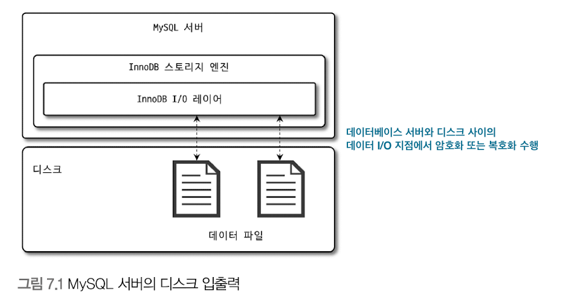
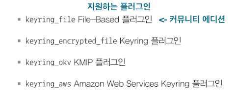
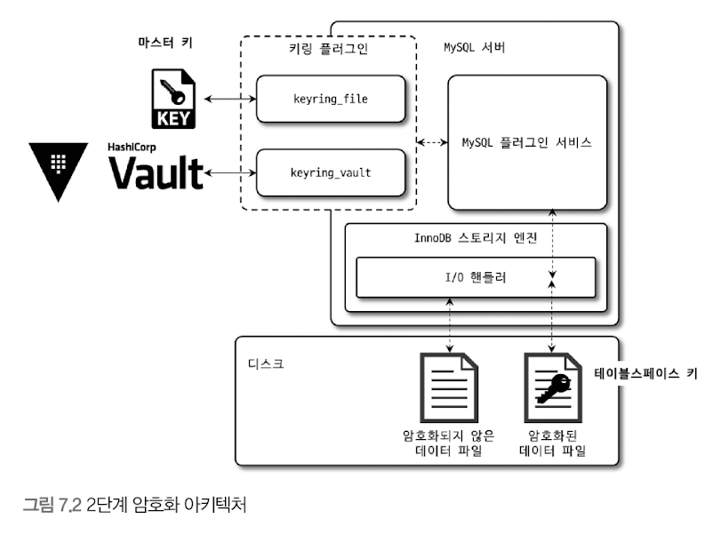
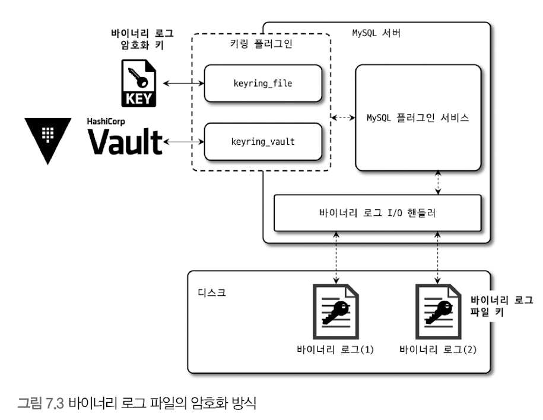
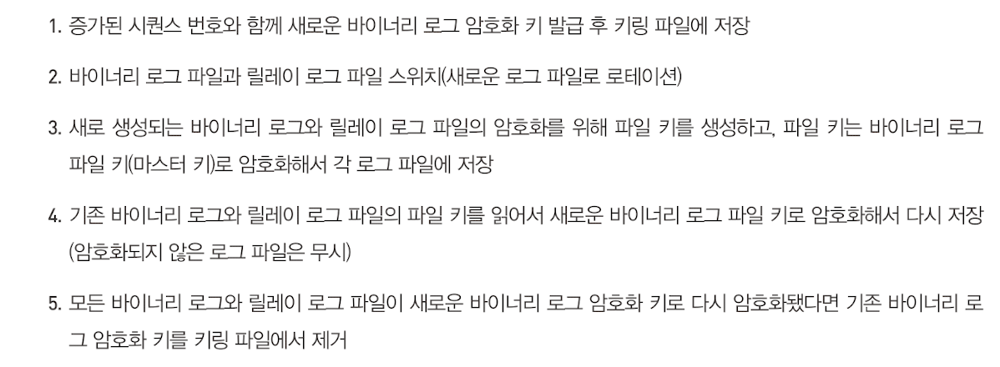

# 데이터 암호화 
## MySQL 서버의 데이터 암호화 

- MySQL 서버(InnoDB 스토리지 엔진)의 I/O 레이어에서만 데이터의 암호화/복호화 과정 실행 
  - 서버 내부와 사용자 입장에서는 아무런 차이가 없음 
- 이런 암호화 방식을 `TDE(Transparent Data Encryption)` 혹은 `Data at Rest Encryption`이라고 함
  - Data at Rest : 메모리(In-Process)나 네트워크 전송(In-Transit) 단계가 아닌 **디스크에 저장(At Rest)된 단계에서만 암호화 된다**는 의미임

<br/><br/>

### 2단계 키 관리 
- TDE의 암호화 키는 키링(KeyRing) 플러그인에 의해 관리 됨 
  - </img>

<br>

2단계(2-Tier) 키 작동 방식은 다음과 같다.
 
- 마스터 키 + 테이블 스페이스 키 
  - 테이블 스페이스 키 == 프라이빗 키 
```text
[ 기본 작동 방식 ]
1. 외부 키 관리 솔루션(KMS, Key Management Service) 또는 디스크의 파일(플러그인)에서 마스터 키를 가져옴 
2. 암호화된 테이블이 생성될 때 마다 해당 테이블을 위한 임의의 테이블 스페이스 키 발급 
3. 서버는 마스터 키를 이용해 테이블 스페이스 키 암호화 
4. 각 테이블의 데이터 파일 헤더에 저장 
5. 생성된 테이블 스페이스 키는 테이블이 삭제되지 않는 이상 절대 변경되지 않음 
  - 이는 절대 외부 노출이 안되므로, 키를 자주 변경하지 않아도 보안상 취약점이 되지는 않는다.
  - 하지만 마스터 키는 외부 노출 위험이 있음 -> 주기적 변경 필요


[ 마스터 키를 변경한 경우 ]
1. 기존의 마스터 키를 이용해 각 테이블의 테이블 스페이스 키를 복호화 
2. 새로운 마스터 키로 다시 암호화   
```

2단계 암호화 방식을 사용하는 이유 
- 키 변경으로 인한 과도한 시스템 부하 회피 
- 테이블 스페이스 키가 변경된다면 서버는 모든 데이터 파일의 모든 데이터를 다시 복호화했다가 다시 암호화 해야 할 것 -> 엄청난 부하 


지원되는 암호화 알고리즘 
- AES 256 비트 
  - 테이블 스페이스 키 : AES-256 ECB(Electronic CodeBook)를 통해 암호화 
  - 실제 데이터 파일 : AES-256 CBC(Cipher Block Chaining)를 통해 암호화

</br></br>

### 암호화와 성능 
- TDE 암호화 -> 디스크로부터 한 번 읽은 데이터 페이지는 복호화되어 InnoDB 버퍼 풀에 적재 됨 
  - 버퍼 풀에 없는 데이터를 조회할 경우 -> 복호화 과정을 거침 -> 해당 시간동안 쿼리 처리 지연 
  - 암호화된 테이블이 변경되면, 다시 디스크로 동기화될 때 암호화 되어야 함 -> 추가 시간 더 걸림 


- 하지만, 데이터 페이지 저장은 사용자의 쿼리를 처리하는 스레드가 아닌, 서버의 백그라운드 스레드가 수행함 -> 실제 사용자의 쿼리가 지연되는 것은 아님
- 변경하고자 하는 레코드를 innodb 버퍼 풀로 읽어와야 함 -> 새롭게 디스크에서 읽어야 하는 데이터 페이지 개수에 따라 그만큼 복호화 지연 발생 


- AES(Advanced Encryption Standard) 
  - 암호화하고자 하는 평문의 길이가 짧은 경우, 암호화 키의 크기에 따라 암호화된 결과의 용량이 더 커질 수도 있음 
  - 이미 데이터 페이지는 암호화 키보다 훨씬 큼 -> 암호화 결과가 평문의 결과와 동일한 크기의 암호문 반환 
  - TDE를 적용한다고 해도 데이터 파일의 크기는 암호화되지 않은 테이블과 동일한 크기를 가짐 
  - 즉, 암호화 한다고 해서 버퍼 풀 효율이 달라지거나 메모리 사용 효율이 떨어지는 현상은 **발생하지 않음**


- 암호화 & 압축이 동시에 적용되면, 서버는 압축 선 수행 후 암호화를 적용 함 
  - 일반적으로 암호화된 결과문은 아주 랜덤한 바이트의 배열을 가지게 되는데, 이는 압축률을 상당히 떨어뜨린다. 그래서 최대한 압축 효율을 높이기 위해 사용자의 데이터를 그대로 압축해서 용량을 최소화한 후 암호화를 적용한다. 
  - 또한 암호화된 테이블의 데이터 페이지는 복호화된 상태로 InnODB 버퍼 풀에 저장되지만, 압축된 데이터 페이지는 압축 또는 압축 해제의 모든 상태로 InnoDB 버퍼 풀에 존재할 수 있다. 그래서 암호화가 먼저 실행되고 압축이 적용된다면 MySOL 서버는 InnODB 버퍼 풀에 존재하는 데이터 페이지에 대해서도 매번 암복호화 작업을 수행해야 된다.

</br></br>

### 암호화와 복제 
- 레플리카 서버
  - 소스 서버의 모든 사용자 데이터를 동기화함 
  - TDE를 이용한 암호화 사용 시, 마스터키와 테이블 스페이스 키는 동일하지 않음 


- 서버에서 기본적으로 모든 노드는 각자의 마스터키를 할당해야 함 
  - 복제 멤버들의 데이터 파일은 암호화되기 전의 값이 동일하더라도, 실제 암호화된 데이터가 저장된 데이터 파일의 내용은 완전히 달라짐 

</br></br>


## 언두 로그 및 리두 로그 암호화 
- 테이블 암호화 -> 해당 테이블의 모든 데이터가 암호화 
- 리두 로그, 언두 로그를 평문으로 저장하다가, 암호화가 활성화되면 그 때부터 생성되는 리두 로그나 언두 로그만 암호화해서 저장함 
  - 반대의 경우는 비활성화 시점부터 평문으로 저장 
  - 암호화를 비활성화 한다고 해서 즉각적으로 암호화에 사용된 키가 불필요 해지는 것은 아님
  - 상황에 따라 며칠 ~ 몇 달 동안 암호화 키가 필요할 수도 있음 
- 테이블 스페이스 키로 암호화 됨 -> 이는 다시 마스터 키로 암호화  
  - 테이블 스페이스 키는 리두 로그와 언두 로그 각각을 위한 프라이빗 키를 의미함.
  - 마스터키로 암호화된 프라이빗 키는 리두 로그, 언두 로그 각각의 헤더에 저장 됨


</br></br>

## 바이너리 로그 암호화 
- 상당히 긴 시간 보관되거나, 증분 백업(Incremental Backup)을 위해 바이너리 로그를 보관하기도 함 
  - 해당 로그 파일의 암호화는 상황에 따라 중요도가 높아질 수 있음 
- 디스크에 저장된 로그 파일에 대한 암호화만 담당 
  - 서버의 메모리 내부/소스 서버와 레플리카 서버 간의 네트워크 구간에서 로그 데이터를 암호화 하지는 않음  
  - 복제 멤버 간 네트워크 구간에서도 바이너리 로그를 암호화 하고자 한다면 복제를 위한 계정이 SSL을 사용하도록 설정 


### 바이너리 로그 암호화 키 관리 

- 바이너리 로그, 릴레이 로그 파일의 데이터 -> 파일 키로 암호화해서 디스크에 저장 
- 파일 키는 바이너리 로그 암호화 키로 암호화 -> 각 파일의 헤더에 저장 


### 바이너리 로그 암호화 키가 변경되면 

- 바이너리 로그 암호화 키는 내부적으로 버전(시퀀스 번호) 관리가 이뤄짐 