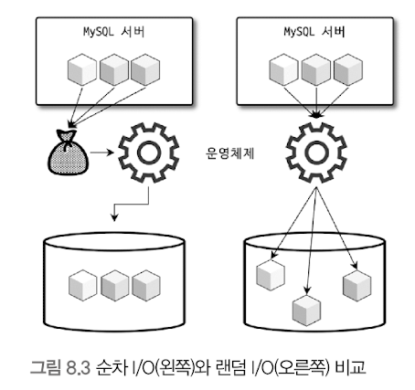

# 디스크 읽기 방식 
- 데이터베이스 성능 튜닝은 어떻게 디스크 I/O를 줄이느냐가 관건일 때가 상당히 많음 

## HDD & SDD
### CPU, Memory
- 전자식 장치 

### HDD
- 기계식 장치
- 디스크 장치가 병목의 원인이 됨

### SSD
- 전자식 저장 매체 
- HDD를 대체하기 위해 나옴 
- SSD도 HDD와 같은 인터페이스인 SATA나 SAS를 지원함 
- 내장 디스크, DAS, 또는 SAN에 그대로 사용 가능 
- 데이터 저장용 플래터(원판) 제거 -> 플래시 메모리 장착 
- 데이터를 빨리 읽고 쓸 수 있음 
- 전원이 공급되지 않아도 데이터가 삭제되지 않음
- D-Ram보다는 느리지만, HDD보다는 훨씬 빠름

- 순차 I/O
  - 디스크 헤더를 움직이지 않고 한 번에 많은 데이터를 읽는 방식 
  - SSD가 HDD보다 조금 빠르거나 거의 비슷한 성능 

- 랜덤 I/O
  - SSD가 기존 HDD보다 훨씬 빠름
  - DB 서버에서 순차 I/O 보다는 랜덤 I/O로 작은 데이터를 읽고 쓰는 작업이 대부분임 

## 랜덤 I/O & 순차 I/O

- 순차 I/O
  - 3개의 페이지를 디스크에 기록하기 위해 한 번의 시스템 콜 요청 
- 랜덤 I/O -> 더 큰 작업 부하 
  - 3개의 페이지를 디스크에 기록하기 위해 세 번의 시스템 콜 요청
> 디스크의 성능은 디스크 헤더의 위치 이동 없이 얼마나 많은 데이터를 한번에 기록하느냐에 의해 결정 됨

### 랜덤 I/O를 줄이자!
- 쿼리를 처리하는 데 꼭 필요한 데이터만 읽도록 쿼리를 개선하자.
- 인덱스 레인지 스캔은 데이터를 읽기 위해 랜덤 입출력을 이용한다.
- 풀 테이블 스캔은 순차 입출력을 이용한다.
- 큰 테이블의 레코드 대부분을 읽는 작업 -> 인덱스 말고 풀 테이블 스캔 사용 유도 -> 순차 입출력이 훨씬 빨리, 더 많은 레코드를 읽어올 수 있기 떄문 
