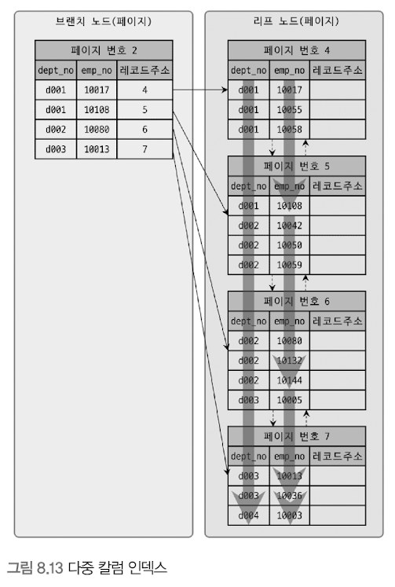

# B-Tree 인덱스
- Balanced Tree
- B+-Tree, B*-Tree ... 
- 원래 값을 변형시키지 않고(값의 앞부분만 잘라서 관리하기는 함)
- 인덱스 구조체 내에서는 항상 정렬된 상태로 유지함 


## 구조 및 특성 
### 구조 


- 최상위에 하나의 루트 노드가 존재 + 하위에 자식 노드가 붙어 있음 
  - 중간 노드는 브랜치 노드라고 부름 
  - 가장 하위는 리프 노드라고 부름
- 인덱스와 실제 데이터는 따로 관리 됨
  - 리프 노드는 항상 실제 데이터 레코드를 찾아가기 위한 **주솟값**을 가지고 있음 

- 인덱스 키 : 모두 정렬
- 데이터 파일 레코드 : 임의의 순서
  - insert된 순서대로 저장되는 것이 아님 
  - 레코드 삭제로 빈 공간이 생기면 그 다음 insert는 삭제된 공간을 재활용 하도록 하기 때문 

> InnoDB 테이블에서 레코드는 클러스터되어 디스크에 저장되기 때문에, 기본적으로 프라이머리 키 순서로 정렬되어 저장 됨 

<br/><br/>

인덱스는 테이블의 키 칼럼만 가지고 있다.
  - 나머지 칼럼을 읽으려면 데이터 파일에서 해당 레코드를 찾아야 한다.
  - 이를 위해 인덱스의 리프 노드는 데이터 파일에 저장된 레코드 주소를 가짐


#### MyISAM 리프 노드 + 테이블 데이터 레코드

- 레코드 주소
  - 레코드가 테이블에 insert된 순번 혹은 데이터 파일 내의 위치(offset)
- 세컨더리 인덱스가 물리적인 주소를 가짐

#### InnoDB 리프 노드 + 테이블 데이터 레코드

- PK가 Row의 id 역할을 함 (ROWID)
- PK를 주소처럼 사용 -> 논리적인 주소
- 데이터 파일을 바로 찾아가지 못함 
  - 인덱스에 저장돼 있는 PK 값을 이용해 PK 인덱스를 한번 더 검색한 후, PK 인덱스의 리프 페이지에 저장돼 있는 레코드를 읽음
  - 즉, 모든 세컨더리 인덱스 검색에서 데이터 레코드를 읽기 위해서는 반드시 PK를 저장하고 있는 B-Tree를 다시한번 더 검색해야 함 


### B-Tree 인덱스 키 추가 및 삭제 
- 레코드를 저장하거나 변경하는 경우 인덱스 키 추가/삭제 작업이 발생함 
- 어떻게 처리되는지 알아야 쿼리 성능 예측 가능 

#### 인덱스 키 추가 
- B-Tree에 새로운 키 값이 저장될 때 
  - 저장될 키 값을 이용해 적절한 위치를 검색 
  - 저장될 위치가 결정되면 레코드의 키 값과 대상 레코드의 주소 정보를 리프 노드에 저장 
- 리프노드가 꽉 찬 경우 
  - 리프 노드 분리(Split)해야 함 -> 상위 브랜치 노드까지 처리 범위가 넓어짐 
  - 이러한 작업으로 인해 B-Tree는 상대적으로 쓰기 작업(새로운 키 추가)에 비용이 많이 듦 
- 대략적 계산 방법
  - 레코드를 추가하는 비용을 1이라고 가정할 경우, 인덱스에 키를 추가하는 작업 비용은 1.5 정도로 예측할 수 있음 
  - 테이블에 인덱스가 3개 있다면, 인덱스가 하나도 없는 경우 작업 비용이 1이고, 3개인 경우네는 5.5(1.5 * 3 + 1) 정도로 예측함 
  - **비용의 대부분이 CPU, 메모리에서 처리하는 시간이 아니라 디스크로부터 인덱스 페이지를 읽고 쓰기를 해야해서 걸리는 시간임**<br/><br/>


- MyISAM, Memory -> 새로운 키 값을 즉시 인덱스에 변경 
- InnoDB -> 필요 시 인덱스 키 추가 작업을 지연시켜 나중에 처리 
  - PK, 유니크 인덱스는 중복 체크 필요 -> 즉시 추가/삭제 함 <br/><br/>

#### 인덱스 키 삭제
- 해당 키 값이 저장된 리프 노드를 찾은 후 삭제 마크 수행 
- 삭제 마킹된 인덱스 키 공간 -> 방치 or 재활용 
- 삭제로 인한 마킹 작업 또한 디스크 쓰기 필요 -> 디스크 입출력 필요 
  - InnoDB에서는 버퍼링 + 지연 처리 가능 
  - 처리가 지연된 인덱스 키 삭제 -> 사용자에게 특별한 악영향 없이 서버가 내부적으로 처리<br/><br/> 

#### 인덱스 키 변경 
- 인덱스 키 값은 그 값에 따라 저장될 리프 노드의 위치가 결정 됨 
- 키가 변경되는 경우, 단순히 인덱스 상의 키 값만 변경하는 것은 불가능함 
- 변경 작업
  - 키 값 삭제 
  - 다시 새로운 키 값 추가 
- InnoDB는 체인지 버퍼를 활용해 지연 처리 가능 <br/><br/>


#### 인덱스 키 검색 
- 트리 탐색 
  - 루트 노드 -> 브랜치 노드 -> 리프 노드 이동하면서 비교 작업 수행
  - select 뿐만 아니라 update, delete를 처리하기 위해 해당 레코드를 먼저 검색해야 할 경우에도 사용 
- B-Tree 인덱스를 이용한 검색은 **100% 일치 혹은 값의 앞부분만 일치하는 경우**에 사용 가능
- 인덱스 키 값에 변형이 가해진 후 비교되는 경우, 절대 B-Tree의 빠른 검색 기능을 사용할 수 없음
  - 이미 변형된 값은 인덱스에 존재하는 값이 아님 
- InnoDB 스토리지 엔진에서의 인덱스
  - 테이블에서 지원하는 레코드 잠금이나 넥스트 키락(갭락)이 검색을 수행한 인덱스를 잠근 후 테이블의 레코드를 잠그는 방식으로 구현돼 있음 
  - update, delete 문장이 실행될 때 테이블에 적절히 사용할 수 있는 인덱스가 없는 경우 불필요하게 많은 레코드를 잠금 
  - 테이블의 모든 레코드를 잠글 수도 있음 
  - InnoDB 스토리지 엔진에서는 그만큼 인덱스 설계가 중요하고 많은 부분에 영향을 미침<br/><br/>


## B-Tree 인덱스 사용에 영향을 미치는 요소 
### 인덱스 키 값의 크기 
- 페이지/블록 : 디스크에 데이터를 저장하는 가장 기본 단위 
  - 디스크의 모든 읽기 및 쓰기 작업의 최소 작업 단위가 됨
  - InnoDB 버퍼 풀에서 데이터를 버퍼링하는 기본 단위이기도 함
  - 인덱스도 결국은 페이지 단위로 관리 됨 <br/><br/>
- B-Tree는 자식 노드의 개수가 가변적인 구조임
  - 인덱스 페이지 크기와 키 값에 크기에 따라 자식노드 개수가 결정됨 


- 자식 노드 주소 : 여러 가지 복합적인 정보가 담긴 영역
- 위 그림의 경우 하나의 인덱스 페이지에 16 * 1024 / (16 + 12) = 585개 저장 가능 
- 자식 노드를 585개 가질 수 있는 B-Tree가 되는 것 


- 인덱스 키 값이 커지면 커질수록 
  - 디스크로부터 읽어야 하는 횟수가 증가한다 -> 느려짐 
  - 전체적인 인덱스 크기가 커진다 -> InnoDB 버퍼 풀에 캐시해둘 수 있는 레코드 수가 감소 -> 메모리 효율 감소<br/><br/>

### B-Tree 깊이
- 상당히 중요하지만 직접 제어 불가능
  - 값을 검색할 때, 몇 번이나 랜덤하게 디스크를 읽어야 하는지와 직결됨 
- 위 그림에서 B-Tree 깊이가 3인 경우 
  - 키가 16바이트 : 최대 2억 (585^3)개 정도의 키 값을 담음
  - 키가 32바이트 : 최대 5천만(372^3)개 정도의 키 값을 담음 
- 인덱스 키 값의 크기가 커질수록, 하나의 인덱스 페이지가 담을 수 있는 인덱스 키 값의 개수가 적어짐 
  - 같은 레코드 건수라 하더라도 B-Tree의 깊이가 깊어져서 디스크 읽기가 더 많이 필요하게 된다는 것을 의미 
> 인덱스 키 값의 크기는 가능하면 작게 만드는 것이 좋다!

<br/><br/>
### 선택도(기수성)
- 모든 인덱스 키 값 가운데 유니크한 값의 수 
  - 전체 인덱스 키 값이 100개인 경우, 유니크한 값의 수가 10개라면 -> 기수성은 10 
  - 중복 증가 -> 기수성 감소 -> 선택도 감소 
- 선택도가 높을 수록 검색 대상이 줄어들기 때문에 빠르게 처리 됨 
> 인덱스는 항상 검색에만 사용되는 것은 아니다.
> - 정렬이나 그루핑과 같은 작업을 위해 인덱스를 만드는 것이 훨씬 더 나은 경우도 많음 
> - 여러 가지 용도를 고려해 적절히 인덱스를 설계하자. 

<br/><br/>
### 인덱스를 이용한 읽기의 손익 분기점 
- 인덱스를 통해 레코드 1건을 읽는 것 
  - 테이블에서 직접 레코드 1건을 익는 것 보다 4~5배 정도 비용이 더 많이 드는 작업임
  - 즉, 인덱스를 통해 읽어야 할 레코드 건수가 전체 테이블 레코드의 20~25%를 넘어 서는 경우, 인덱스를 이용하지 않고 테이블을 모두 직접 읽어서 필요한 레코드만 가려내는 (필터링) 방식으로 처리하는 것이 효율적임 
  - 이는 MySQL 옵티마이저가 판단함 

<br/><br/>
## B-Tree 인덱스를 통한 데이터 읽기 
- 어떤 경우에 인덱스를 사용하게 유도할지, 또는 사용하지 못하게 할지 판단하려면 어떻게 인덱스를 이용(경유)해서 실제 레코드를 읽어 내는지 알아야 함 

### 인덱스 레인지 스캔 
- 가장 대표적인 접근 방식 
- 비교적 빠름 


```mysql
select * from employees where first_name between 'Ebbe' and 'Gad';
```


- 검색해야 할 인덱스 범위가 결정됐을 때 사용하는 방식 
- 검색하려는 값의 수나 검색 결과 레코드 건수와 관계 없이 레인지 스캔이라고 표현함 
- 리프 노드까지 찾아 들어가야 필요한 레코드의 시작 지점을 찾을 수 있음  
  - 시작해야 할 위치를 찾은 경우, 리프 노드의 레코드만 순서대로 읽으면 됨 
  - 스캔하다가 리프 노드의 끝까지 읽는 경우, 리프 노드 간의 링크를 이용해 다음 리프 노드를 찾아 다시 스캔 
  - 스캔을 멈춰야 할 위치에 다다르면 지금까지 읽은 레코드를 사용자에게 반환하고 쿼리를 끝냄 


- 루트와 브랜치 노드를 이용해 시작 스캔 위치 탐색
- 시작 지점부터 필요한 방향으로 인덱스를 읽어 나감 
- 해당 인덱스를 구성하는 칼럼의 정순 또는 역순으로 정렬된 상태로 레코드를 가져옴 
  - 이는 인덱스 자체의 정렬 특성 때문임 
- 리프 노드에 저장된 레코드 주소로 데이터 파일의 레코드를 읽어옴
- 레코드 한 건 단위로 랜덤 I/O가 한번씩 발생함
- 인덱스를 통해 데이터 레코드를 읽는 작업 -> 비용이 많이 드는 작업으로 분류 됨 
- 인덱스를 통해 읽어야 할 데이터 레코드가 20~25%를 넘는 경우, 인덱스를 통한 읽기보다 테이블의 데이터를 직접 읽는 것이 더 효율적인 처리 방식이 됨
  

#### 인덱스 레인지 스캔 처리 단계 
1. 인덱스에서 조건을 만족하는 값이 저장된 위치를 찾음 -> 인덱스 탐색(index seek)
2. 1번에서 탐색된 위치부터 필요한 만큼 인덱스를 차례대로 쭉 읽음 -> 인덱스 스캔(index scan)
3. 2번에서 읽어 들인 인덱스 키와 레코드 주소를 이용해 레코드가 저장된 페이지를 가져온 후, 최종 레코드를 읽어옴
   - 커버링 인덱스의 경우, 3번 과정은 필요하지 않을 수 있음 
   - 커버링 인덱스로 처리되는 쿼리 -> 디스크의 레코드를 읽지 않아도 됨 -> 랜덤 읽기가 상당히 줄어들고 성능은 빨라짐


<br/><br/>
### 인덱스 풀 스캔
- 인덱스의 처음부터 끝까지 모두 읽는 방식 
- 쿼리의 조건절에 사용된 컬럼이 인덱스의 첫 번째 컬럼이 아닌 경우 인덱스 풀 스캔 방식이 사용 됨 
- 직접 테이블을 처음부터 끝까지 읽는 것 보다는 인덱스만 읽는 것이 효율적임 
  - 즉, 테이블 풀 스캔보다는 효율적임 
- 쿼리가 인덱스에 명시된 컬럼만으로 조건을 처리할 수 있는 경우, 주로 이 방식이 사용됨
  - 즉, 인덱스에 포함된 컬럼만으로 쿼리를 처리할 수 있는 경우 테이블의 레코드를 읽을 필요가 없음 
- **인덱스 뿐만 아니라 데이터 레코드까지 모두 읽어야 할 경우 절대 이 방식으로 처리되지 않음**


- 인덱스 전체 크기 < 테이블 자체 크기 
- 테이블 전체를 읽는 것 보다 적은 디스크 I/O로 쿼리를 처리할 수 있음 

> (인덱스를 사용한다) == (인덱스 레인지 스캔 or 루스 인덱스 스캔 방식으로 인덱스를 사용한다)
> - 인덱스 풀 스캔 방식도 인덱스를 이용하는 것이지만 효율적인 방식은 아님
>   - 또한, 일반적으로 인덱스를 생성하는 목적도 아님 
> 
> (인덱스를 사용하지 못함 or 인덱스를 효율적으로 사용하지 못함) == (테이블 전체를 읽음 or 인덱스 풀 스캔 방식으로 인덱스를 사용함)


<br/><br/>
### 루스(loose) 인덱스 스캔


- 인덱스 레인지 스캔, 인덱스 풀 스캔 -> 타이트(tight) 인덱스 스캔
- 느슨하게, 또는 듬성듬성하게 인덱스를 읽음
- 중간에 필요치 않은 인덱스 키 값은 무시(skip)하고 다음으로 넘어가는 형태로 처리함 
  - 일반적으로 group by나 max, min과 같은 집합 함수에 대해 최적화를 하는 경우에 사용함 
  - 인덱스는 정렬이 되어있기 때문에 max, min 연산에 효율적임 


<br/><br/>
### 인덱스 스킵 스캔
- 인덱스의 핵심 : 값이 정렬되어 있음 
- 인덱스를 구성하는 칼럼 순서가 매우 중요함 

```mysql
ALTER TABLE employees ADD INDEX ix_gender_birthdate (gender, birth_date);
```

위 인덱스를 사용하려면, where 조건절에 gender 컬럼에 대한 비교 조건이 필수임 
```mysql
# 인덱스를 사용하지 못하는 쿼리
SELECT * FROM employees WHERE birth_date>='1965-02-01';

# 인덱스를 사용할 수 있는 쿼리
SELECT * FROM employees WHERE gender='M' AND birth_date >='1965-02-01';
```

하지만, mysql 8.0 버전부터는 옵티마이저가 gender 컬럼을 건너 뛰어서 birth_date 컬럼만으로도 인덱스 검색이 가능하게 해주는 인덱스 스킵 스캔 최적화 기능이 도입되었음 


#### 인덱스 스킵 스캔이 off인 경우 

- 인덱스 풀 스캔이 발생함 

#### 인덱스 스킵 스캔이 on인 경우 

- range : 인덱스에서 꼭 필요한 값만 읽었다는 것을 의미 
- using index for skip scan : 인덱스 스킵 스캔을 활용해 데이터를 조회했다는 것을 의미


MySQL 옵티마이저가 아래와 같이 처리함

- gender 컬럼에서 유니크한 값을 모두 조회 -> 주어진 쿼리에 gender 컬럼 조건을 추가해서 쿼리를 다시 실행 
- 단점
  - where 조건절에 조건이 없는 인덱스의 선행 컬럼의 유니크한 값의 개수가 적어야 함 (위 예제에서는 M, F로 두개 뿐) 
    - 많아질 수록 검색 작업이 많아져 성능이 오히려 안좋아질 수 있음 
  - 쿼리가 인덱스에 존재하는 컬럼만으로 처리 가능해야 함(커버링 인덱스)
    - 
    - 인덱스에 퐇마된 gender, birth_date 컬럼 이외의 나머지 컬럼도 필요 -> 인덱스 스킵 스캔 사용 불가 -> 풀 테이블 스캔 발생 


<br/><br/>
## 다중 컬럼 인덱스 

- 실제 서비스용 db에서는 2개 이상의 컬럼을 포함하는 인덱스가 더 많이 사용 됨 
  - 두 개 이상의 컬럼으로 구성된 인덱스 -> 다중 컬럼 인덱스 (multi-column index or concatenated index)
- 레코드 건수가 작은 경우 브랜치 노드가 없을 수 있음
  - 루트 노드와 리프 노드는 항상 존재
- 인덱스 정렬
  - 첫번째 컬럼을 기준으로 정렬 -> 첫번째 컬럼의 값이 같은 경우 두번째 컬럼으로 정렬 ...


<br/><br/>
## B-Tree 인덱스의 정렬 및 스캔 방향 
- 인덱스 키 값 : 항상 오름차순 or 내림차순 
- 인덱스를 읽는 방향은 쿼리에 따라 옵티마이저가 실시간으로 만들어내는 실행 계획에 따라 결정 됨 

### 인덱스의 정렬 
- 정렬 순서 혼합 가능 
```mysql
CREATE INDEX ix_teamname_userscore ON employees (team_name ASC, user_score DESC);
```

### 인덱스 스캔 방향 
- 인덱스가 오름차순으로 정렬돼 있는 경우, 최대값을 가져오고자 할 때
  - 오름차순으로 값을 순차적으로 읽어 최대값을 가져오는 게 아니라, 내림차순으로 읽어 첫 번째 값을 가져오는 방법을 택함
  - 이는 옵티마이저가 이미 알고 있음


- 쿼리가 인덱스를 사용하는 시점에 인덱스를 읽는 방향에 따라 오름차순/내림차순 정렬 효과를 얻을 수 있음

```mysql
SELECT * FROM employees WHERE first_name='Anneke'
ORDER BY first_name ASC LIMIT 4;

SELECT * FROM employees
ORDER BY first_name DESC LIMIT 5;
```
- 첫 번째 쿼리
  - first_name 컬럼에 정의된 인덱스를 이용해 'Anneke'레코드를 찾음 
  - 정순으로 해당 인덱스를 읽으면서 4개의 레코드만 읽어옴 
  - 정렬 효과 ok
- 두 번째 쿼리 
  - 인덱스를 역순으로 읽으면서 처음 5개의 레코드만 가져옴 


### 내림차순 인덱스

- 오름차순 인덱스 : **작은** 값의 인덱스 키가 B-tree의 왼쪽으로 정렬된 인덱스
- 내림차순 인덱스 : **큰** 값의 인덱스 키가 B-tree의 왼쪽으로 정렬된 인덱스
- 인덱스 정순 스캔 : 인덱스 키의 크고 작음에 관계 없이 리프 노드의 **왼쪽 페이지부터 오른쪽**으로 스캔 
- 인덱스 역순 스캔 : 인덱스 키의 크고 작음에 관계 없이 리프 노드의 **오른쪽 페이지부터 왼쪽**으로 스캔


#### InnoDB에서 인덱스 역순 스캔은 인덱스 정순 스캔에 비해 느리다  

- 페이지 락이 인덱스 정순 스캔에 적합한 구조임 
- 페이지 내에서 인덱스 레코드가 단방향으로만 연결된 구조임
  - InnoDB 페이지 내부에서 레코드들이 단방향으로만 링크를 가짐 

> 위 그림에서는 레코드들이 페이지 내부에서 정렬 순서대로 저장돼 있는 것처럼 표시돼 있지만, 실제로 InnoDB 페이지는 힙처럼 사용되기 때문에 물리적으로 저장이 순서대로 배치되지는 않음 
> 또한, 각 데이터 페이지(InnoDB에서 데이터 파일은 PK 인덱스 자체다.)나 인덱스 페이지의 엔트리(레코드 or 인덱스 키)는 키 값과 데이터를 가지는데, 인덱스(PK 인덱스, 세컨더리 인덱스 모두)의 루트 노드 또는 브랜치 노드라면 자식 노드의 주소를 가진다.
> PK에서 리프노드의 데이터는 실제 레코드들의 칼럼 값들이며, 세컨더리 인덱스 페이지에서는 PK 값을 가진다. 


결론적으로, 정순 스캔이 더 빠르니, 더 빈번히 조회하게 될 것 같은 방식에 따라 오름차순/내림차순 인덱스를 선택해야 한다.


<br/><br/>
## B-Tree 인덱스의 가용성과 효율성 
- where, group by, order by 절이 어떤 경우에 인덱스를 사용할 수 있고 어떤 방식으로 사용할 수 있는지 식별할 수 있어야 함 

### 비교 조건의 종류와 효율성 
- 다중 컬럼 인덱스에서 각 컬럼의 순서와 그 컬럼에 사용된 조건이 동등 비교("=")인지 아니면 `>, <`과 같은 범위 조건인지에 따라 각 인덱스 컬럼의 활용 형태와 효율이 달라짐 


```mysql
# 날린 쿼리 
select * from dept_emp where dept_no='d002' and emp_no >= 10114;
```


- 케이스 A 
  - `dept_no='d002' and emp_no >= 10114`인 레코드를 찾고, `dept_no`가 `d002`가 아닐 때까지 인덱스를 쭉 읽으면 됨
  - 조건을 만족하는 레코드가 5건이라고 할 때, 꼭 필요한 5번의 비교 작업만 수행하게 됨 -> 효율적임 
- 케이스 B
  - `emp_no >= 10114 and dept_no='d002'`인 레코드를 찾고, 모든 레코드에 대해 `dept_no='d002'`인지 비교하는 과정을 거침

인덱스를 통해 읽은 레코드가 나머지 조건에 맞는지 비교하면서 취사 선택하는 작업을 "필터링"이라고 함.
- 케이스 B에서는 죄종적으로 dept_no='d002'를 만족(필터링)하는 레코드 5건을 가져옴 -> 그림 상에서 해당 5건을 찾기 위해 7번의 비교 과정을 거침

어째서 이런 현상이?
- 다중 컬럼 인덱스의 정렬 방식 때문임 
  - 다중 컬럼 인덱스의 정렬 방식 : 첫 번째 인덱스를 기준으로 정렬 -> 같을 경우 다음 인덱스 기준으로 정렬
- **케이스 A -> 작업의 범위를 결정하는 조건(작업 범위 결정 조건)**
  - 첫 번째 컬럼이 이미 정렬되어 있음 -> d002로 범위가 좁혀짐 
  - 첫 번째 컬럼이 동일할 경우, 두 번째 컬럼이 정렬 됨 -> emp_no >= 10114인 컬럼을 찾기 매우 수월함 
  - 두 컬럼이 모두 정렬되어 있기 때문에, 두 컬럼 모두 **작업 범위 결정 조건**임
- **케이스 B -> 필터링 조건, 체크 조건** 
  - 첫 번째 컬럼이 이미 정렬되어 있음 -> emp_no >= 10114로 정렬 됨 
  - 두 번째 컬럼은 첫 번째 컬럼이 동일하지 않을 경우 정렬되어 있지 않음 -> 하나하나 비교하면서 찾을 수밖에 없음  
    - 두번째 컬럼인 dept_no는 비교 작업의 범위를 좁히는 데 아무런 도움을 주지 못함 -> 쿼리 조건에 맞는지 검사하는 용도로만 사용됨
  - 한 컬럼만 정렬되어 있기 때문에 emp_no만 **작업 범위 결정 조건**이고, dept_no는 **필터링 조건**임


> 작업 범위 결정 조건은 많으면 많을수록 쿼리의 처리 성능을 높이나, 체크 조건은 많다고 해서 쿼리 처리 성능을 높이지는 못함. 오히려 느려지게 만들 때가 더 많음.


### 인덱스의 가용성
- B-Tree 인덱스의 특징
  - 왼쪽 값을 기준으로 오른쪽 값이 정렬돼 있음 


위의 케이스에서, 아래와 같은 쿼리를 날린다고 가정할 때
```mysql
# 케이스 A
select * from employees where first_name like '%mer';
```
- 위 쿼리는 인덱스 레인지 스캔 방식으로 인덱스를 이용할 수 없음


```mysql
# 케이스 B
select * from dept_no where emp_no >= 10144;
```
- dept_no 조건 없이 emp_no로만 검색하면 인덱스를 효율적으로 사용할 수 없음 


### 가용성과 효율성 판단 
- B-Tree 인덱스 특성 상 다음의 조건에서는 사용할 수 없음 (p.251 참고) 
  - 사용할 수 없다 == 작업 범위 결정 조건으로 사용할 수 없다는 뜻
  - 체크 조건으로 인덱스를 사용할 수는 있음 

```mysql
index ix_text(col1, col2, col3, .., coln)
```
- 작업 범위 결정 조건으로 인덱스를 사용하지 못하는 경우
  - col1 컬럼에 대한 비교 조건이 없는 경우
  - col1 비교 조건이 위의 인덱스 아용 불가 조건 중 하나인 경우(p.251)
- 작업 범위 결정 조건으로 인덱스를 사용하는 경우(2 < i < n)
  - col1 ~ col(i-1)까지 동등 비교 형태("=" or "in")
  - coli 컬럼에 대해 다음 연산자 중 하나로 비교
    - 동등 비교 (=, in)
    - 크다 작다 형태 (> or <)
    - like로 좌측 일치 패턴(like '승환%')
