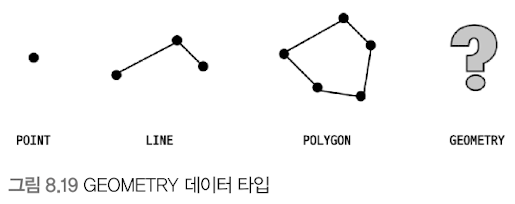
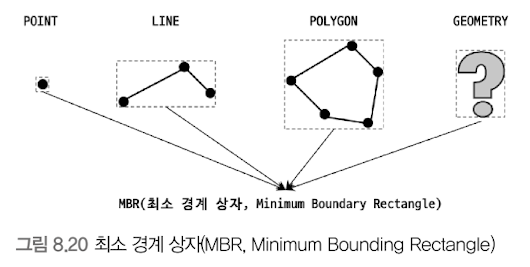
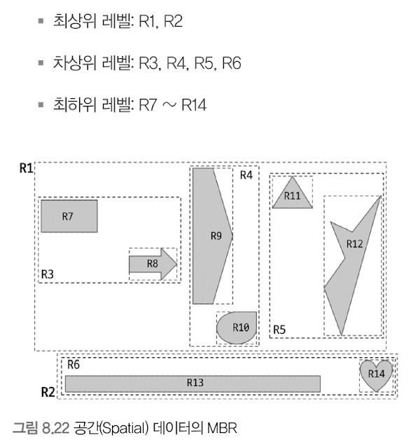
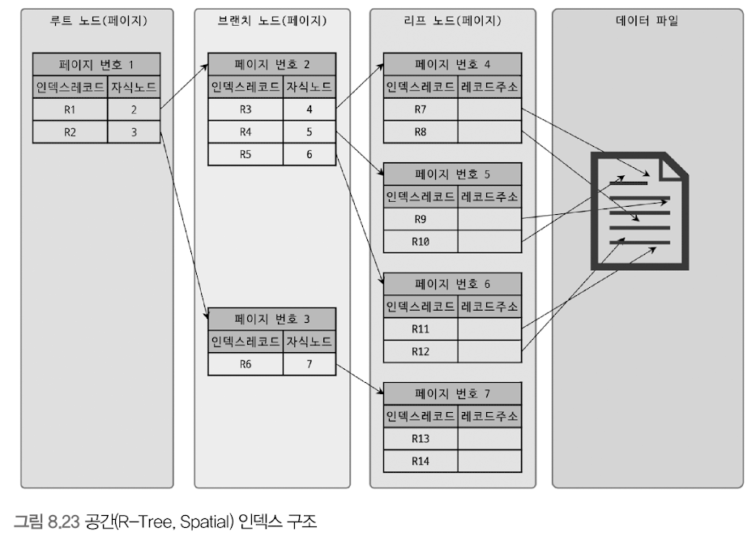
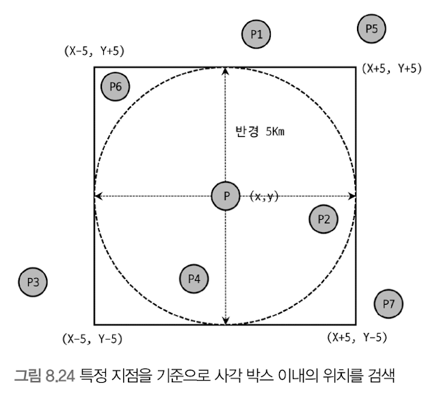

# R-Tree 인덱스
## 공간 인덱스 
- R-Tree 인덱스 알고리즘을 이용해 2차원의 데이터를 인덱싱하고 검색하는 목적의 인덱스 
- 내부 메커니즘은 B-Tree와 흡사함 
- B-Tree : 인덱스를 구성하는 칼럼의 값이 1차원의 스칼라 값 
- R-Tree : 2차원의 공간 개념 값 

### 공간 확장 
- 공간 데이터를 저장할 수 있는 데이터 타입
- 공간 데이터의 검색을 위한 공간 인덱스 (R-Tree 알고리즘)
- 공간 데이터의 연산 함수 (거리 또는 포함 관계의 처리)

  

## 구조 및 특성 

- 공간 정보의 저장 및 검색을 위해 여러 가지 기하학적 도형(Geometry) 정보를 관리할 수 있는 데이터 타입 제공 
- Geometry 타입 : point, line, polygon 객체 모두 저장 가능한 슈퍼 타입 

### MBR(Minimum Bounding Rectangle)

- 해당 도형을 감싸는 최소 크기의 사각형 
- 이 사각형들의 포함 관계를 B-Tree 형태로 구현한 인덱스가 R-Tree임 

#### 공간 데이터의 MBR 표현 예 

- 최하위 레벨 : 각 도형 데이터의 mbr
- 차상위 레벨 : 중간 크기의 mbr 그룹 (최상위 레벨의 브랜치 노드)
- 최상위 레벨 : R-Tree 루트 노드에 저장되는 정보 

#### 인덱스 내부 구조 

  

## R-Tree 인덱스의 용도 
- MBR + B-Tree = R(Rectangle) + Tree = R-Tree
- 공간 인덱스라고도 부름 
- WGS84(GPS) 기준의 위도, 경도 좌표 저장에 주로 사용 됨 
  - CAD/CAM 소프트웨어 또는 회로 디자인 등과 같이 좌표 시스템에 기반을 둔 정보에 대해서는 모두 적용 가능 
- MBR의 포함 관계를 이용해 만들어진 인덱스
  - ST_contains(), ST_Within() 등과 같은 포함 관계를 비교하는 함수로 검색을 수행하는 경우에만 인덱스를 사용할 수 있음 
  - 예시
    - 현재 사용자의 위치로부터 반경 5km 이내의 음식점 검색 

- 기준점 P로부터 반경 5km 이내의 점들을 검색하려면
  - 사각 점선 상자에 포함되는 점들을 검색하면 됨 (ST_contains(), ST_Within())
  - ST_contains(), ST_Within() : 다각형으로만 연산 -> 5km 반경을 그리는 원을 포함하는 mbr로 포함 관계 비교 수행 