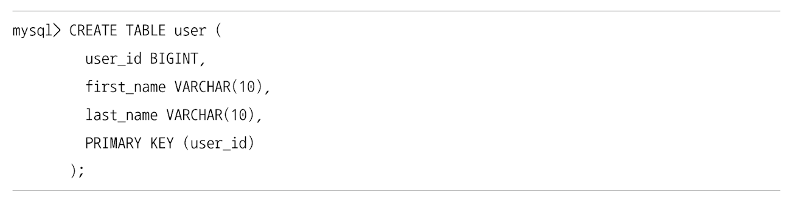
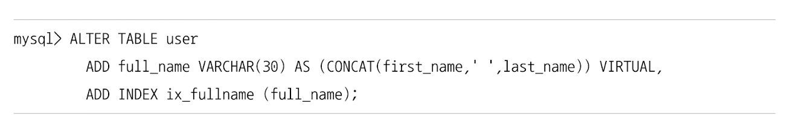
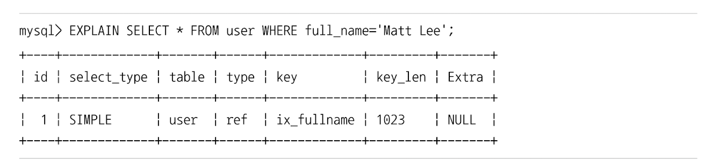
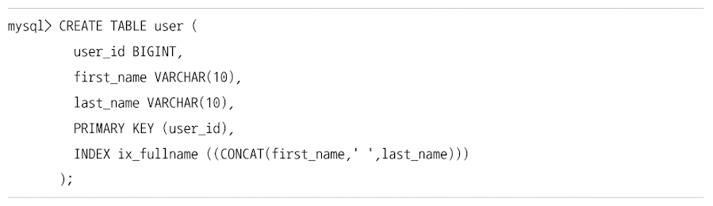
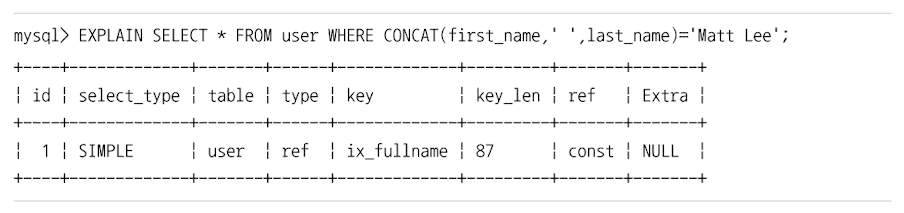

# 함수 기반 인덱스 
일반적인 인덱스 생성 
- 컬럼의 값 일부(앞부분) 또는 전체에 대해서만 인덱스 생성 허용

칼럼의 값을 변형해서 만들어진 값에 대한 인덱스를 구축해야 할 때는 어떻게 할 수 있을까? 
- 함수 기반의 인덱스를 활용하면 된다.
  - 가상 칼럼을 이용한 인덱스
  - 함수를 이용한 인덱스 
  - 위 두 방법은 인덱싱할 값을 계산하는 과정의 차이만 있을 뿐, 실제 인덱스의 내부적인 구조 및 유지관리 방법은 B-Tree 인덱스와 동일함

## 가상 칼럼을 이용한 인덱스 

위와 같은 테이블이 있을 경우, first_name과 last_name을 합쳐서 검색해야 할 때 
- full_name 이라는 칼럼을 추가하고 모든 레코드에 대해 full_name을 업데이트 하는 작업을 거쳐야 했음 
- 그래야만 비로소 full_name 칼럼에 대한 인덱스 생성 가능 

MySQL8.0 부터는 가상 칼럼을 도입

- 위와 같이 가상 칼럼을 추가하고, 해당 가상 칼럼에 인덱스를 생성할 수 있음 

- 새로 만들어진 인덱스로 full_name 칼럼에 대한 검색 가능 

가상 칼럼은 virtual, stored 옵션 중 어떤 옵션으로 생성됐든 상관 없이 해당 가상 칼럼에 인덱스를 생성할 수 있음 
- 테이블에 새로운 칼럼을 추가하는 것과 같은 효과 -> 실제 테이블 구조가 변경됨 

  
## 함수를 이용한 인덱스 

- 위와 같이 함수를 직접 사용하는 인덱스 생성 가능 
- 함수 기반 인덱스를 제대로 활용하기 위해서는 반드시 조건절에 함수 기반 인덱스에 명시된 표현식이 그대로 사용돼야 함 

- 만약 위 문장이 제대로 인덱스를 사용하지 않는 경우 concat 함수에 사용된 공백 문자 리터럴 때문일 가능성 농후 
  - 이럴 경우 다음 3개의 시스템 변수 값을 동일한 콜레이션으로 일치시킨 후 다시 테스트 수행 요망 (책에서는 "utf8mb4_0900_ai_ci"로 통일해 테스트함)
    - collation_connection
    - collation_database
    - collation_server

