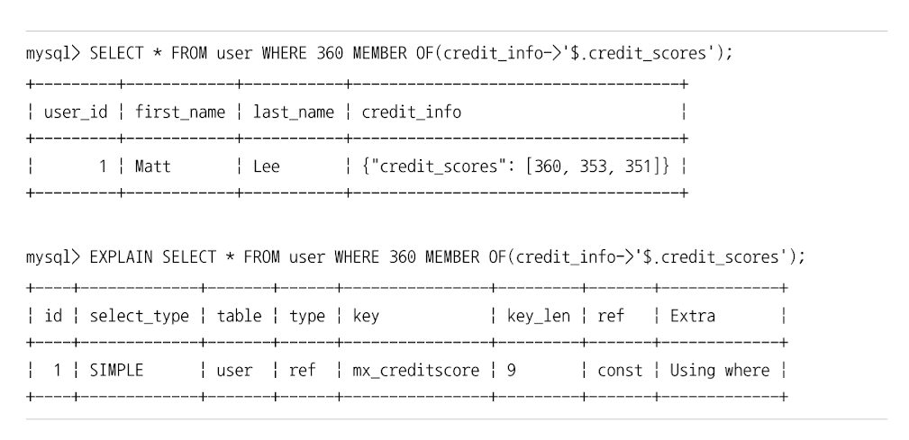

# 멀티 밸류 인덱스 
- 전문 검색 인덱스를 제외한 모든 인덱스는 레코드 1건이 1개의 인덱스 키 값을 가짐
  - 인덱스 키:데이터 레코드 = 1:1

## 멀티 밸류 인덱스
- 하나의 데이터 레코드가 여러 개의 키 값을 가질 수 있는 형태의 인덱스
  - 일반적인 RDBMS 기준으로는 정규화에 위배되는 형태 
  - 최근 RDBMS 들이 JSON 형태의 데이터 타입을 지원하기 시작하면서, JSON의 배열 타입 필드에 저장된 원소들에 대한 인덱스 요건이 발생함 


```mysql
CREATE TABLE users (
    user_id BIGINT AUTO_INCREMENT PRIMARY KEY, 
    first_name VARCHAR(10), 
    last_name VARCHAR (10),
    credit_info JSON,
    INDEX mx_creditscores ( (CAST(credit_info->'$.credit_scores' AS UNSIGNED ARRAY)) )
);

insert into users values (1, 'Matt', 'Lee', '{"credit_scores":[360, 353, 351]}');
```
- 멀티 밸류 인덱스를 활용하기 위해서는 일반적인 조건 방식을 사용하면 안됨.
- 다음 함수들을 이용해서 검색해야 옵티마이저가 인덱스를 활용한 실행 계획을 수립함 
  - member of()
  - json_contains()
  - json_overlaps()




