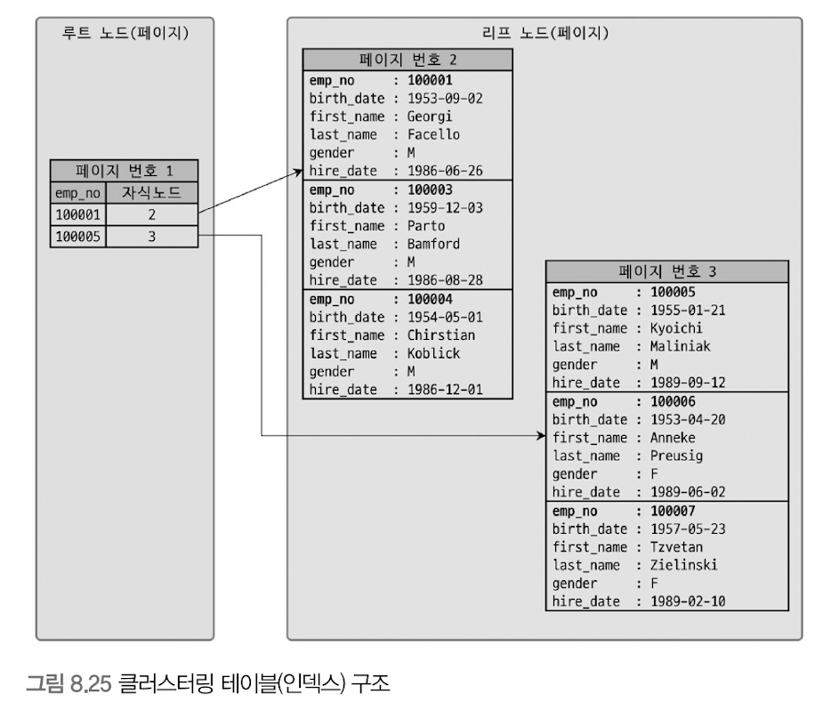
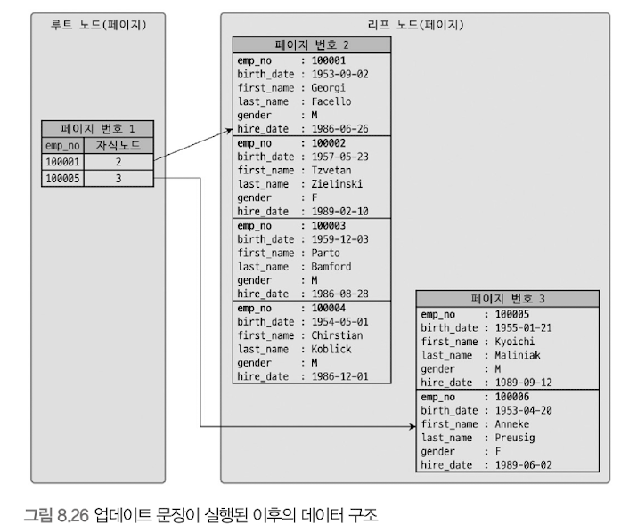

# 클러스터링 인덱스 
- 클러스터링 : 여러개를 하나로 묶는다는 의미 
- MySQL 서버에서 클러스터링은 테이블 레코드를 비슷한 것(PK를 기준으로)들끼리 묶어서 저장하는 형태로 구현 됨 
  - 비슷한 값들을 동시에 조회하는 경우가 많다는 점에 착안한 것 
  - InnoDB 스토리지 엔진에서만 지원 

<br/><br/>
## 클러스터링 인덱스
- 테이블의 PK에 대해서만 적용 됨 
- PK 값이 비슷한 레코드끼리 묶어서 저장하는 것 -> "클러스터링 인덱스"
  - PK 값에 의해 레코드 저장 위치가 결정 됨 
  - PK가 변경되면 해당 레코드의 물리적인 저장 위치가 바뀌어야 한다는 것을 의미 
- PK값으로 클러스터링된 테이블 -> PK 값 자체에 대한 의존도가 상당히 큼 -> 신중히 PK를 결정해야 함 
- 클러스터링 인덱스는 알고리즘이라기 보다 테이블 레코드 저장 방식에 가까움 
  - 클러스터링 인덱스 == 클러스터링 테이블 
  - PK == 클러스터링 키 
- InnoDB와 같이 항상 클러스터링 인덱스로 저장되는 테이블 
  - PK 기반 검색이 매우 빠름
  - 레코드 저장이나 PK 변경이 상대적으로 느림 

> B-Tree 인덱스
> - 인덱스 키 값으로 이미 정렬되어 저장 됨 
> - 이 또한 어떻게 보면 인덱스의 키 값으로 클러스터링 된 것으로 생각할수 있음 
> - 하지만, B-Tree 인덱스를 클러스터링 인덱스라고 부르지 않음
> - 테이블의 레코드가 PK 값으로 정렬되어 저장된 경우만 클러스터링 인덱스(테이블)이라고 부름 


### 구조

- B-Tree의 리프노드와는 달리, 클러스터링 인덱스의 리프노드에는 레코드의 모든 컬럼이 같이 저장돼 있다. 
  - 클러스터링 테이블은 그 자체가 하나의 거대한 인덱스 구조로 관리되는 것

### PK 변경 문장이 실행될 경우

```mysql
update tb_test set emp_no=100002 where emp_no=100007;
```
- 3번 페이지의 100007 레코드가 100002로 변경되면서 2번 페이지로 이동 

> InnoDB를 제외한 기타 테이블의 데이터 레코드
> - PK나 인덱스 키 값이 변경된다고 해서 실제 데이터 레코드 위치가 변경되지는 않음 
> - 데이터 레코드 -> insert -> 데이터 파일의 끝(또는 임의의 빈 공간)에 저장됨 
> - 한 번 결정된 위치는 절대 바뀌지 않음 
> - 레코드가 저장된 주소는 MySQL 내부적으로 레코드를 식별하는 아이디로 인식됨 
> - row-id : 레코드가 저장된 주소 
>   - 일부 DBMS에서는 이 값을 사용자가 직접 조회하거나 쿼리의 조건으로 사용할 수 있으나, MySQL에서는 노출되지 않음


### PK가 없는 InnoDB 테이블
PK가 없는 경우, InnoDB 스토리지 엔진은 다음 우선순위대로 OK를 대체할 컬럼을 선택함 
1. PK가 있으면 기본적으로 PK를 클러스터링 키로 선택
2. not null 옵션의 유니크 인덱스 중에서 첫 번째 인덱스를 클러스터링 키로 선택
3. 자동으로 유니크한 값을 가지도록 증가되는 컬럼을 내부적으로 추가한 후, 클러스터링 키로 선택
   - 내부적으로 클러스터링 키 후보를 찾지 못하면 스토리지 엔진이 내부적으로 레코드의 일련번호 컬럼을 생성함 
   - 자동으로 추가된 PK는 사용자에게 노출되지 않음 -> 쿼리 문장에 명시적으로 사용 불가 
   - 아무 의미 없는 숫자값으로 클러스터링 되는 것 -> 혜택 X


InnoDB 테이블에서 클러스터링 인덱스는 테이블당 단 하나만 가질 수 있는 엄청난 혜택이므로, PK를 명시적으로 생성하는 것이 좋다.


<br/><br/>
## 세컨더리 인덱스에 미치는 영향
### InnoDB의 세컨더리 인덱스가 실제 레코드가 저장된 주소를 가지고 있다면?
- 클러스터링 키 값이 변경될 때 마다 데이터 레코드의 주소가 변경될 것임 
  - 그 때마다 모든 인덱스에 저장된 주솟값을 변경해야 함 -> 오버헤드 발생 
- 위와 같은 오버헤드를 제거하기 위해 InnoDB 클러스터링 테이블의 모든 세컨더리 인덱스는 해당 레코드가 저장된 주소가 아닌 PK 값을 저장하도록 구현돼 있음 

```mysql
CREATE TABLE employees (
    emp_no INT NOT NULL, 
    first_name VARCHAR (20) NOT NULL, 
    PRIMARY KEY (emp_no),
    INDEX ix_firstname (first_name)
);

select *
from employees where first_name='Aamer';
```
- MyISAM : ix_firstname 인덱스 검색 -> 레코드 주소 확인 -> 레코드 주소를 이용해 최종 레코드 획득
- InnoDB : ix_firstname 인덱스 검색 -> 레코드의 PK 확인 -> PK 인덱스 검색 -> 최종 레코드 획득 

<br/><br/>

## 클러스터링 인덱스의 장단점
클러스터링 되지 않은 일반 PK vs 클러스터링 인덱스

### 장점 : 빠른 읽기(select)
- PK(클러스터링 키)로 검색할 때 처리 성능이 매우 빠름
  - 특히 PK 범위 검색하는 경우 매우 빠름
- 테이블의 모든 세컨더리 인덱스가 PK를 가지고 있음
  - 인덱스만으로 처리될 수 있는 경우가 많음. (이를 커버링 인덱스라고 함)


### 단점 : 느린 쓰기(insert, update, delete)
- 테이블의 모든 세컨더리 인덱스가 클러스터링 키를 가짐 
  - 클러스터링 키의 값의 크기가 클 경우, 전체적으로 인덱스 크기가 증가함
- 세컨더리 인덱스를 통해 검색할 때 PK로 다시 한 번 검색해야 함 -> 처리 성능이 느림 
- insert할 때 PK에 의해 레코드의 저장 위치가 결정됨 -> 처리 성능이 느림
- PK를 변경할 때 레코드를 delete하고 insert하는 작업이 필요 -> 처리 성능이 느림 


> 웹 서비스와 같은 온라인 트랜잭션 환경 (OLTP, On-Line Transaction Processing)
> - 쓰기와 읽기의 비율이 2:8 ~ 1:9 정도이기 때문에, 조금 느린 쓰기를 감수하고 읽기를 빠르게 유지하는 것이 중요함 


<br/><br/>
## 클러스터링 테이블 사용 시 주의사항 
### 클러스터링 인덱스 키의 크기

- 클러스터링 테이블은 모든 세컨더리 인덱스가 PK 값을 포함함 
  - Pk값 증가 -> 세컨더리 인덱스 크기 증가 
  - 일반적으로 테이블에 세컨더리 인덱스가 4~5개 생성된다는 것을 고려하면 세컨더리 인덱스 크기는 급증함


### PK는 Auto-increment보다는 업무적인 컬럼으로 생성(가능한 경우)
- InnoDB의 PK -> 클러스터링 키로 사용됨 -> 이 값에 의해 레코드 위치가 결정됨 
- PK로 검색하는 경우 (범위 검색의 경우 특히) 매우 빠르게 처리될 수 있음
- 그렇기 때문에 PK는 아주 중요한 역할을 한다. -> 검색에서 빈번하게 사용함
- 업무적으로 해당 레코드를 대표할 수 있다면 크기가 크더라도 해당 컬럼을 PK로 설정하는 것이 좋음 


### PK는 반드시 명시할 것
- PK는 Auto-increment를 사용해서라도 생성하는 것을 권장함 
- PK를 정의하지 않으면 InnoDB 엔진이 내부적으로 일련번호 컬럼을 추가함 
  - 자동 추가된 컬럼은 사용자에게 보이지 않음 -> 사용 불가 


### Auto-increment 컬럼을 인조 식별자로 사용할 경우
- 여러 개의 컬럼이 복합으로 PK로 만들어지는 경우, PK의 크기가 길어질 때가 가끔 있음 
  - 하지만 PK 크기가 길어져도 세컨더리 인덱스가 필요하지 않은 경우에는 그대로 PK를 사용하는 것이 좋음
- 세컨더리 인덱스도 필요하고 PK의 크기도 길다면 Auto-increment 컬럼을 추가하고 이를 PK로 설정하면 됨 
  - 이를 인조 식별자(Surrogate key)라고 함 -> PK를 대체하기 위해 인위적으로 추가된 PK
  - 로그 table과 같이 조회보다는 insert 위주의 테이블인 경우, Auto-increment를 이용한 인조 식별자를 PK로 설정하는 것이 성능 향상에 도움이 됨


