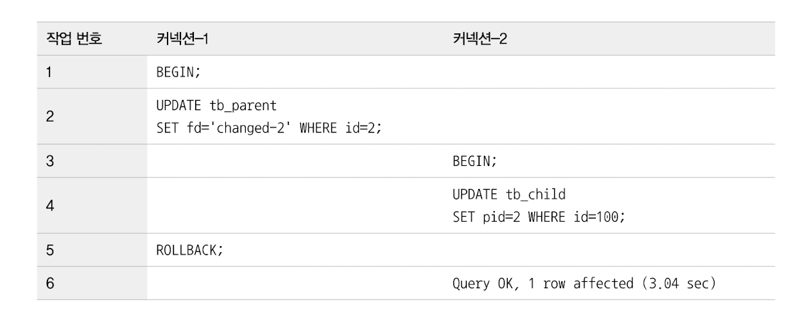
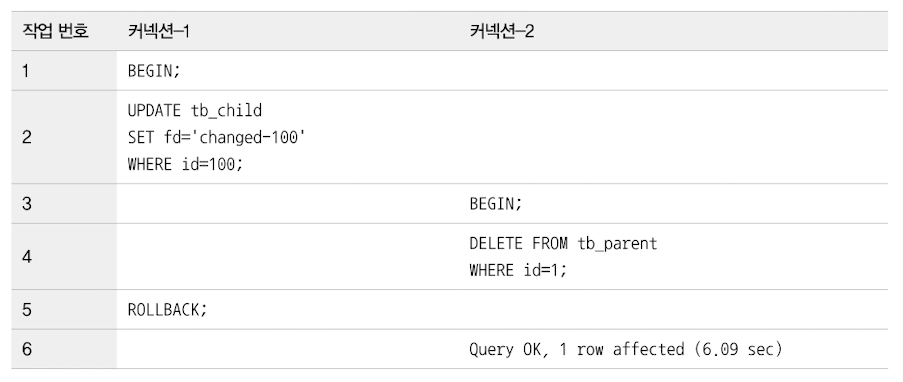

# 외래키 (FK)
- MySQL에서 외래키는 InnoDB 스토리지 엔진에서만 생성할 수 있다.
- 외래키 제약이 설정될 경우, 자동으로 연관되는 테이블의 컬럼에 인덱스까지 생성된다.
- 외래키가 제거되지 않은 상태에서는 자동으로 생성된 인덱스를 삭제할 수 없다.

### InnoDB 외래키 관리의 중요한 특징
- 테이블의 변경(쓰기 락)이 발생하는 경우에만 락 경합이 발생한다.
- 외래키와 연관되지 않은 컬럼의 변경은 최대한 락 경합을 발생시키지 않는다.

## 자식 테이블의 변경이 대기하는 경우 

1. 1번 커넥션에서 먼저 트랜잭션 시작 
2. 부모 테이블의 id가 2인 레코드에 업데이트 수행 
   - 1번 커넥션이 부모 테이블에서 id가 2인 레코드에 대해 쓰기 락 획득
3. 2번 커넥션에서 자식 테이블의 pid(FK)를 2로 변경하는 쿼리 실행 
   - 해당 쿼리는 부모 테이블 변경 작업이 완료될 때 까지 기다림 
4. 1번 커넥션이 rollback/commit으로 트랜잭션 종료
5. 2번 커넥션이 대기하던 작업이 측시 처리 됨 

- 즉, 자식 테이블의 FK 컬럼의 변경은 부모 테이블의 확인이 필요함 -> 이 상태에서 부모 테이블의 해당 레코드가 쓰기 락이 걸려있는 경우 -> 해당 쓰기 락이 해제될 때까지 기다림
- 자식테이블의 외래키가 아닌 컬럼의 변경은 외래키로 인한 락 확장이 발생하지 않음 

## 부모 테이블의 변경이 대기하는 경우

1. 1번 커넥션에서 자식 테이블의 FK=1을 참조하고 있는 레코드를 변경
2. 자식 테이블의 레코드에 대한 쓰기 락 획득 
3. 2번 커넥션이 부모 테이블의 id=1인 레코드를 삭제한다 
   - 자식 테이블의 레코드에 대한 쓰기 락이 해제될 때 까지 대기
   - 자식 테이블이 생성될 때 정의된 FK의 특성(`on delete cascade`) 때문에 부모 레코드가 삭제되면 자식 레코드도 동시에 삭제되는 방식으로 작동하기 때문 

DB에서 FK를 물리적으로 생성할 경우, 위 현상으로 인한 락 경합까지 고려해 모델링을 해야한다.
- 물리적인 FK를 생성하면 자식 테이블에 레코드가 추가되는 경우, 해당 FK가 부모 테이블에 있는지 확인한다.
- 물리적인 FK의 고려 사항은 이러한 체크 작업이 아니라, **이러한 체크를 위해 연관 테이블에 읽기 락을 걸어야 한다는 것**이다
- 락이 다른 테이블로 확장될 경우, 그만큼 전체적으로 쿼리의 동시 처리 성능에 영향을 미친다.

