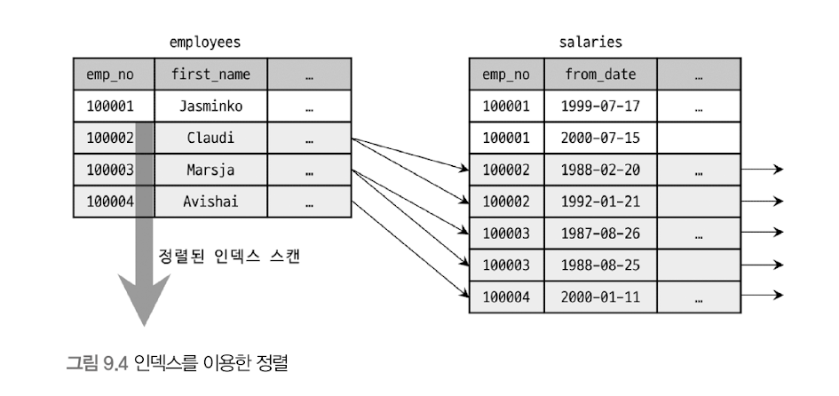
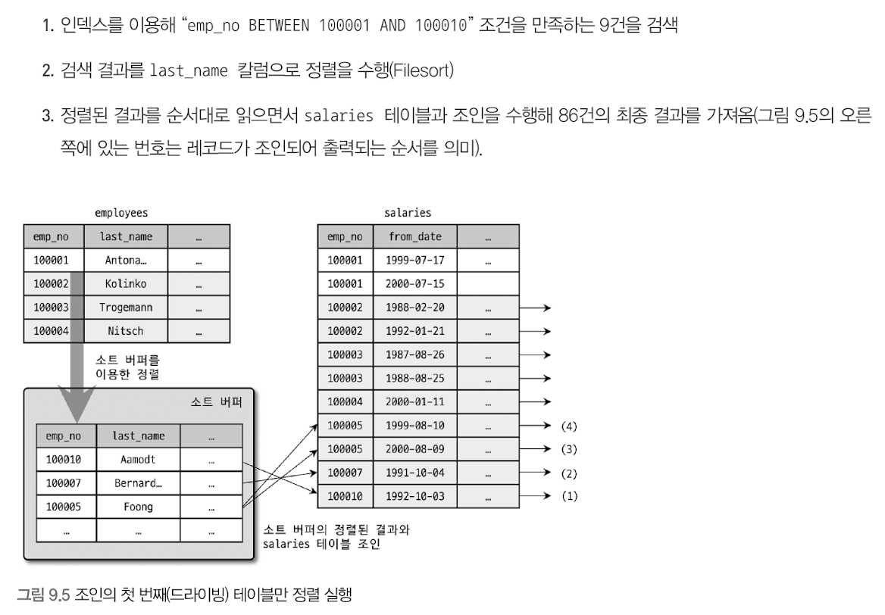
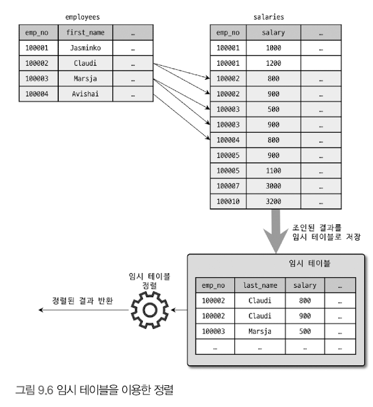
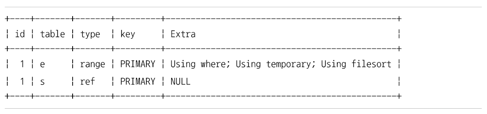

# 기본 데이터 처리 
## 풀 테이블 스캔 & 풀 인덱스 스캔
### 풀 테이블 스캔 
- 인덱스를 사용하지 않고 테이블의 데이터를 처음부터 끝까지 읽어서 요청된 작업을 처리하는 것 
- 아래의 조건일 때 주로 풀 테이블 스캔 수행
  - 테이블 레코드 건수가 매우 작아, 인덱스를 통해 읽는 것 보다 풀 테이블 스캔을 하는 편이 더 빠른 경우(테이블이 페이지 1개로 구성된 경우)
  - where 절이나 on 절에 인덱스를 이용할 수 있는 적절한 조건이 없는 경우 
  - 인덱스 레인지 스캔을 사용할 수 있는 쿼리라고 하더라도, 옵티마이저가 판단한 조건 일치 레코드 건수가 너무 많은 경우(인덱스의 B-Tree를 샘플링해서 조사한 통계 정보 기준)
  - 보통 한꺼번에 여러 개의 블록이나 페이지를 읽어오는 기능이 내장돼 있음 

### InnoDB의 풀 테이블 스캔 
- 특정 테이블의 연속된 데이터 페이지가 읽히면, 백그라운드 스레드에 의해 리드 어헤드 작업이 자동으로 시작 됨
  - 리드 어헤드 : 어떤 영역의 데이터가 앞으로 필요해지리라는 것을 예측해서 요청이 오기 전에 미리 디스크에서 읽어 InnoDB 버퍼 풀에 가져다 두는 것 
- 풀 테이블 스캔 실행
  - 처음 몇 개의 데이터 페이지는 foreground 스레드(클라이언트 스레드)가 페이지 읽기 실행 
  - 특정 시점부터는 읽기 작업을 백그라운드 스레드로 위임
  - 백그라운드 스레드가 읽기를 넘겨받는 시점부터는 한번에 4개 or 8개씩의 페이지를 읽으면서 계속 그 수를 증가시킴
  - 이 때 한번에 최대 64개 데이터 페이지까지 읽어서 버퍼 풀에 저장함 
  - 포그라운드 스레드는 미리 버퍼 풀에 준비된 데이터를 가져다 사용 -> 쿼리 처리 속도 향상 


- 리드 어헤드는 풀 인덱스 스캔에서도 동일하게 사용된다.
```mysql
select count(*) from employees;  -- 풀 인덱스 스캔이 발생함 
select * from employees;  -- 풀 테이블 스캔이 발생함
```

<br/><br/>
## 병렬 처리 (p.306)
하나의 쿼리를 여러 스레드가 작업을 나누어 동시에 처리하는 것을 의미 
- 여러 스레드가 동시에 각각의 쿼리를 처리하는 것은 MySQL이 처음 만들어 질 때부터 가능했으니 오해말자
- 아래와 같이 아무런 where 조건 없이 단순히 테이블의 전체 건수를 가져오는 쿼리만 병렬 처리 가능  


- 병렬 처리용 스레드 개수가 늘어날수록 쿼리 처리에 걸리는 시간이 줄어든다.
  - 하지만, 병렬 처리용 스레드 개수를 아무리 늘리더라도 서버에 장착된 CPU의 코어 개수를 넘어서는 경우는 오히려 성능이 떨어질 수 있으니 주의하자. 


<br/><br/>
## order by 처리(using filesort)
- 레코드 1~2건을 가져오는 쿼리를 제외하면 대부분의 select에서 정렬은 필수로 사용됨
- 정렬을 처리하는 방법
  - 인덱스 이용하는 방법
  - 쿼리가 실행될 때 filesort라는 별도의 처리를 이용하는 방법 

#### 인덱스 이용 
- 장점
  - insert, update, delete 쿼리가 실행될 때 이미 인덱스가 정렬돼 있어서 순서대로 읽기만 하면 되므로 매우 빠름 
- 단점 
  - insert, update, delete 작업 시 부가적인 인덱스 추가/삭제 작업이 필요하므로 느림
  - 인덱스 때문에 디스크 공간이 더 많이 필요함 
  - 인덱스 개수가 늘어날수록 InnoDB의 버퍼 풀을 위한 메모리가 많이 필요함

#### Filesort 이용
- 장점
  - 인덱스를 생성하지 않아도 되므로 인덱스를 이용할 때의 단점이 장점으로 바뀜 
  - 정렬해야 할 레코드가 많지 않은 경우, 메모리에서 Filesort가 처리됨 -> 충분히 빠름 
- 단점 
  - 정렬 작업이 쿼리 실행 시 처리됨 -> 레코드 대상 건수가 많아질수록 쿼리 응답 속도가 느림 


- 레코드를 정렬하기 위해 항상 Filesort라는 작업을 거쳐야 하는 것은 아님 
- 모든 정렬을 인덱스를 이용하도록 튜닝하는 것은 거의 불가능에 가까움 
  - 정렬 기준이 너무 많아서 요건 별로 모두 인덱스를 생성하는 것이 불가능한 경우 
  - group by의 결과 또는 distinct 같은 처리의 결과를 다시 정렬해야 하는 경우 
  - union의 결과와 같이 임시 테이블의 결과를 다시 정렬해야 하는 경우 
  - 랜덤하게 결과 레코드를 가져와야 하는 경우 


- MySQl 서버에서 인덱스를 이용하지 않고 별도의 정렬 처리를 수행헀는지 여부 확인
  - 실행 계획의 Extra 칼럼에 "Using filesort"메시지가 표시되는지 여부로 판단 가능 

### 소트 버퍼 
- 소트 버퍼 : MySQL이 정렬을 수행하기 위해 할당받은 별도의 메모리 공간 
- 정렬이 필요할 때만 할당 됨
- 버퍼의 크기는 정렬해야 할 레코드 크기에 따라 가변적으로 증가함 (최대 사용 가능한 공간 설정 가능)
- 소트 버퍼를 위한 메모리 공간은 **쿼리의 실행이 완료될 경우 즉시 시스템으로 반납**됨

#### 문제점

- 정렬해야 할 레코드 건수가 소트 버퍼로 할당된 공간보다 크다면?
  - MySQL은 정렬해야 할 레코드를 여러 조각으로 나눠서 처리한다. 이 과정에서 임시 저장을 위해 디스크를 사용함 
- 메모리의 소트 버퍼에서 정렬 수행 -> 그 결과를 임시로 디스크에 기록 -> 다음 레코드를 가져옴 -> 정렬 -> 반복적으로 디스크에 임시 저장 
  - 각 버퍼 크기만큼 정렬된 레코드를 다시 병합하면서 정렬을 수행해야 함 
  - 해당 병합 작업을 **멀티 머지**라고 표현한다. 
- 해당 작업들은 모두 **디스크의 읽기와 쓰기를 유발**함 
  - 레코드 건수 증가 -> 반복 작업 횟수 증가 -> 디스크 I/O 증가


- MySQL : 글로벌 메모리 영역 + 세션(로컬) 메모리 영역
  - 소트 버퍼는 세션 메모리 영역에 해당함 
  - 이는 여러 클라이언트가 공유해서 사용할 수 있는 영역이 아님 
  - 커넥션이 많아질 수록, 정렬 작업이 많아질 수록 소트 버퍼로 소비되는 메모리 공간이 커짐을 의미
  - OS가 메모리 부족 현상을 겪게될 수 있음 -> OOM-Killer가 프로세스를 강제 종료 할수도.. 
    - OOM-Killer는 메모리를 가장 많이 사용하는 프로세스를 강제 종료함
    - 일반적으로 메모리를 가장 많이 사용하는 MySQL 서버가 강종 1순위임


### 정렬 알고리즘 
- 레코드 정렬 시, 레코드 전체를 소트 버퍼에 담을지 or 정렬 기준 컬럼만 소트 버퍼에 담을지에 따라 "싱글 패스", "투 패스" 2가지 정렬 모드로 나뉨
```text
[ 투 패스 정렬 방식 ]
- <sort_key, rowid> : 정렬 키와 레코드의 로우 아이디만 가져와서 정렬하는 방식

[ 싱글 패스 정렬 방식 ]  
- <sort_key, additional_fields> : 정렬 키와 레코드 전체를 가져와서 정렬하는 방식. 레코드의 컬럼들은 고정 사이즈로 메모리 저장
- <sort_key, packed_additional_fields> : 정렬 키와 레코드 전체를 가져와서 정렬하는 방식. 레코드의 컬럼들은 가변 사이즈로 메모리 저장 
```

#### 싱글 패스 정렬 방식 
- 소트 버퍼에 정렬 기준 컬럼을 포함해 select 대상이 되는 컬럼 전부를 담아서 정렬을 수행하는 방식 
```mysql
SELECT emp_no, first_name, last_name
FROM employees
ORDER BY first_name;
```
- first_name 으로 정렬해서 emp_no, first_name, last_name을 select 하는 쿼리
 

- 정렬에 필요하지 않은 last_name 컬럼도 전부 읽어서 소트 버퍼에 담고 정렬을 수행함 
- 정렬이 완료되면 정렬 버퍼의 내용을 그대로 클라이언트로 넘겨줌 


#### 투 패스 정렬 방식 
- 정렬 대상 컬럼과 PK 값만 소트 버퍼에 담아서 정렬 수행한 후 
  - 정렬된 순서대로 다시 PK로 테이블을 읽어서 select할 컬럼을 가져오는 방법


- 정렬에 필요한 first_name과 PK인 emp_no만 읽어서 정렬 수행 
- 정렬 완료 후 순서대로 employees 테이블을 한번 더 읽어서 last_name을 가져옴 
- 최종적으로 그 결과를 클라이언트로 넘겨줌 
- 투 패스 방식은 테이블을 두 번 읽는다.
  - 상당히 불함리하다. -> 싱글 패스에는 불합리함이 없음
  - 하지만 싱글 패스는 더 많은 소트 버퍼 공간이 필요함 
- 일반적으로 최신 버전에서는 싱글 패스 정렬 방식을 주로 사용 
- 아래 두 가지 경우에는 투 패스 정렬 방식 사용
  - 레코드 크기가 max_length_for_sort_data 시스템 변수에 설정된 값보다 클 때
  - blob이나 text 타입의 컬럼이 select 대상에 포함될 때 
- 싱글 패스 : 정렬 대상 레코드 크기나 건수가 작은 경우 빠름
- 투 패스 : 정렬 대상 레코드의 크기나 건수가 상당히 많은 경우 효율적임 

> 주의   
> SELECT 쿼리에서 꼭 필요한 칼럼만 조회하지 않고, 모든 칼럼(+)을 가져오도록 개발할 때가 많다. 하지만 이는 정렬 버퍼를 몇 배에서 몇십 배까지 비효율적으로 사용할 가능성이 크다. SELECT 쿼리에서 꼭 필요한 칼럼만 조회하도록 쿼리를 작성하는 것이 좋다고 권장하는 것은 바로 이런 이유 때문이다. 특히 정렬이 필요한 SELECT는 불필요한 칼럼을 SELECT하지 않게 쿼리를 작성하는 것이 효율적이다. 
> 이는 꼭 정렬 버퍼에만 영향을 미치는 것이 아니라 임시 테이블이 필요한 쿼리에서도 영향을 미친다. 


### 정렬 처리 방법 

- 인덱스 사용 : filesort 과정 없이 인덱스를 순서대로 읽어 결과 반환 
- 인덱스 사용 불가 : where 조건에 일치하는 레코드를 검색해 정렬 버퍼에 저장하면서 정렬을 처리(filesort)
  - 정렬 대상 레코드를 최소화 하기 위해 다음 2가지 방법 중 하나를 선택
    - 조인의 드라이빙 테이블만 정렬한 다음 조인을 수행 
    - 조인이 끝나고 일치하는 레코드를 모두 가져온 후 정렬을 수행 


#### 인덱스를 이용한 정렬 

- order by에 명시된 컬럼이 제일 먼저 읽는 테이블에 속하고, order by에 순서대로 생성된 인덱스가 있어야 함.
  - 조인이 사용된 경우 드라이빙 테이블
- where 절에 첫 번째로 읽는 테이블의 칼럼에 대한 조건이 있는 경우, 그 조건과 order by는 같은 인덱스를 사용할 수 있어야 함 
- B-Tree 계열 인덱스가 아닌, 해시 인덱스나 전문 검색 인덱스 등에서는 인덱스를 이용한 정렬 사용 불가 
  - R-Tree도 B-Tree 계열이나, 특성상 이 방식을 사용할 수 없음 
- 여러 테이블이 조인되는 경우 Nested-loop 방식의 조인에서만 이 방식 사용 가능 
- 인덱스를 이용한 정렬
  - 실제 인덱스 값이 정렬돼 있기 때문에 순서대로 읽기만 하면 됨
  - B-Tree 인덱스가 키 값을 기준으로 정렬돼있기 때문 
  - 조인이 Nested-loop 방식으로 실행되기 때문에, 조인 때문에 드라이빙 테이블의 인덱스 읽기 순서가 흐트러지지 않음 

> order by 절을 넣지 않아도 자동으로 정렬된다고 해서 order by 절 자체를 완전히 제거할 필요는 없다.
> - 부가적으로 불필요한 정렬 작업은 수행되지 않기 때문 
> - 쿼리 실행 계획이 조금 변경될 경우, order by가 명시되지 않은 쿼리는 결과를 기대했던 순서로 가져오지 못해 버그로 연결될 수 있다. 그러니 order by가 있어야 한다면 작성하자.


#### 조인의 드라이빙 테이블만 정렬 

- 일반적으로 조인 수행 시, 레코드 건수가 몇 배로 불어나고, 레코드 하나 하나의 크기도 늘어남
- 조인 실행 전에 첫 번째 테이블의 레코드를 먼저 정렬한 다음 조인을 실행하는 것이 정렬의 차선책 
  - 드라이빙 테이블의 컬럼만으로 order by 절을 작성하자

```mysql
select *
from employees.e, salaries s
where s.emp_no=e.emp_no and e.emp_no between 100002 and 100010
order by e.last_name;
```
- 위 쿼리에서 옵티마이저는 employees 테이블을 드라이빙 테이블로 선택한다 
  - where 절의 검색 조건은 employees 테이블의 PK를 이용해 검색하면 작업량이 감소됨 
  - Driven table(salaries)의 조인 컬럼인 emp_no 컬럼에 인덱스가 있음 
- order by 절에 명시된 컬럼은 employees 테이블의 PK와 전혀 연관이 없음 
  - 인덱스를 이용한 정렬 불가능 
  - order by 절의 정렬 기준 컬럼이 드라이빙 테이블에 포함된 컬럼임을 알 수 있기 때문에, 옵티마이저는 드라이빙 테이블만 검색해서 정렬을 먼저 수행하고, 해당 결과와 드리븐 테이블을 조인한 것임


#### 임시 테이블을 이용한 정렬 

- 쿼리가 여러 테이블을 조인하지 않고, 하나의 테이블로부터 select해서 정렬하는 경우는 임시 테이블이 불필요함 
- 2개 이상의 테이블을 조인해서 그 결과를 정렬해야 할 경우 임시 테이블이 필요할 수 있음 
  - 조인의 드라이빙 테이블만 정렬할 경우 임시 테이블 사용하지 않음
  - 그 외 패턴에서는 항상 조인의 결과를 임시 테이블에 저장하고, 그 결과를 다시 정렬하는 과정을 거침 
  - 정렬해야 할 레코드 건수가 가장 많기 때문에 가장 느린 정렬 방법임 

```mysql
select *
from employees.e, salaries s
where s.emp_no=e.emp_no and e.emp_no between 100002 and 100010
order by s.salary;
```
- 위 쿼리는 드라이빙 테이블이 아닌 드리븐 테이블(salaries)을 기준으로 정렬함 
  - 정렬 수행 전에 salaries 테이블을 읽어야 함 -> 조인된 데이터를 가지고 정렬할 수 밖에 없는 케이스 


- 위 쿼리의 실행 계획
- Using temporary; Using filesort 
  - 조인의 결과를 임시 테이블에 저장하고, 그 결과를 다시 정렬 처리했음을 의미 


#### 정렬 처리 방법의 성능 비교 
- 웹 서비스용 쿼리 : order by와 limit이 거의 필수로 함께 사용되는 경향이 있음 
  - limit : 결과의 일부만 가져와 mysql 서버가 처리해야 할 작업량을 줄이는 역할 
- order by, group by 같은 작업은 where 조건을 만족하는 레코드를 limit 건수만큼만 가져와서는 처리 불가 
  - 조건을 만족하는 레코드를 모두 가져와서 정렬을 수행하거나 그루핑 작업을 실행해야만 비로소 limit으로 건수를 제한할 수 있음 
  - where 조건이 아무리 인덱스를 잘 활용하도록 튜닝되어도, 잘못된 order by나 group by 때문에 쿼리가 느려지는 경우가 자주 발생함 

인덱스를 사용하지 못하는 정렬이나 그루핑 작업이 왜 느리게 작동할 수 밖에 없는가? 

#### 스트리밍 방식
> 대표적인 방법 : 인덱스를 사용한 정렬 방식 
> - limit으로 제한된 건수만큼만 읽으면서 바로바로 클라이언트로 결과 전송 

- 서버 쪽에서 처리할 데이터가 얼마인지에 관계 없이 조건에 일치하는 레코드가 검색될 때마다 바로바로 클라이언트로 전송 해주는 방식 
- 클라이언트는 쿼리를 요청한 후 곧바로 원했던 첫번째 레코드를 전달받음. 
  - 마지막 레코드는 언제 받을지 알 수 없음 
- 클라이언트는 mysql 서버가 일치하는 레코드를 찾는 즉시 전달받음 
  - 동시에 데이터 가공 작업 시작 가능 
  - 웹 서비스같은 OLTP 환경에서는 쿼리의 요청에서부터 첫 번쨰 레코드를 전달받게 되기까지의 응답 시간이 매우 중요함
- 스트리밍 방식으로 처리되는 쿼리는 쿼리가 얼마나 많은 레코드를 조회하느냐에 상관없이 빠른 응답 시간을 보장해줌
- limit처럼 결과 건수를 제한하는 조건들은 쿼리의 전체 실행 시간을 상당히 줄여줄 수 있음 
  - 매우 큰 테이블을 아무런 조건 없이 select만 해보면 첫 번째 레코드는 아주 빨리 가져옴 
  - 풀 테이블 스캔 결과가 아무런 버퍼링 처리나 필터링 과정 없이 바로 클라이언트로 스트리밍 되기 때문 
  - limit 조건 추가 -> 전체적으로 가져오는 레코드 건수가 줄어들기 때문에 마지막 레코드를 가져오기까지의 시간을 상당히 줄일 수 있음


#### 버퍼링 방식 
> 대표적인 방법 : 조인의 드라이빙 테이블만 정렬 & 임시 테이블을 이용한 정렬 
> - 모든 레코드를 디스크로부터 읽어서 정렬한 후에야 비로소 limit으로 제한된 건수만큼 잘라서 클라이언트에게 전송 

- order by, group by 같은 처리는 쿼리 결과가 스트리밍되는 것을 불가능하게 함
  - where 조건에 일치하는 모든 레코드를 가져온 후, 정렬하거나 그루핑해서 차례대로 보내야 하기 때문
- 검색 및 정렬 작업을 수행하는 동안 클라이언트는 아무것도 하지 않고 기다려야함 -> 느린 응답 속도 
- 쿼리는 먼저 결과를 모아서 mysql 서버에서 일괄 가공해야 함 -> 모든 결과를 스토리지 엔진으로부터 가져올 때까지 기다려야함 
  - limit과 같이 건수를 제한하는 조건이 있어도 성능 향상에 별로 도움이 안됨 
  - 네트워크로 전송되는 레코드 건수를 줄일 수는 있지만 mysql 서버가 해야하는 작업량에는 그다지 변화가 없기 때문 


> 스트리밍 처리는 어떤 클라이언트 도구나 API를 이용하느냐에 따라 그 방식에 차이가 있을 수 있음 
> - JDBC 라이브러리를 이용해 "select * from bigtable" 쿼리 수행 
>   - mysql 서버는 레코드를 읽자마자 클라이언트로 결과 전달 
>   - jdbc는 서버로부터 받는 레코드를 일단 내부 버퍼에 모두 담아둔 후, 마지막 레코드가 전달될 때까지 대기함. 
>   - 모든 결과를 전달 받은 후에야 클라이언트 애플리케이션에 결과를 반환 
> - 전송 방식을 스트리밍 방식으로 변경할 수도 있음 


#### 중요 
- 어떤 테이블이 먼저 드라이빙되어 조인되는지도 중요하나, 어떤 **정렬 방식으로 처리되는지**는 더 큰 성능 차이를 만듬 
  - 가능하다면 인덱스를 사용한 정렬로 유도할 것 
  - 그렇게하지 못 할 경우, 드라이빙 테이블만 정렬해도 되는 수준으로 유도하는 것도 좋은 튜닝 방법임 
- MySQL 서버의 정렬 알고리즘
  - limit 10 이 있을 경우, 상위 10건만 정렬이 채워지면 정렬을 멈추고 결과 반환
  - 퀵 소트, 힙 소트 알고리즘 사용 

<br/><br/>
## group by 처리 
- 쿼리가 스트리밍 처리를 할 수 없게 하는 처리중 하나 
- 