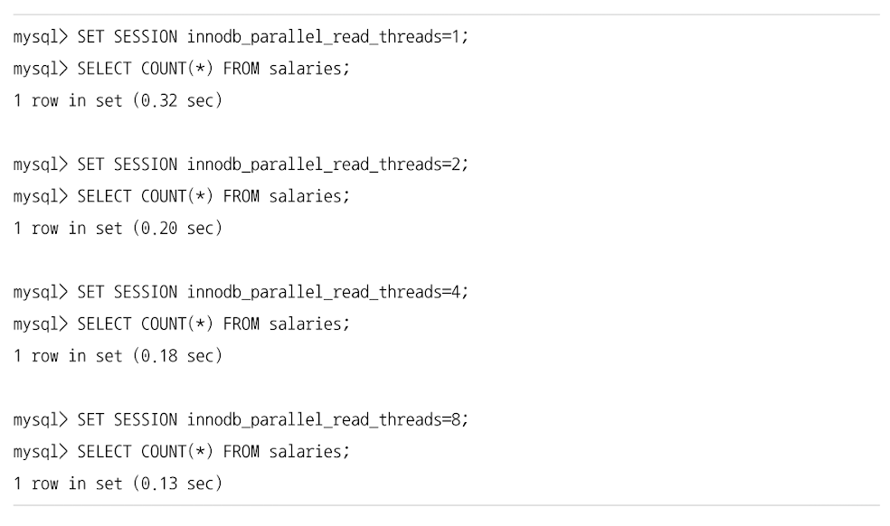
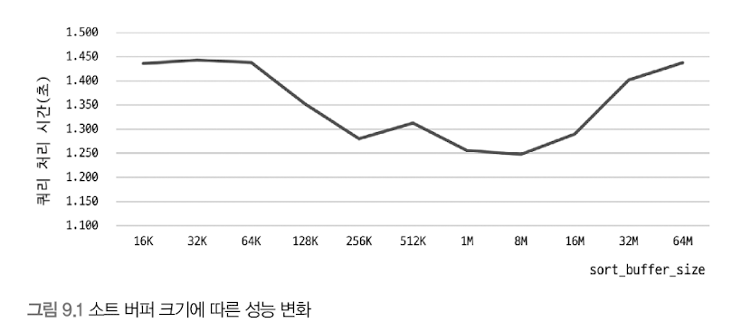
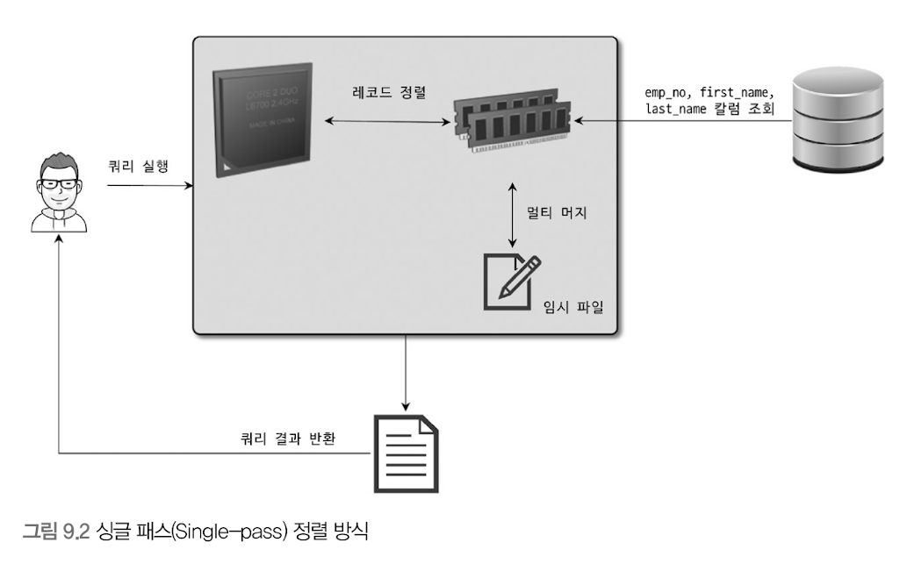
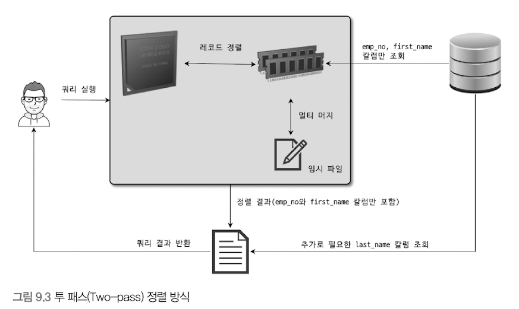

# 기본 데이터 처리 
## 풀 테이블 스캔 & 풀 인덱스 스캔
### 풀 테이블 스캔 
- 인덱스를 사용하지 않고 테이블의 데이터를 처음부터 끝까지 읽어서 요청된 작업을 처리하는 것 
- 아래의 조건일 때 주로 풀 테이블 스캔 수행
  - 테이블 레코드 건수가 매우 작아, 인덱스를 통해 읽는 것 보다 풀 테이블 스캔을 하는 편이 더 빠른 경우(테이블이 페이지 1개로 구성된 경우)
  - where 절이나 on 절에 인덱스를 이용할 수 있는 적절한 조건이 없는 경우 
  - 인덱스 레인지 스캔을 사용할 수 있는 쿼리라고 하더라도, 옵티마이저가 판단한 조건 일치 레코드 건수가 너무 많은 경우(인덱스의 B-Tree를 샘플링해서 조사한 통계 정보 기준)
  - 보통 한꺼번에 여러 개의 블록이나 페이지를 읽어오는 기능이 내장돼 있음 

### InnoDB의 풀 테이블 스캔 
- 특정 테이블의 연속된 데이터 페이지가 읽히면, 백그라운드 스레드에 의해 리드 어헤드 작업이 자동으로 시작 됨
  - 리드 어헤드 : 어떤 영역의 데이터가 앞으로 필요해지리라는 것을 예측해서 요청이 오기 전에 미리 디스크에서 읽어 InnoDB 버퍼 풀에 가져다 두는 것 
- 풀 테이블 스캔 실행
  - 처음 몇 개의 데이터 페이지는 foreground 스레드(클라이언트 스레드)가 페이지 읽기 실행 
  - 특정 시점부터는 읽기 작업을 백그라운드 스레드로 위임
  - 백그라운드 스레드가 읽기를 넘겨받는 시점부터는 한번에 4개 or 8개씩의 페이지를 읽으면서 계속 그 수를 증가시킴
  - 이 때 한번에 최대 64개 데이터 페이지까지 읽어서 버퍼 풀에 저장함 
  - 포그라운드 스레드는 미리 버퍼 풀에 준비된 데이터를 가져다 사용 -> 쿼리 처리 속도 향상 


- 리드 어헤드는 풀 인덱스 스캔에서도 동일하게 사용된다.
```mysql
select count(*) from employees;  -- 풀 인덱스 스캔이 발생함 
select * from employees;  -- 풀 테이블 스캔이 발생함
```

<br/><br/>
## 병렬 처리 (p.306)
하나의 쿼리를 여러 스레드가 작업을 나누어 동시에 처리하는 것을 의미 
- 여러 스레드가 동시에 각각의 쿼리를 처리하는 것은 MySQL이 처음 만들어 질 때부터 가능했으니 오해말자
- 아래와 같이 아무런 where 조건 없이 단순히 테이블의 전체 건수를 가져오는 쿼리만 병렬 처리 가능  


- 병렬 처리용 스레드 개수가 늘어날수록 쿼리 처리에 걸리는 시간이 줄어든다.
  - 하지만, 병렬 처리용 스레드 개수를 아무리 늘리더라도 서버에 장착된 CPU의 코어 개수를 넘어서는 경우는 오히려 성능이 떨어질 수 있으니 주의하자. 


<br/><br/>
## order by 처리(using filesort)
- 레코드 1~2건을 가져오는 쿼리를 제외하면 대부분의 select에서 정렬은 필수로 사용됨
- 정렬을 처리하는 방법
  - 인덱스 이용하는 방법
  - 쿼리가 실행될 때 filesort라는 별도의 처리를 이용하는 방법 

#### 인덱스 이용 
- 장점
  - insert, update, delete 쿼리가 실행될 때 이미 인덱스가 정렬돼 있어서 순서대로 읽기만 하면 되므로 매우 빠름 
- 단점 
  - insert, update, delete 작업 시 부가적인 인덱스 추가/삭제 작업이 필요하므로 느림
  - 인덱스 때문에 디스크 공간이 더 많이 필요함 
  - 인덱스 개수가 늘어날수록 InnoDB의 버퍼 풀을 위한 메모리가 많이 필요함

#### Filesort 이용
- 장점
  - 인덱스를 생성하지 않아도 되므로 인덱스를 이용할 때의 단점이 장점으로 바뀜 
  - 정렬해야 할 레코드가 많지 않은 경우, 메모리에서 Filesort가 처리됨 -> 충분히 빠름 
- 단점 
  - 정렬 작업이 쿼리 실행 시 처리됨 -> 레코드 대상 건수가 많아질수록 쿼리 응답 속도가 느림 


- 레코드를 정렬하기 위해 항상 Filesort라는 작업을 거쳐야 하는 것은 아님 
- 모든 정렬을 인덱스를 이용하도록 튜닝하는 것은 거의 불가능에 가까움 
  - 정렬 기준이 너무 많아서 요건 별로 모두 인덱스를 생성하는 것이 불가능한 경우 
  - group by의 결과 또는 distinct 같은 처리의 결과를 다시 정렬해야 하는 경우 
  - union의 결과와 같이 임시 테이블의 결과를 다시 정렬해야 하는 경우 
  - 랜덤하게 결과 레코드를 가져와야 하는 경우 


- MySQl 서버에서 인덱스를 이용하지 않고 별도의 정렬 처리를 수행헀는지 여부 확인
  - 실행 계획의 Extra 칼럼에 "Using filesort"메시지가 표시되는지 여부로 판단 가능 

### 소트 버퍼 
- 소트 버퍼 : MySQL이 정렬을 수행하기 위해 할당받은 별도의 메모리 공간 
- 정렬이 필요할 때만 할당 됨
- 버퍼의 크기는 정렬해야 할 레코드 크기에 따라 가변적으로 증가함 (최대 사용 가능한 공간 설정 가능)
- 소트 버퍼를 위한 메모리 공간은 **쿼리의 실행이 완료될 경우 즉시 시스템으로 반납**됨

#### 문제점

- 정렬해야 할 레코드 건수가 소트 버퍼로 할당된 공간보다 크다면?
  - MySQL은 정렬해야 할 레코드를 여러 조각으로 나눠서 처리한다. 이 과정에서 임시 저장을 위해 디스크를 사용함 
- 메모리의 소트 버퍼에서 정렬 수행 -> 그 결과를 임시로 디스크에 기록 -> 다음 레코드를 가져옴 -> 정렬 -> 반복적으로 디스크에 임시 저장 
  - 각 버퍼 크기만큼 정렬된 레코드를 다시 병합하면서 정렬을 수행해야 함 
  - 해당 병합 작업을 **멀티 머지**라고 표현한다. 
- 해당 작업들은 모두 **디스크의 읽기와 쓰기를 유발**함 
  - 레코드 건수 증가 -> 반복 작업 횟수 증가 -> 디스크 I/O 증가


- MySQL : 글로벌 메모리 영역 + 세션(로컬) 메모리 영역
  - 소트 버퍼는 세션 메모리 영역에 해당함 
  - 이는 여러 클라이언트가 공유해서 사용할 수 있는 영역이 아님 
  - 커넥션이 많아질 수록, 정렬 작업이 많아질 수록 소트 버퍼로 소비되는 메모리 공간이 커짐을 의미
  - OS가 메모리 부족 현상을 겪게될 수 있음 -> OOM-Killer가 프로세스를 강제 종료 할수도.. 
    - OOM-Killer는 메모리를 가장 많이 사용하는 프로세스를 강제 종료함
    - 일반적으로 메모리를 가장 많이 사용하는 MySQL 서버가 강종 1순위임


### 정렬 알고리즘 
- 레코드 정렬 시, 레코드 전체를 소트 버퍼에 담을지 or 정렬 기준 컬럼만 소트 버퍼에 담을지에 따라 "싱글 패스", "투 패스" 2가지 정렬 모드로 나뉨
```text
[ 투 패스 정렬 방식 ]
- <sort_key, rowid> : 정렬 키와 레코드의 로우 아이디만 가져와서 정렬하는 방식

[ 싱글 패스 정렬 방식 ]  
- <sort_key, additional_fields> : 정렬 키와 레코드 전체를 가져와서 정렬하는 방식. 레코드의 컬럼들은 고정 사이즈로 메모리 저장
- <sort_key, packed_additional_fields> : 정렬 키와 레코드 전체를 가져와서 정렬하는 방식. 레코드의 컬럼들은 가변 사이즈로 메모리 저장 
```

#### 싱글 패스 정렬 방식 
- 소트 버퍼에 정렬 기준 컬럼을 포함해 select 대상이 되는 컬럼 전부를 담아서 정렬을 수행하는 방식 
```mysql
SELECT emp_no, first_name, last_name
FROM employees
ORDER BY first_name;
```
- first_name 으로 정렬해서 emp_no, first_name, last_name을 select 하는 쿼리
 

- 정렬에 필요하지 않은 last_name 컬럼도 전부 읽어서 소트 버퍼에 담고 정렬을 수행함 
- 정렬이 완료되면 정렬 버퍼의 내용을 그대로 클라이언트로 넘겨줌 


#### 투 패스 정렬 방식 
- 정렬 대상 컬럼과 PK 값만 소트 버퍼에 담아서 정렬 수행한 후 
  - 정렬된 순서대로 다시 PK로 테이블을 읽어서 select할 컬럼을 가져오는 방법


- 정렬에 필요한 first_name과 PK인 emp_no만 읽어서 정렬 수행 
- 정렬 완료 후 순서대로 employees 테이블을 한번 더 읽어서 last_name을 가져옴 
- 최종적으로 그 결과를 클라이언트로 넘겨줌 
- 투 패스 방식은 테이블을 두 번 읽는다.
  - 상당히 불함리하다. -> 싱글 패스에는 불합리함이 없음
  - 하지만 싱글 패스는 더 많은 소트 버퍼 공간이 필요함 
- 일반적으로 최신 버전에서는 싱글 패스 정렬 방식을 주로 사용 
- 아래 두 가지 경우에는 투 패스 정렬 방식 사용
  - 레코드 크기가 max_length_for_sort_data 시스템 변수에 설정된 값보다 클 때
  - blob이나 text 타입의 컬럼이 select 대상에 포함될 때 
- 싱글 패스 : 정렬 대상 레코드 크기나 건수가 작은 경우 빠름
- 투 패스 : 정렬 대상 레코드의 크기나 건수가 상당히 많은 경우 효율적임 

> 주의   
> SELECT 쿼리에서 꼭 필요한 칼럼만 조회하지 않고, 모든 칼럼(+)을 가져오도록 개발할 때가 많다. 하지만 이는 정렬 버퍼를 몇 배에서 몇십 배까지 비효율적으로 사용할 가능성이 크다. SELECT 쿼리에서 꼭 필요한 칼럼만 조회하도록 쿼리를 작성하는 것이 좋다고 권장하는 것은 바로 이런 이유 때문이다. 특히 정렬이 필요한 SELECT는 불필요한 칼럼을 SELECT하지 않게 쿼리를 작성하는 것이 효율적이다. 
> 이는 꼭 정렬 버퍼에만 영향을 미치는 것이 아니라 임시 테이블이 필요한 쿼리에서도 영향을 미친다. 